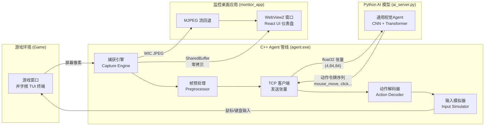

**本页是整份文档的入口**。如果你只读一页，请读这一页。它将回答三个问题：这个项目做什么？它由哪些部分构成？如何开始阅读其余文档？

---

## 一句话概括

这个项目构建了一个**端到端的通用视觉游戏AI系统**，其核心接口是——**像素输入（屏幕画面）→ 动作输出（鼠标/键盘操作）**。AI像人类玩家一样"看"屏幕画面，然后"操作"鼠标和键盘来进行游戏，整个过程不依赖任何游戏内部数据（内存、API、源码），仅凭视觉信息决策。

Sources: [README.md](README.md#L1-L3), [claude.md](CLAUDE.md#L7-L8)

---

## 系统概览图

下面这张图展示系统的完整数据流——从AI看到画面到它做出操作，经历了哪些模块：



Sources: [agent/src/agent.cpp](agent/src/agent.cpp#L1-L10), [README.md](README.md#L4-L6)

---

## 核心架构：四层管线

系统由四个功能层串联而成，构成从"看到"到"做到"的完整闭环：

| 层级 | 模块 | 语言 | 职责 |
|------|------|------|------|
| **L0: 游戏本体** | `game/` | C++17 | 3x3井字棋棋盘逻辑、规则判定、TUI终端界面、网络对战协议 |
| **L1: 屏幕捕获** | `capture/` | C++17 | 捕获目标窗口像素（WGC GPU加速 / GDI CPU回退），帧预处理管线 |
| **L2: 输入模拟** | `input/` | C++17 | 将抽象"动作"翻译为操作系统级鼠标/键盘事件（Interception驱动 / SendInput API） |
| **L3: AI模型** | `ai/` + `model/` | Python | 两套模型：井字棋专用MLP（快速对战） + 通用视觉CNN-Transformer（泛化训练） |

这四层通过**TCP 9999端口**和**统一二进制协议（protocol/）**通信。C++负责所有实时管线（捕获+预处理+输入模拟+GUI），Python负责AI推理和训练。

Sources: [README.md](README.md#L26-L31), [claude.md](CLAUDE.md#L11-L36)

---

## 六大模块职责

### 1. `logger/` — 统一日志引擎
纯C API（`capture_log_write_msg`），线程安全的文件+环形缓冲区双重输出。所有模块（C++、Rust FFI、独立工具）都汇聚到这一个写入函数。支持日志文件滚动删除、内存日志实时读取。

Sources: [logger/logger.h](logger/logger.h#L1-L17)

### 2. `capture/` — 屏幕捕获引擎
抽象接口 `ICaptureBackend` 搭配五种后端实现。核心后端是 **WGC（Windows Graphics Capture）**，利用 GPU FramePool + D3D11 + WinRT 实现 60+ FPS 捕获。回退链为 DesktopBlt → GetWindowDC → PrintWindow → ScreenBitBlt。帧预处理管线将任意分辨率 BGRA 帧转化为标准的 `(4, 84, 84)` float32 张量：裁剪→双线性缩放84x84→ITU-R BT.601灰度化→4帧堆叠→归一化。

Sources: [capture/include/capture.hpp](capture/include/capture.hpp#L1-L48), [capture/include/preprocess.hpp](capture/include/preprocess.hpp#L1-L12)

### 3. `monitor_app/` — 纯C++ WebView2监控桌面
替换了原先的 Tauri/Rust 方案。一个进程中运行 Win32窗口 + WebView2浏览器控件 + 捕获引擎 + MJPEG服务器。React前端（TypeScript + Tailwind）通过 `chrome.webview.postMessage` WebMessage 桥接与C++后端通信。三种画面传输路径：**SharedBuffer零拷贝**（GPU→Canvas直推）、**MJPEG HTTP 9998端口**（WIC JPEG编码回退）、**TCP 9999端口**（二进制协议对外通信）。提供仪表盘、窗口捕获预览、FPS计数、日志环缓冲区、窗口选择器等功能。

Sources: [monitor_app/src/main.cpp](monitor_app/src/main.cpp#L1-L15), [README.md](README.md#L108-L115)

### 4. `agent/` — 视觉Agent主循环
这是整个系统的**执行中枢**。`agent.exe` 作为一个自主运行的CLI程序，循环执行：**捕获画面 → 预处理 → 通过TCP发送张量到AI服务器 → 接收动作令牌 → 解码 → 执行输入操作**。整个管线是游戏无关的——模型输出什么动作，agent 就执行什么动作，不包含任何游戏特定的逻辑。

Sources: [agent/src/agent.cpp](agent/src/agent.cpp#L103-L148), [agent/include/agent.hpp](agent/include/agent.hpp#L1-L9)

### 5. `ai/` + `model/` — AI模型体系
包含**两个层次的模型架构**：

- **井字棋专用MLP**（`ai/net.py`）：9维输入 → 三层全连接（hidden=128）→ 分叉为策略头（9个logits）和价值头（tanh压缩[-1,1]）。50ms内CPU推理，自弈训练（epsilon-greedy探索 → 策略梯度 → 500轮收敛）。
- **通用视觉Agent**（`model/generic_agent.py`）：CNN视觉编码器（Nature CNN风格，4x84x84→256维） + Transformer自回归解码器（生成动作令牌序列，最多32个令牌）。游戏无关，约0.8M~3M参数。
- **层次化架构**（`model/hierarchical.py`）：L1感知专家（像素→16维压缩隐变量z）+ L2策略推理器（z+历史→动作），信息瓶颈训练，可提取L1作为快速推理捷径。

Sources: [ai/net.py](ai/net.py#L13-L50), [model/generic_agent.py](model/generic_agent.py#L17-L43), [model/hierarchical.py](model/hierarchical.py#L1-L15)

### 6. `protocol/` — 二进制通信协议
统一线缆格式：`[magic:4 "FRAM"][payload_size:4 LE][type_tag:4 LE][body]`。C++/Python双端同步实现。支持三种传输方式：TCP 9999（外部通信）、命名管道（stdout/stdin）、SharedBuffer（GPU零拷贝）。

Sources: [protocol/protocol.h](protocol/protocol.h#L1-L16)

---

## 通用动作编解码：游戏无关的核心设计

项目最关键的架构决定——**AI模型输出的不是"在井字棋第2行第1列落子"，而是"移动鼠标到屏幕坐标(350, 280)，点击左键"**。这个设计让整套系统与具体游戏解耦。

动作令牌系统定义了10种原子操作，每种都映射为 `[令牌类型][参数...]` 的紧凑二进制格式：

| 令牌 | 编码 | 参数长度 | 示例 |
|------|------|----------|------|
| MOUSE_MOVE_ABS | 0 | 9字节 | 移动到屏幕标准化坐标(0.3, 0.5) |
| MOUSE_MOVE_REL | 1 | 9字节 | 相对移动(dx=10, dy=-5)像素 |
| MOUSE_CLICK | 2 | 10字节 | 在坐标(x,y)处左键点击 |
| KEY_TAP | 7 | 3字节 | 敲击VK_SPACE键100ms |
| WAIT | 8 | 3字节 | 等待500ms |
| NOOP | 255 | 1字节 | 序列结尾标记 |

C++端 `ActionDecoder` 负责将令牌流反序列化为 `DecodedAction`，`GenericActionMapper` 再转换为 `GameAction` 交给 `IInputBackend` 执行。整个管道不通晓任何游戏规则。

Sources: [agent/include/action_mapper.hpp](agent/include/action_mapper.hpp#L1-L10), [model/action_space.py](model/action_space.py#L1-L19)

---

## 输入/捕获双后端策略

项目在捕获和输入两个关键环节都采用了"主+备"双后端设计，以提高鲁棒性：

### 捕获后端

| 后端 | 原理 | 性能 | 适用场景 |
|------|------|------|----------|
| **WGC** | GPU FramePool + D3D11 + WinRT | 60+ FPS, 1-3ms | 首选（Win10/11） |
| DesktopBlt | 虚拟桌面DC BitBlt | 5-15ms | 回退首选 |
| GetWindowDC | 窗口DC获取 | 5-10ms | 第二回退 |
| PrintWindow | WM_PRINT消息 | 10-30ms | 第三回退 |
| ScreenBitBlt | 全屏BitBlt | 5-15ms | 最终回退 |

回退链自动降级：WGC不可用时依次尝试更低级别的后端。

### 输入后端

| 后端 | 层级 | 是否可检测 | 适用场景 |
|------|------|-----------|----------|
| Interception驱动 | 内核驱动层 | 否（绕过大多数反作弊） | 首选（需管理员权限安装驱动） |
| SendInput API | Win32系统层 | 是（LLMHF_INJECTED标记） | 回退（单机游戏可见） |

Sources: [capture/include/capture.hpp](capture/include/capture.hpp#L54-L57), [input/include/input.hpp](input/include/input.hpp#L7-L10), [README.md](README.md#L78-L88)

---

## 项目结构总览

```
tictactoe/
├── game/             井字棋游戏本体（3x3棋盘 + TUI + 网络对战）
├── capture/          屏幕捕获引擎（5种后端，按方法独立编译为.lib）
├── input/            输入模拟中间件（Interception驱动 + SendInput回退）
├── agent/            视觉Agent主循环（捕获→预处理→TCP→解码→执行）
├── ai/               井字棋MLP专用AI（训练 + TCP预测服务）
├── model/            通用视觉Agent模型（CNN编码器 + Transform解码器）
├── protocol/         二进制线缆协议（C++/Python双端同步）
├── common/           跨模块公用库（类型定义 + 负载打包 + 传输层）
├── logger/           统一日志引擎（C API + 线程安全环形缓冲区）
├── monitor_app/      纯C++ WebView2监控桌面应用
├── monitor_web/      React前端（TypeScript + Tailwind，与宿主解耦）
├── train/            数据收集器（MLP自弈记录 → 视觉模型蒸馏）
└── test/             基准测试 + 帧查看工具
```

Sources: [claude.md](CLAUDE.md#49-96), [README.md](README.md#66-76)

---

## 下一步阅读建议

根据你的兴趣，可以选择以下路径深入：

### 🎮 对"游戏本身"感兴趣
→ [游戏逻辑：3x3棋盘规则、胜负判定与控制台终端TUI交互](6-you-xi-luo-ji-3x3qi-pan-gui-ze-sheng-fu-pan-ding-yu-kong-zhi-tai-zhong-duan-tuijiao-hu) → [网络对战协议：纯文本行协议](7-wang-luo-dui-zhan-xie-yi-chun-wen-ben-xing-xie-yi-9qi-ge-zhi-qi-fang-fan-hui-xing-lie-zhi-chi-ren-ren-human-vs-ai-ai-vs-aisan-chong-mo-shi) → [快速启动：从编译到运行一个完整的井字棋AI自弈](2-kuai-su-qi-dong-cong-bian-yi-dao-yun-xing-ge-wan-zheng-de-jing-zi-qi-aizi-yi)

### 🔬 对"AI如何看和操作"感兴趣
→ [捕获引擎架构：抽象接口与五种后端](8-bu-huo-yin-qing-jia-gou-chou-xiang-jie-kou-icapturebackend-yu-wu-chong-hou-duan-wgc-desktopblt-getwindowdc-printwindow-screenbitblt) → [帧预处理管线](10-zheng-yu-chu-li-guan-xian-ren-yi-fen-bian-lu-bgra-cai-jian-84x84shuang-xian-xing-suo-fang-hui-du-hua-4zheng-dui-die-gui-hua-float32zhang-liang) → [通用动作编解码](14-tong-yong-dong-zuo-bian-jie-ma-actionpooler-jin-zhi-xie-yi-shu-biao-yi-dong-dian-ji-an-jian-deng-dai-deng-10chong-cao-zuo-you-xi-wu-guan-de-biao-zhun-hua-ge-shi) → [双后端策略](12-shuang-hou-duan-ce-lue-interceptionqu-dong-ceng-nei-he-ji-rao-guo-fan-zuo-bi-yu-sendinputxi-tong-ceng-apiji-ke-jian-ce)

### 🤖 对"AI模型架构"感兴趣
→ [井字棋MLP模型](15-jing-zi-qi-mlpmo-xing-9wei-shu-ru-3ceng-quan-lian-jie-ce-lue-tou-9-logits-jie-zhi-tou-tanh-1-1-ke-50msnei-cputui-li) → [通用视觉Agent模型](17-tong-yong-shi-jue-agentmo-xing-cnnshi-jue-bian-ma-qi-4x84x84-256wei-transformerzi-hui-gui-jie-ma-qi-sheng-cheng-dong-zuo-ling-pai-xu-lie-you-xi-wu-guan) → [层次化架构](18-ceng-ci-hua-jia-gou-l1gan-zhi-zhuan-jia-xiang-su-16wei-ya-suo-yin-bian-liang-z-l2ce-lue-tui-li-qi-z-li-shi-dong-zuo-duan-dao-duan-xin-xi-ping-jing-xun-lian) → [自弈训练系统](16-zi-yi-xun-lian-xi-tong-ai_server-py-game-main-exe-lian-diao-epsilon-greedytan-suo-ce-lue-ti-du-die-dai-500lun-shou-lian)

### 🖥️ 对"监控桌面应用"感兴趣
→ [纯C++ WebView2宿主](21-chun-c-webview2su-zhu-win32chuang-kou-react-ui-yu-taurijie-ou-tong-fen-qian-duan-dai-ma-100-bu-bian) → [WebMessage桥接](22-webmessageqiao-jie-chrome-webview-postmessage-c-ming-ling-fen-fa-jsonxiang-ying-qu-dai-tauri-invoke) → [流式传输管线](23-liu-shi-chuan-shu-guan-xian-wgc-gpukao-bei-sharedbufferzhi-tui-canvas-zhu-lu-jing-wic-jpegbian-ma-mjpeg-httpduo-bu-fen-chuan-shu-hui-tui) → [监控面板功能](24-jian-kong-mian-ban-gong-neng-yi-biao-pan-chuang-kou-bu-huo-yu-lan-fpsji-shu-ri-zhi-huan-huan-chong-qu-chuang-kou-xuan-ze-qi-she-zhi-ye-mian)

### 🏗️ 对"整体架构哲学"感兴趣
→ [设计哲学：四层架构与零Rust纯C++策略](3-she-ji-zhe-xue-si-ceng-jia-gou-you-xi-ben-ti-ping-mu-bu-huo-shu-ru-mo-ni-aimo-xing-yu-ling-rustchun-c-ce-lue) → [长期愿景：自组织层次化视觉AI](5-chang-qi-yuan-jing-zi-zu-zhi-ceng-ci-hua-shi-jue-ai-cong-jing-zi-qi-dao-tong-yong-you-xi-de-fan-hua-lu-jing)

### ⚡ 想立刻运行起来
→ [快速启动：从编译到运行一个完整的井字棋AI自弈](2-kuai-su-qi-dong-cong-bian-yi-dao-yun-xing-ge-wan-zheng-de-jing-zi-qi-aizi-yi)

Sources: [CLAUDE.md](CLAUDE.md#38-46), [README.md](README.md#38-63)

---

> **设计哲学摘要**：零Rust。C++17负责所有实时工作（捕获、GUI、MJPEG、TCP、日志），TypeScript/React运行在WebView2内部（与宿主解耦，同一份代码100%不变），Python负责AI训练和推理。整个系统围绕一个核心信念构建——**通用游戏AI应该像人一样"看"和"操作"，而不是读取游戏内存或API。**