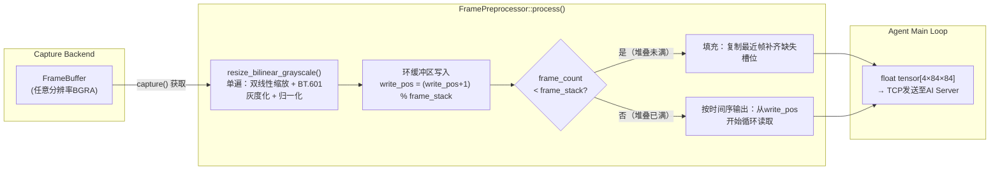
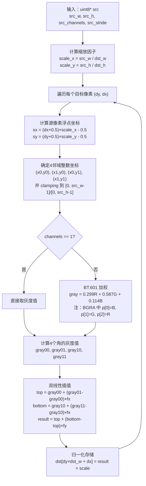
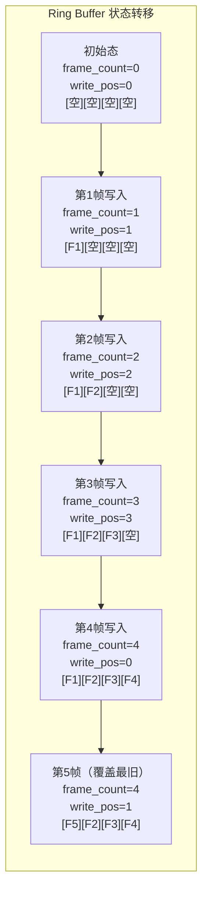

帧预处理管线是视觉游戏AI系统中连接「屏幕捕获」与「AI模型推理」的关键桥梁。它的核心使命是：将捕获后端产出的任意分辨率BGRA帧，转换为通用视觉模型所期望的标准张量输入——形状为 `(4, 84, 84)`、值域归一化到 `[0, 1]` 的float32多帧灰度堆叠。该管线在 `FramePreprocessor` 类中完整实现，是一整套严格流水线化的图像处理链，包含六个串联阶段：裁剪（由调用方指定region，不在类内部执行）→ 双线性缩放+灰度化（单遍融合）→ 归一化 `×1/255` → 环缓冲区堆叠 → 按时间序重组输出。

Sources: [preprocess.hpp](capture/include/preprocess.hpp#L1-L12)，[preprocess.cpp](capture/src/preprocess.cpp#L1-L3)

## 管线架构总览

整个管线的触发点位于 `agent/src/agent.cpp` 的主循环中：每一帧先通过 `capture->capture(frame_buf, &game_rect)` 获取裁剪后的 `FrameBuffer`，随后调用 `preproc.process(frame_buf, tensor)` 执行完整预处理。注意 `FramePreprocessor` 本身不执行裁剪——裁剪由捕获后端的 `capture()` 方法通过 `Rect` 参数完成，这保持了预处理器的纯粹性（只做像素格式转换，不关心窗口位置）。只有 `process()` 返回 `true`（即堆叠已满）时，`tensor_out` 中的张量才包含完整的4帧信息，此时Agent才会将其通过TCP发送给AI服务器。

Sources: [agent.cpp](agent/src/agent.cpp#L138-L152)

## 配置结构 PreprocessConfig

| 字段 | 类型 | 默认值 | 说明 |
|------|------|--------|------|
| `target_width` | int | 84 | 缩放目标宽度 |
| `target_height` | int | 84 | 缩放目标高度 |
| `frame_stack` | int | 4 | 堆叠帧数，即输出张量的通道维度 |
| `scale` | float | 1.0/255.0 | 归一化因子，将uint8 `[0,255]` 映射到float32 `[0,1]` |

这组参数就是预先与通用视觉CNN模型约定好的输入特征——模型的第一层卷积期望的正是 `(C=4, H=84, W=84)` 的张量。`target_width` 和 `target_height` 可以修改为其他尺寸（如128×128），但必须与模型训练时的输入尺寸一致。`frame_stack=4` 是一个标准选择：4帧灰度图足以编码短期运动信息（棋子的移动轨迹、棋盘状态变化），且计算开销可控。

Sources: [preprocess.hpp](capture/include/preprocess.hpp#L16-L22)

## 核心算法：单遍双线性缩放+灰度化

函数 `resize_bilinear_grayscale()` 是整个管线计算量最密集的环节，其核心设计思想是**融合**——将双线性插值缩放与灰度化合并为单遍操作，避免中间缓冲区的分配和数据搬运。算法流程如下：

坐标映射采用**中心对齐**策略（`+0.5` 偏移后再 `-0.5`），这是双线性缩放的常见做法——将目标像素视作一个点，映射到源图像中对应的浮点位置，然后对该位置周围的2×2邻域做加权平均。此方法比简单的 `floor(sx)` 直接取整更平滑，能有效减少锯齿。

灰度化采用ITU-R BT.601标准的亮度公式 `Y = 0.299R + 0.587G + 0.114B`。注意源数据是BGRA排列（`p[0]=Blue, p[1]=Green, p[2]=Red`），因此提取R/G/B时索引为 `p[2]/p[1]/p[0]`。Alpha通道被直接忽略——因为捕获窗口通常不透明，且游戏UI的透明通道不含有效信息。

归一化直接在最后一步通过 `pixel * cfg_.scale` 完成，其中 `scale = 1.0f / 255.0f`。这意味着 `resize_bilinear_grayscale` 的输出已经是 `[0,1]` 范围的float32值，**没有单独的归一化循环**。

Sources: [preprocess.cpp](capture/src/preprocess.cpp#L63-L127)

### 时间复杂度分析

设输入分辨率 `(W_in, H_in)`，输出分辨率 `(W_out=84, H_out=84)`。双线性缩放的时间复杂度为 `O(W_out × H_out)`，与输入分辨率无关！这是因为算法对**每个目标像素**执行固定次数的操作（4次读像素+2次插值），而非遍历所有源像素。对于84×84的输出，共7056个像素，每个像素需读取4个源像素（即最多28224次像素读取），这对现代CPU而言是微秒级的计算量。

**内存访问模式**：按行扫描输出（`dy`外层循环、`dx`内层循环），对源图像的空间局部性较好——同一行的目标像素大概率落在源图像的相邻行内，有利于CPU缓存命中。

## 环缓冲区帧堆叠机制

`FramePreprocessor` 内部维护了一个 `std::vector<float> ring_buffer_`，大小为 `frame_stack × H × W = 4 × 84 × 84 × 4B ≈ 113KB`，非常紧凑。堆叠机制的核心是**写位置指针 `write_pos_`** 的循环递增：

`process()` 每次被调用时先将新帧写入 `write_pos_` 指向的slot，然后更新 `write_pos_ = (write_pos_ + 1) % frame_stack`，并在 `frame_count_ < frame_stack` 时递增计数。当 `frame_count_` 达到4后，环缓冲区进入稳态——新帧覆盖最旧的帧，始终保持最新的4帧。

### 输出张量的时间序重组

输出 `tensor_out` 必须按**时间序（从旧到新）**排列，以确保模型接收到的数据与时间轴一致。这分为两种情况：

**情况一：堆叠未满（`frame_count_ < frame_stack`）**——此时缓冲区中有空洞，但Agent仍希望尽快获得推理结果。处理策略是用**最近的有效帧回填**缺失的槽位。例如只有2帧时，输出为 `[F1, F2, F2, F2]`，将最后一帧复制3次。这确保模型不会看到未初始化的零值，且刚启动时就能快速响应。

**情况二：堆叠已满（`frame_count_ == frame_stack`）**——从 `write_pos_` 开始循环读取 `[write_pos, write_pos+1, write_pos+2, write_pos+3] % frame_stack`，即按写入顺序输出。注意 `write_pos_` 指向的是**下一次要写入的位置**，因此当前最早帧在 `write_pos_` 处（它是上次循环中最早被覆盖的那个）。

输出使用 `memcpy` 逐通道复制，每个通道是连续的 `H×W` 个float，最终张量布局为 `[C0:84×84][C1:84×84][C2:84×84][C3:84×84]`——这正是ONNX和PyTorch的 `(C, H, W)` 格式，符合CNN视觉编码器的输入约定。

Sources: [preprocess.cpp](capture/src/preprocess.cpp#L23-L61)

## 与Agent主循环的集成

在Agent的实际运行时序中，预处理环节的位置和性能特征如下：

| 阶段 | 操作 | 典型耗时 |
|------|------|----------|
| `t0→t1` | DXGI捕获（含裁剪） | ~1-2ms |
| `t1→t2` | 预处理（缩放+灰度+归一化+堆叠） | **~0.1-0.3ms** |
| `t2→t3` | TCP发送张量 + 等待模型推理 + 接收响应 | ~5-50ms（取决于模型） |
| `t3→t4` | 动作令牌解码 + 输入模拟执行 | <1ms |

预处理阶段是整个管线中最轻量的环节（微秒级），远快于捕获（毫秒级）和网络传输（毫秒级）。这意味着即使在低端CPU上，预处理也不会成为瓶颈。同时，预处理**不涉及GPU操作**——所有计算全是纯CPU的标量浮点运算，无需CUDA/DirectCompute，这保证了与任意捕获后端的兼容性。

Sources: [agent.cpp](agent/src/agent.cpp#L156-L195)

## 关键设计决策

| 决策 | 选择 | 替代方案 | 考量 |
|------|------|----------|------|
| 色彩空间 | ITU-R BT.601灰度 | RGB均值、YUV直接取Y | BT.601的亮度权重更符合人眼感知，且是计算机视觉标准做法 |
| 缩放算法 | 双线性插值 | 最近邻、双三次、Lanczos | 最近邻锯齿严重；双三次/Lanczos计算量高数倍；双线性是精度/速度最优平衡 |
| 单遍融合 | 缩放+灰度+归一化一次完成 | 分三步独立做 | 避免中间缓冲区，减少内存带宽消耗，提升缓存局部性 |
| 堆叠未满策略 | 复制最后一帧补齐 | 等待直到堆叠满 | 减少启动延迟，AI初期即可获得近似结果 |
| 数据类型 | float32 | uint8、float16 | 模型推理需要float32；uint8需额外反量化；float16在CPU上无加速反而有精度损失 |
| 环缓冲区大小 | 4×84×84×4B ≈ 113KB | 可动态分配 | 极小的固定大小，L1/L2缓存可容纳，无堆分配开销 |

## 管线边界与约束

- **不支持颜色空间转换的逆操作**：管线是单向的——BGRA→灰度，不支持从灰度还原颜色。若未来需要彩色输入，需修改 `resize_bilinear_grayscale` 输出3通道值而非单通道。
- **不支持动态分辨率**：`target_width/target_height` 在构造时固定，但可通过销毁并重建 `FramePreprocessor` 的方式更改。
- **线程安全**：`FramePreprocessor` 不是线程安全的。`process()` 对 `ring_buffer_` 的写操作和 `write_pos_`/`frame_count_` 的修改未加锁。调用方（Agent主循环）应确保 `process()` 在单线程中串行调用。
- **内存所有权**：`tensor_out` 由调用方预分配，`FramePreprocessor` 不持有输出缓冲区所有权。在Agent实现中，`float tensor[4 * 84 * 84]` 是栈分配数组，零动态分配开销。

Sources: [preprocess.hpp](capture/include/preprocess.hpp#L37-L40)

## 下一步阅读

- [Agent主循环管线：捕获→预处理→TCP发送→接收动作令牌→解码→执行输入](13-agentzhu-xun-huan-guan-xian-bu-huo-yu-chu-li-tcpfa-song-jie-shou-dong-zuo-ling-pai-jie-ma-zhi-xing-shu-ru) — 查看预处理输出的张量如何进入AI推理管线
- [通用视觉Agent模型：CNN视觉编码器(4x84x84→256维) + Transformer自回归解码器](17-tong-yong-shi-jue-agentmo-xing-cnnshi-jue-bian-ma-qi-4x84x84-256wei-transformerzi-hui-gui-jie-ma-qi-sheng-cheng-dong-zuo-ling-pai-xu-lie-you-xi-wu-guan) — 了解84×84灰度堆叠张量如何被CNN编码
- [二进制线缆协议：魔数"FRAM" + 小端载荷大小/类型标签 + 体](19-er-jin-zhi-xian-lan-xie-yi-mo-shu-fram-xiao-duan-zai-he-da-xiao-lei-xing-biao-qian-ti-c-pythonshuang-duan-tong-bu) — 预处理后的张量通过该协议传输至AI服务器