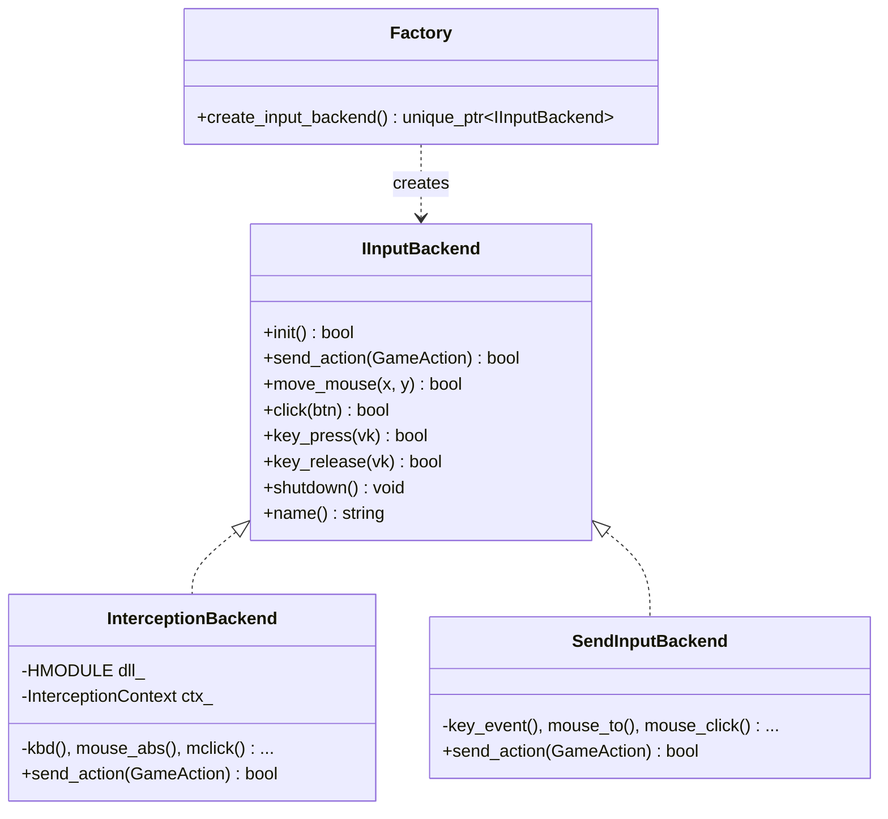

在视觉游戏AI系统中，输入模拟是一个关键的"最后一公里"问题：模型推理出"应该点击棋盘的中间格子"，但具体是使用硬件驱动级注入、还是系统API发送鼠标事件，是调用`mouse_event`还是`SendInput`，这些底层实现细节不应污染上层的决策逻辑。输入模块通过两层抽象——`GameAction`语义层与`IInputBackend`后端接口层——实现了"做什么"（What）与"怎么做"（How）的彻底分离。

Sources: [input.hpp](input/include/input.hpp#L1-L98)

---

## 第一层抽象：GameAction — 统一的动作语义

`GameAction`是一个C++数据结构体（POD类型），定义了9种与游戏交互相关的原子操作，涵盖了键盘、鼠标、等待三种基本交互维度：

| 类型枚举 | 含义 | 关键参数 |
|---|---|---|
| `KeyDown` / `KeyUp` / `KeyTap` | 按键按下/释放/敲击（按下+等待+释放） | `vk_code`（虚拟键码），`KeyTap`额外有`wait_ms` |
| `MouseMove` / `MouseMoveRelative` | 绝对坐标移动 / 相对偏移移动 | `(x,y)` 或 `(dx,dy)` |
| `MouseDown` / `MouseUp` / `MouseClick` | 鼠标按钮按下/释放/点击（移动+按下+释放） | `(x,y)` + `btn`（左/右/中键） |
| `Wait` | 等待指定时长 | `wait_ms` |

每个动作都配有静态工厂方法，使得构造动作的语法简洁且类型安全：

```cpp
// 构造一个"在屏幕(400,300)处左键点击"的动作
GameAction a = GameAction::click_at(400, 300, MouseButton::Left);
```

关键设计决策在于：`GameAction`**完全不耦合于任何一种具体的输入实现**。它只描述"在(400,300)处左键点击"这个意图，而不关心底层的`SendInput`结构体如何组装、Interception的`I_MouseStroke`如何填充。这是架构中最核心的抽象边界。

Sources: [input.hpp](input/include/input.hpp#L9-L67)

---

## 第二层抽象：IInputBackend — 多后端策略模式

`IInputBackend`是一个纯虚接口类，定义了输入模拟的契约：

```cpp
class IInputBackend {
public:
    virtual bool init() = 0;
    virtual bool send_action(const GameAction& a) = 0;
    virtual bool move_mouse(int x, int y) = 0;
    virtual bool click(MouseButton btn) = 0;
    virtual bool key_press(uint16_t vk) = 0;
    virtual bool key_release(uint16_t vk) = 0;
    virtual bool key_tap(uint16_t vk, int dur_ms) = 0;
    virtual const char* name() const = 0;
    virtual void shutdown() = 0;
};
```

所有具体后端都继承自该接口，通过虚函数多态实现。接口设计上提供了两种级别的API：

- **高层API**（`send_action`）：接收一个`GameAction`，内部switch分发到对应的底层操作
- **低层API**（`move_mouse`/`click`/`key_press`等）：为那些不需要经过`GameAction`语义包装的场景提供直接调用入口

工厂函数`create_input_backend()`负责返回当前激活的后端实例，使用者无需关心具体是哪个后端。

Sources: [input.hpp](input/include/input.hpp#L69-L98)

---

## 两端实现对比：InterceptionBackend vs SendInputBackend

当前代码库中有两个完整实现：



**InterceptionBackend**（`input_interception.cpp`）是内核级别的实现。它动态加载`interception.dll`（通过`LoadLibrary`运行时绑定，而非编译期硬链接），使用Interception驱动发送键盘/鼠标事件。关键特点：

- 内核级注入，事件从驱动层直接注入——对于反作弊系统不可检测
- 通过动态加载避免了编译期对Interception SDK的依赖，缺失`interception.dll`时优雅降级
- `mouse_abs()`使用`I_MOUSE_MOVE_ABSOLUTE`标志实现绝对坐标定位
- 初始化需要管理员权限（驱动安装要求），`create_context`失败时报错提示"Run as Admin?"

**SendInputBackend**（`input_sendinput.cpp`）是用户态的回退实现。它使用Win32 `SendInput()` API：

- 简单可靠，适用于大多数单机游戏和桌面应用
- 事件携带`LLMHF_INJECTED`标志，可被反作弊系统检测
- 鼠标绝对坐标需将像素坐标转换为0~65535范围的规范化值
- 初始化永远成功（`init()`直接`return true`），无需任何驱动或权限

当前工厂函数的默认策略是"优先尝试Interception，失败则回退SendInput"。在`input_sendinput.cpp`中作为编译单元的默认工厂，而`input_interception.cpp`则导出一个独立的`create_input_backend_interception()`函数，便于未来实现更精细的链接时覆盖（link-time override）选择机制。

Sources: [input_interception.cpp](input/src/input_interception.cpp#L1-L168), [input_sendinput.cpp](input/src/input_sendinput.cpp#L1-L130)

---

## 从动作到执行的完整管道

`GameAction → IInputBackend::send_action()`这条调用链在整个系统中贯穿了多个层级：

```
Agent主循环 → ActionMapper → GameAction → IInputBackend → 具体后端实现
```

在Agent代码中（`agent/src/agent.cpp`），模型输出的原始字节流经过三层转换：

1. **Token解码**（`ActionDecoder::decode`）：将模型输出的二进制token序列解析为`DecodedAction`结构。例如token `MOUSE_CLICK` + 两个float坐标 + 一个byte按钮，被解码为带绝对像素坐标的点击动作

2. **语义转换**（`ActionDecoder::to_game_action`）：将`DecodedAction`转换为`GameAction`——这是跨过抽象边界的一步，从此动作不再依赖token格式，只依赖统一的语义描述

3. **物理执行**（`GenericActionMapper::execute` → `IInputBackend::send_action`）：将`GameAction`交由当前激活的后端执行

这种三阶段设计保证了每层只负责自己的关注点：Token解码关心网络协议和二进制格式，`GameAction`关心语义完整性，后端关心物理实现细节。

Sources: [agent.cpp](agent/src/agent.cpp#L1-L216), [action_mapper.hpp](agent/include/action_mapper.hpp#L1-L101), [action_mapper.cpp](agent/src/action_mapper.cpp#L1-L131)

---

## 抽象边界的价值

将"做什么"与"怎么做"分离的架构选择，带来了几个关键收益：

**可替换性**：切换输入机制只需替换`IInputBackend`的实现，上层代码零改动。Interception驱动不可用时，自动降级到SendInput，Agent主循环不受影响。

**可测试性**：可以创建一个Mock后端，记录所有收到的`GameAction`用于测试验证。实际代码中`AgentConfig::dry_run`模式正是利用了这一接口抽象——设置`dry_run = true`时，`GenericActionMapper`的`execute`调用仍然走通，只是后端可以选择不实际执行。

**关注点分离**：`GameAction`的存在使得所有上层代码（Agent、模型映射）只需要理解"点击(400,300)左键"这种领域语言，而不需要知道`INPUT_MOUSE`结构体如何填充、`I_MouseStroke.flags`如何设置。

**未来扩展**：若要支持Linux下的`uinput`或macOS下的`CGEvent`，只需新增一个实现类，接入点不变。接口本身的稳定性保障了系统横向扩展能力。

Sources: [input.hpp](input/include/input.hpp#L1-L98), [input_interception.cpp](input/src/input_interception.cpp#L1-L168), [input_sendinput.cpp](input/src/input_sendinput.cpp#L1-L130)

---

## 下一步阅读

输入模块的设计是整个系统"Agent主循环管线"的基石。建议继续阅读以下相关页面以形成完整认知：

- [双后端策略：Interception驱动层与SendInput系统层](12-shuang-hou-duan-ce-lue-interceptionqu-dong-ceng-nei-he-ji-rao-guo-fan-zuo-bi-yu-sendinputxi-tong-ceng-apiji-ke-jian-ce) — 深入比较两种后端的实现机制与适用场景
- [Agent主循环管线：捕获→预处理→TCP发送→接收动作令牌→解码→执行输入](13-agentzhu-xun-huan-guan-xian-bu-huo-yu-chu-li-tcpfa-song-jie-shou-dong-zuo-ling-pai-jie-ma-zhi-xing-shu-ru) — 了解`GameAction`在完整Agent管线中的位置
- [通用动作编解码：ActionPool二进制协议](14-tong-yong-dong-zuo-bian-jie-ma-actionpooler-jin-zhi-xie-yi-shu-biao-yi-dong-dian-ji-an-jian-deng-dai-deng-10chong-cao-zuo-you-xi-wu-guan-de-biao-zhun-hua-ge-shi) — 从模型输出到`GameAction`的完整编码规范