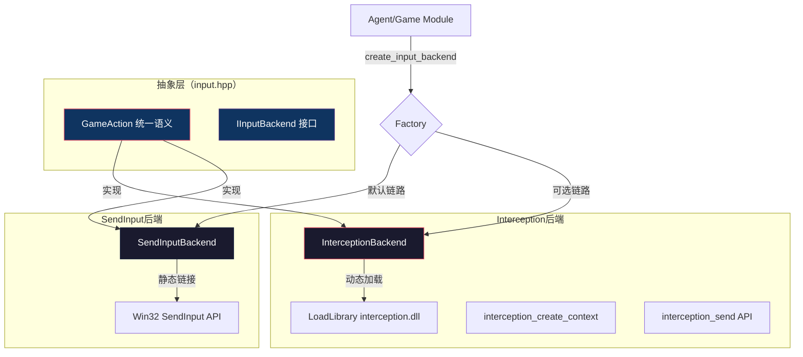

输入模拟（Input Simulation）是整个视觉游戏AI系统的"执行末端"——AI模型在像素空间做出决策后，需要通过某种方式将决策转化为真实的游戏操作。本项目采用**双后端策略**（Dual-Backend Strategy），在同一个抽象接口 `IInputBackend` 下同时支持两种截然不同的输入注入途径：内核级的Interception驱动后端和API级的SendInput系统后端。前者为驱动级注入，对游戏进程完全透明，能绕过绝大多数反作弊检测；后者为Win32 API注入，实现简单但携带 `LLMHF_INJECTED` 标记位，可被检测。这种"双轨制"设计让系统能够在开发调试阶段使用简便可检测的后端，在部署对抗反作弊环境时无缝切换到不可检测的内核级后端，而上层Agent管线无需知晓后端的差异。
Sources: [input.hpp](input/include/input.hpp#L1-L10), [input_sendinput.cpp](input/src/input_sendinput.cpp#L1-L130), [input_interception.cpp](input/src/input_interception.cpp#L1-L168)

## 抽象层架桥：GameAction统一语义

在深入后端细节之前，需要理解这两个后端的共同语言层——`GameAction` 结构体。这不是一个后端专属概念，而是整个项目"输入抽象层设计"的核心体现。`input.hpp` 中定义了10种原子操作类型：

| Action Type | 语义 | 参数字段 | 后端映射场景 |
|---|---|---|---|
| `KeyDown` | 按住某键 | `vk_code` | WASD移动、组合键 |
| `KeyUp` | 释放某键 | `vk_code` | 键位复位 |
| `KeyTap` | 点按（按+放） | `vk_code, wait_ms` | 井字棋格选择确认 |
| `MouseMove` | 绝对移动鼠标 | `x, y`（像素坐标） | 定位UI按钮 |
| `MouseMoveRelative` | 相对移动鼠标 | `dx, dy`（像素偏移） | FPS视角旋转 |
| `MouseDown` | 按住鼠标按钮 | `btn`（左/右/中） | 拖拽操作开始 |
| `MouseUp` | 释放鼠标按钮 | `btn` | 拖拽操作结束 |
| `MouseClick` | 定位+点击 | `x, y, btn` | 井字棋落子操作 |
| `Wait` | 等待 | `wait_ms` | 游戏帧间隔、动画等 |

Sources: [input.hpp](input/include/input.hpp#L14-L62), [action_mapper.hpp](agent/include/action_mapper.hpp#L1-L101)

这些Action构成"做什么"的语义层，而具体"怎么做"由后端的 `send_action()` 方法实现。`IInputBackend` 接口定义了完整的生命周期方法：`init()` → `send_action()` / `send_actions()` → `shutdown()`，外加 `move_mouse()`、`click()`、`key_press()` 等便捷方法。工厂函数 `create_input_backend()` 负责在运行时选择合适的后端。


Sources: [input.hpp](input/include/input.hpp#L64-L98), [input_interception.cpp](input/src/input_interception.cpp#L1-L168), [input_sendinput.cpp](input/src/input_sendinput.cpp#L1-L130)

## Interception驱动层：内核级不可检测注入

Interception是一个开源的Windows键盘鼠标过滤驱动程序，其核心原理是作为**内核态过滤驱动**嵌入Windows输入栈。当Interception驱动加载后，它会在键盘/鼠标设备栈中插入自己的过滤层。调用 `interception_send()` 时，输入事件从驱动层注入，不经过Win32消息子系统，因此生成的输入事件在硬件抽象层（HAL）层面与真实物理输入**完全不可区分**——没有 `LLMHF_INJECTED` 标记，没有 `SendInput` 的API调用栈特征，对目标游戏进程而言就如同用户真实按键一样。

### 动态加载与零硬依赖设计

`InterceptionBackend` 的实现采用了一种精妙的**动态加载模式**（Dynamic Loading Pattern），而不是传统的静态链接：

```cpp
bool init() override {
    dll_ = LoadLibraryA("interception.dll");
    if (!dll_) { /* gracefully fall back */ }
    
    #define LOAD(fn) pfn_##fn = (PFN_##fn)GetProcAddress(dll_, #fn);
    LOAD(interception_create_context);
    LOAD(interception_send);
    // ...
}
```

这种设计的工程价值有三重。其一，**零硬依赖**——系统在运行时不要求 `interception.dll` 必须存在，若缺失则优雅降级（返回 `nullptr`），编译产物不含对Interception的静态链接引用。其二，**运行时决策**——是否使用Interception完全取决于运行时环境是否有驱动支持，而非编译时决定，这让同一个二进制文件可以在不同机器上自适应选择后端。其三，**管理员提权隔离**——驱动上下文创建（`interception_create_context()`）需要管理员权限才能成功，动态加载使得非管理员环境可以自然回退而不崩溃。
Sources: [input_interception.cpp](input/src/input_interception.cpp#L30-L58), [input_interception.cpp](input/src/input_interception.cpp#L140-L168)

### 驱动安装与签名要求

Interception驱动使用测试签名，必须在系统上启用测试签名模式才能加载。安装流程为：下载驱动包 → `install-interception.exe`（管理员）安装驱动到 `C:\Windows\System32\drivers\interception.sys` → `bcdedit /set testsigning on` 开启测试签名 → 重启。从安全角度看，这种内核级驱动是双刃剑——它既能绕过游戏反作弊，也意味着执行进程本身需要高权限，且安装过程中系统的Secure Boot信任链会被破坏（测试签名模式）。
Sources: [interception.h](input/include/interception.h#L1-L23)

### 设备上下文与接口分派

初始化成功后，后端的设备分配策略为：键盘设备ID固定为1（`kbd_dev_ = 1`），鼠标设备ID固定为2（`mouse_dev_ = 2`），所有键盘操作通过 `interception_send(ctx_, kbd_dev_, &stroke, 1)` 发送，鼠标操作通过 `mouse_dev_` 发送。每种动作类型的实现对应到Interception的原生stroke结构：

- **键盘按下/释放**：构造 `I_KbdStroke{code, state, information}`，其中 `code` 为虚拟键码，`state` 为 `I_KEY_DOWN(0x00)`或`I_KEY_UP(0x01)`
- **鼠标绝对移动**：构造 `I_MouseStroke{state=I_MOUSE_MOVE, flags=I_MOUSE_MOVE_ABSOLUTE, x, y}`，坐标直接使用屏幕像素值
- **鼠标相对移动**：构造 `I_MouseStroke{state=I_MOUSE_MOVE, flags=0, x=dx, y=dy}`，无绝对标志位
- **鼠标按钮**：根据 `MouseButton` 类型选择对应的上下行state常量

值得注意的时序细节是，点击操作的实现中包含了**硬编码的等待间隔**：`mbtn(down) → wait_ms(30) → mbtn(up) → wait_ms(20)`。这个30ms+20ms的间隔是经过权衡的——太短可能导致游戏无法识别点击事件，太长则增加人类输入延迟（单次点击约50ms的输入时长在可接受范围内）。
Sources: [input_interception.cpp](input/src/input_interception.cpp#L60-L139)

## SendInput系统层：API级可检测注入

`SendInputBackend` 使用Windows标准的 `SendInput()` API注入输入事件。作为Win32 API的一部分，`SendInput` 向系统输入队列插入 `INPUT` 结构体，这些事件会经过常规的消息泵分发给目标窗口。

### 绝对坐标归一化差异

一个关键的实现差异在于鼠标绝对移动的坐标处理。SendInput使用**归一化坐标系**（0~65535范围），而Interception直接使用**像素坐标系**：

```cpp
// SendInput: 归一化到0~65535
input.mi.dx = (LONG)((double)x / sw * 65535);
input.mi.dy = (LONG)((double)y / sh * 65535);

// Interception: 直接使用像素
s.x = x;  s.y = y;
```

SendInput的坐标归一化源于Windows早期多显示器时代的兼容性设计——`MOUSEEVENTF_ABSOLUTE` 标志位要求坐标映射到虚拟桌面空间的0~65535范围。这种归一化引入了一个微妙的精度问题：对于高分辨率屏幕（如4K 3840x2160），每个像素映射到约17个归一化单位（65535/3840），理论上精度足够；但对于低分辨率窗口（如井字棋300x300），归一化后可能出现取整误差导致像素偏移。而Interception直接接受像素坐标，从语义上看更为直接。
Sources: [input_sendinput.cpp](input/src/input_sendinput.cpp#L69-L81), [input_interception.cpp](input/src/input_interception.cpp#L104-L113)

### 可检测性根源

SendInput的注入事件在目标进程中可以通过钩子（SetWindowsHookEx WH_GETMESSAGE）或原始输入（Raw Input API）捕获，并且在 `MSG` 结构体的 `wParam` 中携带 `LLMHF_INJECTED`（0x00000001）或 `LLMHF_LOWER_IL_INJECTED`（0x00000002）标记。这些标记是由Windows内核在事件注入时自动设置的，无法通过常规手段清除。现代反作弊系统（如Easy Anti-Cheat、BattlEye、Vanguard）会主动扫描这些标记位，一旦发现输入事件包含 `LLMHF_INJECTED`，即刻判定为自动化工具并封禁。
Sources: [input_sendinput.cpp](input/src/input_sendinput.cpp#L1-L130)

## 工厂模式与双后端的运行时选择

整个双后端策略的调度核心在工厂函数 `create_input_backend()` 中。当前默认实现（位于 `input_sendinput.cpp`）直接返回SendInput后端。而 `input_interception.cpp` 中定义了一个独立的导出函数 `create_input_backend_interception()`，该函数尝试初始化Interception后端，若失败（无驱动/无权限）则返回 `nullptr`。

这种设计暗示了未来可扩展的升级路径——通过链接时符号覆盖或配置驱动的方式，让 `create_input_backend()` 优先尝试Interception：

```
当前链路：create_input_backend() → SendInputBackend (硬编码默认值)
扩展链路：create_input_backend() → InterceptionBackend (优先尝试) → SendInputBackend (回退)
```

`agent/build.cmd` 当前的编译命令只链接 `input_sendinput.cpp`，而未含 `input_interception.cpp`，这是因为在开发/演示阶段（井字棋PoC），SendInput的功能已完全满足需求。但对于需要对抗反作弊的通用游戏场景，编译时需要同时链接 `input_interception.cpp`，并通过改进的工厂逻辑实现优先级选择。
Sources: [input_sendinput.cpp](input/src/input_sendinput.cpp#L109-L115), [input_interception.cpp](input/src/input_interception.cpp#L162-L168), [build.cmd](agent/build.cmd#L1-L8)

## 后端对比总览

| 维度 | Interception (驱动层) | SendInput (系统层) |
|---|---|---|
| **注入层级** | 内核态（驱动过滤） | 用户态（Win32 API） |
| **可检测性** | 不可检测（无注入标记） | 可检测（LLMHF_INJECTED标志位） |
| **运行时依赖** | `interception.dll` + 驱动安装 + 管理员权限 | 仅Win32系统库 |
| **加载方式** | `LoadLibrary` 动态加载，零硬依赖 | 静态链接 `user32.lib` |
| **鼠标坐标** | 直接像素（屏幕坐标） | 归一化0~65535 |
| **安装复杂度** | 高（驱动签名+管理员） | 无（内置API） |
| **适用场景** | 生产部署、反作弊环境 | 开发调试、单机游戏 |
| **失败回退** | 内置（返回nullptr） | 是默认回退项 |

## 集成到Agent管线

在Agent主循环（`agent.cpp`）中，输入后端的创建发生在管线初始化阶段，仅执行一次：

```
创建捕获后端 → 创建输入后端 → 定位游戏窗口 → 连接AI服务器
                    ↑
           create_input_backend()
              → Interception? 或 SendInput?
```

创建后的输入后端通过 `GenericActionMapper` 与Agent管线对接。`GenericActionMapper` 持有一个 `IInputBackend*` 指针，将解码后的动作流（`DecodedAction`）转换为 `GameAction`，再调用 `backend_->send_action()` 执行。Agent管线完全不知道当前使用的是哪个后端——`IInputBackend` 接口提供了完美的抽象屏障。
Sources: [agent.cpp](agent/src/agent.cpp#L25-L35), [action_mapper.hpp](agent/include/action_mapper.hpp#L85-L101), [action_mapper.cpp](agent/src/action_mapper.cpp#L110-L131)

这种设计遵循了**策略模式**（Strategy Pattern）的核心思想：客户端（Agent）不直接与具体策略（具体后端）耦合，而是通过抽象接口与整个策略家族交互。新的输入后端（如未来可能的`mousemove`、`pyautogui`、`AutoIt`后端）只需要实现同样的接口，即可无缝接入现有管线。

---

**继续阅读**：[输入抽象层设计：GameAction统一语义 + IInputBackend接口，分离"做什么"与"怎么做"](11-shu-ru-chou-xiang-ceng-she-ji-gameactiontong-yu-yi-iinputbackendjie-kou-fen-chi-zuo-shi-yao-yu-zen-yao-zuo)，理解输入抽象层如何在更高维度统合这些后端。