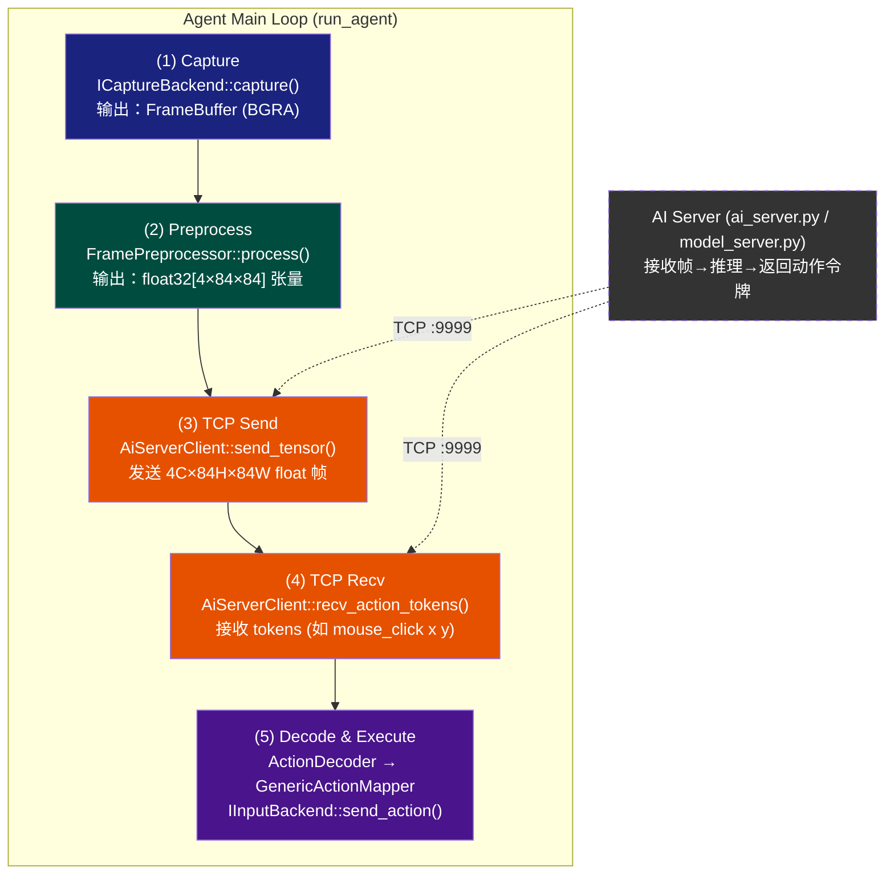
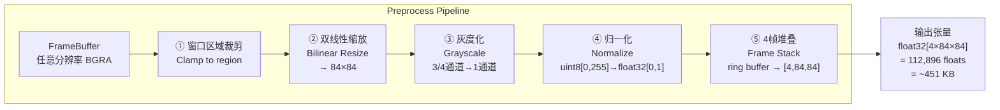

Agent是整个系统的「虚拟人类」——它像人一样看着屏幕（捕获），理解画面（预处理），请AI做决策（TCP通信），然后动手操作（输入模拟）。它的核心循环是一条从像素到物理动作的纯机械管线，一个帧接一个帧地驱动游戏交互。

## 架构总览：五阶段管线

Agent的main loop可以被精确地分解为五个时序严格的首尾相连阶段。每一个阶段都是独立的模块，有明确的输入输出契约，耦合仅通过数据结构传递。



这个管线是**游戏无关**的——Agent自己不知道什么是井字棋，它只做一件事：把像素传给服务器，把动作令牌喂给输入系统。游戏知识全部在AI服务器的模型权重里。

Sources: [agent.cpp](agent/src/agent.cpp#L1-L100), [agent.hpp](agent/include/agent.hpp#L1-L33)

---

## 阶段一：屏幕捕获（Capture）

管线起点。Agent通过 `ICaptureBackend` 接口捕获目标游戏窗口的当前帧画面。

```cpp
// capture.hpp — 抽象接口
class ICaptureBackend {
    virtual bool init() = 0;
    virtual bool capture(FrameBuffer& out, const Rect* region = nullptr) = 0;
    virtual bool get_window_rect(const wchar_t* title, Rect& out) = 0;
    virtual const char* name() const = 0;
    virtual void shutdown() = 0;
};
```

Agent启动时通过工厂函数 `create_capture_backend()` 自动选择最佳后端。当前首选 **DXGI Desktop Duplication**（GPU加速，典型1-2ms），回退到 **GDI BitBlt**（纯CPU，5-10ms）。

关键路径：

1. **`get_window_rect(title, rect)`** — 用窗口标题定位游戏窗口边界，返回 `Rect{x, y, w, h}`
2. **`capture(frame_buf, &rect)`** — 截取窗口矩形区域的BGRA像素，存入 `FrameBuffer{width, height, channels, data, timestamp_us}`

```cpp
// agent.cpp — 启动阶段的核心调用链
auto capture = create_capture_backend();
Rect game_rect = {};
capture->get_window_rect(cfg.window_title.c_str(), game_rect);
// 然后进入循环：
capture->capture(frame_buf, &game_rect);  // 每帧调用
```

注意 `FrameBuffer` 不携带任何格式信息以外的语义——就是一片矩形的BGRA像素。这是一个有意的设计选择：捕获层只需要回答"窗口长什么样"，不关心"画面里有什么"。

Sources: [capture.hpp](capture/include/capture.hpp#L1-L67), [agent.cpp](agent/src/agent.cpp#L139-L143)

---

## 阶段二：帧预处理（Preprocess）

捕获的原始BGRA帧不能直接喂给AI模型。`FramePreprocessor` 负责将任意分辨率的窗口截图转化为模型可消费的标准化张量。

预处理管线包含五个子步骤，按顺序执行：



**堆叠机制**：AI模型看到的不是单帧，而是连续4帧的灰度图像堆叠。这帧叠（frame stacking）让模型感知到运动信息——棋子落下的瞬间、鼠标移动的轨迹——单帧静态图像里没有的时序信号。

`FramePreprocessor` 内部维护一个环形缓冲区（ring buffer）来存储最近4帧的预处理结果：

```cpp
class FramePreprocessor {
    bool process(const FrameBuffer& frame, float* tensor_out) {
        // 1) 双线性缩放+灰度化 → 当前帧写入 ring_buffer_[write_pos_]
        // 2) write_pos_ 循环递增
        // 3) 如果 frame_count_ >= 4，将 ring_buffer 按正确顺序拷贝到 tensor_out
        // 返回 true 表示堆叠已满（可以推理了）
    }
    bool is_ready() const { return frame_count_ >= 4; }
};
```

只有当 `is_ready()` 返回 `true` 时，`tensor_out` 中的4帧堆叠才完整有效。前3帧时返回 `false`，主循环会跳过推理继续捕获。

Sources: [preprocess.hpp](capture/include/preprocess.hpp#L1-L58), [agent.cpp](agent/src/agent.cpp#L152-L155)

---

## 阶段三：TCP发送张量（Tensor Send）

预处理完成的 `float32[4×84×84]` 张量通过TCP套接字发送给AI服务器。这一步把物理世界（像素快照）的信息传递到数字智能（模型推理）的领地。

Agent使用内联的 `AiServerClient` 类（而非 `common/transport/tcp.hpp` 的广播式TcpSender），因为Agent与AI服务器是1:1的请求-响应关系，不需要广播。

发送协议是自定义的紧凑二进制格式：

```
[header: 16 bytes]     [payload: 4×84×84×4 = 112,896 bytes]
┌──────┬──────┬──────┬──────┐  ┌──────────────────────┐
│ size │   C  │   H  │   W  │  │  float32[4×84×84]   │
│uint32│uint32│uint32│uint32│  │   小端编码           │
└──────┴──────┴──────┴──────┘  └──────────────────────┘
  整包大小   4     84     84
 (112908)
```

```cpp
// agent.cpp — 发送实现
bool send_tensor(const float* data, int channels, int height, int width) {
    int data_size = channels * height * width * sizeof(float);
    uint32_t header[4] = {
        htonl(data_size + 12),   // 总大小 = 数据体 + 12字节头
        htonl(channels),          // 4
        htonl(height),            // 84
        htonl(width)             // 84
    };
    if (!send_all((char*)header, sizeof(header))) return false;
    return send_all((char*)data, data_size);
}
```

为什么不用前面定义的 `protocol.h` 的 "FRAM" 协议？Agent与AI服务器之间的通信是内部高速通道，需要最小化解析开销。4个uint32的头比"FRAM+type_tag"更紧凑，对这种固定格式的张量传输来说效率更高。这是**面向连接**的协议选择——Agent不和任意第三方通信，只和它配对的AI服务器对话。

Sources: [agent.cpp](agent/src/agent.cpp#L38-L53), [protocol.h](protocol/protocol.h#L1-L80)

---

## 阶段四：接收动作令牌（Recv Action Tokens）

发送帧后，Agent阻塞等待服务器的响应。服务器（`ai_server.py` 或未来的 `model_server.py`）将帧输入模型做前向推理，输出一串动作令牌（action tokens），通过同一个TCP连接发送回来。

```cpp
// agent.cpp — 接收实现
bool recv_action_tokens(std::vector<uint8_t>& tokens) {
    uint8_t buf[512];  // 足够容纳32个令牌
    int n = recv(sock_, (char*)buf, sizeof(buf), 0);
    if (n <= 0) return false;
    tokens.assign(buf, buf + n);
    return true;
}
```

接收的原始字节流（raw tokens）是一串紧凑编码的动作序列。关于令牌格式的完整定义在 `action_mapper.hpp` 中。5秒超时由 `SO_RCVTIMEO` 设置，在建立连接时配置：

```cpp
// 连接时设置接收超时
DWORD tv = 5000;
setsockopt(sock_, SOL_SOCKET, SO_RCVTIMEO, (char*)&tv, sizeof(tv));
```

如收不到响应（网络问题或服务器崩溃），Agent会打印 "Recv error/timeout"，直接跳过该帧进入下一次循环，不回退、不重试。这种**fail-skip**策略保证了管线不会因为一次网络抖动而永久阻塞。

Sources: [agent.cpp](agent/src/agent.cpp#L55-L62, L110-L113)

---

## 阶段五：解码与执行（Decode & Execute）

收到的原始令牌字节被送入 `ActionDecoder::decode()` 解析成语义化的 `DecodedAction` 列表，然后由 `GenericActionMapper` 逐条交予输入后端执行。

### 解码器：二进制→语义

每个动作令牌的格式由 `action_mapper.hpp` 枚举定义，包含10种动作类型：

| Token类型 | 编码长度 | 参数 | 示例 |
|-----------|---------|------|------|
| `MOUSE_MOVE_ABS` | 9字节 | token(1) + x_norm(float,4) + y_norm(float,4) | 将鼠标移到屏幕归一化坐标(0.5, 0.3) |
| `MOUSE_MOVE_REL` | 9字节 | token(1) + dx(int,4) + dy(int,4) | 相对移动+50, -20像素 |
| `MOUSE_CLICK` | 10字节 | token(1) + x(float,4) + y(float,4) + btn(uint8,1) | 在归一化位置点左键 |
| `MOUSE_DOWN/UP` | 2字节 | token(1) + btn(uint8,1) | 按下/释放鼠标按钮 |
| `KEY_PRESS/RELEASE` | 3字节 | token(1) + vk_code(uint16,2) | 按下空格键(VK_SPACE) |
| `KEY_TAP` | 7字节 | token(1) + vk_code(uint16,2) + duration_ms(int,4) | 点击W键持续50ms |
| `WAIT` | 5字节 | token(1) + duration_ms(int,4) | 等待100ms |
| `SCROLL` | 5字节 | token(1) + delta(int,4) | 滚轮滚动120单位 |
| `NOOP` (255) | 1字节 | — | 序列终结符（padding） |

核心解码逻辑：

```cpp
// action_mapper.cpp — ActionDecoder::decode() 核心
while (i < raw.size()) {
    auto token = static_cast<ActionToken>(raw[i++]);
    if (token == ActionToken::NOOP) break;  // 遇到NOOP停止

    switch (token) {
    case ActionToken::MOUSE_MOVE_ABS: {
        // 读取归一化坐标 (0..1) → 乘以屏幕宽高 → 绝对像素坐标
        float xn, yn;
        memcpy(&xn, &raw[i], 4); i += 4;
        memcpy(&yn, &raw[i], 4); i += 4;
        da.x = (int)(xn * screen_w_);
        da.y = (int)(yn * screen_h_);
        break;
    }
    // ... 其他类型类似
    }
    result.push_back(da);
}
```

**坐标归一化**是关键设计：模型输出的坐标是 `[0,1]` 范围内的浮点数，`ActionDecoder` 在构造时获取屏幕尺寸，在解码阶段将归一化坐标映射为绝对像素坐标。这让模型与目标窗口的分辨率解耦——同一个模型权重可以操作800×600和1920×1080的游戏窗口。

### 映射器：语义→物理操作

`GenericActionMapper` 是连接 `DecodedAction` 和 `IInputBackend` 的薄层，没有游戏逻辑，只做类型转换：

```cpp
bool GenericActionMapper::execute(const std::vector<DecodedAction>& actions) {
    for (auto& da : actions)
        if (!execute_one(da)) return false;
    return true;
}

bool GenericActionMapper::execute_one(const DecodedAction& action) {
    GameAction ga = ActionDecoder::to_game_action(action);
    return backend_->send_action(ga);
}
```

`to_game_action()` 将10种令牌类型映射到 `IInputBackend::send_action()` 可消费的 `GameAction` 联合体。输入后端 `IInputBackend` 有双实现：

| 后端 | 实现级别 | 适用场景 | 可检测性 |
|------|---------|---------|---------|
| **SendInput** | Win32 API层 | 大多数单机游戏，快速原型 | 可检测（LLMHF_INJECTED标志） |
| **Interception** | 内核驱动层 | 带反作弊的竞技游戏 | 较难检测 |

当前工厂函数默认创建 `SendInputBackend`（`input_sendinput.cpp`），Interception后端（`input_interception.cpp`）作为备选在编译时启用。

```cpp
// input_sendinput.cpp — SendInput对GameAction的处理示例
bool send_action(const GameAction& a) override {
    switch (a.type) {
    case GameAction::MouseClick:
        return mouse_to(a.x, a.y) &&  // 移动鼠标到像素坐标
               wait_ms(10) &&          // 短暂停顿
               mouse_click(a.btn);    // 执行点击
    case GameAction::KeyTap:
        return key_event(a.vk_code, 0) &&           // 按键按下
               wait_ms(a.wait_ms) &&                 // 保持等待
               key_event(a.vk_code, KEYEVENTF_KEYUP); // 按键释放
    // ...
    }
}
```

Sources: [action_mapper.hpp](agent/include/action_mapper.hpp#L1-L101), [action_mapper.cpp](agent/src/action_mapper.cpp#L1-L131), [input.hpp](input/include/input.hpp#L1-L98), [input_sendinput.cpp](input/src/input_sendinput.cpp#L1-L130)

---

## 主循环时序与控制流

完整的单帧管线时序：

```cpp
while (!g_quit_flag) {
    auto t0 = capture_now_us();       // ← 开始计时

    // (1) 捕获
    capture->capture(frame_buf, &game_rect);
    auto t1 = capture_now_us();

    // (2) 预处理（如果堆叠未就绪则跳过）
    if (!preproc.process(frame_buf, tensor)) {
        sleep_ms(10); continue;       // 等待更多帧
    }
    auto t2 = capture_now_us();

    // (3) 发送张量
    server.send_tensor(tensor, 4, 84, 84);
    auto t3 = capture_now_us();       // 理论上在t2之后立即

    // (4) 接收令牌
    raw_tokens.clear();
    server.recv_action_tokens(raw_tokens);
    auto t4 = capture_now_us();

    // (5) 解码+执行
    auto decoded = decoder.decode(raw_tokens);
    if (!cfg.dry_run) {
        mapper.execute(decoded);
    }
    auto t5 = capture_now_us();

    // 延迟控制
    sleep_ms(cfg.frame_interval_ms);  // 帧间隔（井字棋默认100ms）
}
```

Agent支持两种运行模式：

| 选项 | 作用 |
|------|------|
| `--verbose` | 打印每帧各阶段耗时（cap/pre/net/act/total） |
| `--dry-run` | 仅捕获+推理，不执行输入（调试/基准测试用） |
| `--interval MS` | 帧间隔控制（回合制游戏设100-200ms，实时游戏设16-33ms） |
| `--games N` | 最大游戏局数（0=无限） |

典型井字棋场景下的延时分布（verbose输出示例）：

```
[1] cap=1.2ms pre=3.5ms net=1.8ms act=0.3ms total=6.8ms tokens=2
[10] .......... (每10帧打一个点，非verbose模式)
```

Source: [agent.cpp](agent/src/agent.cpp#L93-L180), [agent.hpp](agent/include/agent.hpp#L1-L33)

---

## 错误处理策略

Agent管线采用**快速失败+静默跳过**的设计哲学，而非重试或阻塞：

| 故障场景 | 行为 |
|---------|------|
| 窗口未找到 | 启动时报错退出，不会空转 |
| TCP连接失败 | 启动时报错退出，提示启动AI服务器 |
| 捕获失败（DXGI丢帧） | `sleep_ms(10); continue;` 跳过该帧 |
| 预处理未就绪 | `sleep_ms(10); continue;` 等帧堆叠满 |
| TCP发送失败 | `break;` 退出主循环——连接已不可用 |
| TCP接收超时/错误 | `continue;` 跳过本轮动作，等下一帧 |
| ActionDecoder遇到无效token | 忽略该token，继续解析后续 |

Source: [agent.cpp](agent/src/agent.cpp#L93-L180)

---

## 配置入口：CLI参数体系

`agent.exe` 通过命令行参数配置运行行为，参数解析在 `main.cpp` 中实现：

```bash
# 典型井字棋用法
agent.exe --window "Tic Tac Toe" --server 127.0.0.1:9999 --interval 100

# 调试模式（不执行实际输入）
agent.exe --window "main.exe" --dry-run --verbose

# 完整参数
agent.exe --help
```

```
Usage: agent.exe [options]
Options:
  --window TITLE     Game window title (required)
  --server HOST:PORT AI server address (default: 127.0.0.1:9999)
  --interval MS      Frame interval in ms (default: 100)
  --games N          Max games (default: unlimited)
  --verbose          Show per-frame latency
  --dry-run          Don't simulate input (debug mode)
  --help             Show this help
```

Source: [main.cpp](agent/src/main.cpp#L1-L64)

---

## 总结：管线两端的对称设计

Agent管线的优雅之处在于对称性：

- **输入端**：捕获接口 `ICaptureBackend` 屏蔽了WGC/DXGI/GDI的差异——上层看起来都一样是 `FrameBuffer`
- **输出端**：输入接口 `IInputBackend` 屏蔽了SendInput/Interception的差异——上层看起来都一样是 `send_action(GameAction)`
- **中间层**：TCP通信+令牌协议让Agent与AI服务器在物理上解耦，Agent可以在另一台机器上运行

这种设计让Agent主循环仅用约200行C++代码就实现了从像素到物理动作的完整闭环，且与具体游戏内容完全无关。

---

**下一步建议**：
- 想了解动作令牌格式的完整规范 → [通用动作编解码：ActionPool二进制协议](14-tong-yong-dong-zuo-bian-jie-ma-actionpooler-jin-zhi-xie-yi-shu-biao-yi-dong-dian-ji-an-jian-deng-dai-deng-10chong-cao-zuo-you-xi-wu-guan-de-biao-zhun-hua-ge-shi)
- 想了解AI服务器如何接收帧并推理 → [井字棋MLP模型：9维输入→3层全连接→策略头+价值头](15-jing-zi-qi-mlpmo-xing-9wei-shu-ru-3ceng-quan-lian-jie-ce-lue-tou-9-logits-jie-zhi-tou-tanh-1-1-ke-50msnei-cputui-li)
- 想了解捕获后端的实现细节 → [捕获引擎架构：ICaptureBackend与五种后端](8-bu-huo-yin-qing-jia-gou-chou-xiang-jie-kou-icapturebackend-yu-wu-chong-hou-duan-wgc-desktopblt-getwindowdc-printwindow-screenbitblt)
- 想了解预处理管线的完全实现 → [帧预处理管线](10-zheng-yu-chu-li-guan-xian-ren-yi-fen-bian-lu-bgra-cai-jian-84x84shuang-xian-xing-suo-fang-hui-du-hua-4zheng-dui-die-gui-hua-float32zhang-liang)