在整个像素→动作闭环中，AI模型（Transformer自回归解码器）输出的原生产物是离散的**token序列**——一个0~255之间的整数列表，需要被解码为操作系统级别的物理输入事件，才能驱动游戏窗口中的交互。ActionPool协议正是这道"语义鸿沟"上的标准化桥梁：定义了一套**游戏无关的二进制编解码格式**，将模型输出的紧凑token流翻译为鼠标移动、点击、按键按压、等待等10种可执行动作，且不携带任何井字棋（或其他游戏）的特定知识。

该协议横跨C++ agent端（解码执行）与Python模型端（编码生成），由 `agent/src/action_mapper.cpp` 与 `model/action_space.py` 双端同步实现，共享同一套token分配表。

Sources: [action_mapper.hpp](agent/include/action_mapper.hpp#L1-L100), [action_space.py](model/action_space.py#L1-L137)

---

## 协议架构总览：从Token序列到物理按键的三层映射

ActionPool协议不是单一的函数，而是一个**端到端的编解码管线**，分为三个逻辑层次：

```mermaid
flowchart LR
    subgraph "模型输出 (Python)"
        A[Transformer Decoder] -->|"离散整数序列<br>[2, 0.5, 0.3, 0, ...]"| B[tokens_to_actions<br>语义解析]
    end

    subgraph "线缆格式 (二进制)"
        B --> C[actions_to_bytes<br>结构化序列化]
        C -->|"TCP 传输<br>裸字节流"| D[ActionDecoder.decode<br>反序列化]
    end

    subgraph "物理执行 (C++)"
        D --> E[DecodedAction<br>像素坐标]
        E --> F[ActionDecoder.to_game_action<br>GameAction 统一语义]
        F --> G[GenericActionMapper.execute<br>IInputBackend 物理驱动]
    end

    style A fill:#e1f5fe,stroke:#0288d1
    style B fill:#e1f5fe,stroke:#0288d1
    style C fill:#fff3e0,stroke:#f57c00
    style D fill:#fff3e0,stroke:#f57c00
    style E fill:#f3e5f5,stroke:#7b1fa2
    style F fill:#f3e5f5,stroke:#7b1fa2
    style G fill:#f3e5f5,stroke:#7b1fa2
```



**层级一：模型端语义解析（Python）**—— `model/action_space.py` 中的 `tokens_to_actions()` 函数接收Transformer自回归解码器生成的一串整数token（每个token取值0~255），按固定模式解析出 `ParsedAction` 结构体列表。例如token序列 `[2, 128, 64, 0, 255]` 被解析为 "在屏幕归一化坐标(0.5, 0.25)处点击左键"。

**层级二：二进制序列化（线缆格式）**—— `actions_to_bytes()` 将 `ParsedAction` 列表压扁为紧凑的二进制字节流，通过TCP发送给C++ agent进程。反过来，`ActionDecoder::decode()` 将此字节流还原为 `DecodedAction` 列表。

**层级三：物理输入执行（C++）**—— `ActionDecoder::to_game_action()` 将 `DecodedAction` 中的像素坐标（已从归一化还原为屏幕绝对坐标）转换为 `GameAction` 统一语义，再由 `GenericActionMapper::execute()` 通过 `IInputBackend` 接口派发到Interception驱动层或SendInput API。

Sources: [action_mapper.cpp](agent/src/action_mapper.cpp#L1-L131), [action_space.py](model/action_space.py#L61-L137)

---

## Token 词汇表：10种动作类型的二进制定义

每个动作在token流中以**类型头字节**（ActionToken枚举值）开头，后跟数量不等的参数字段。模型输出的token序列是变长的——遇到 `NOOP(255)` 即刻截断，之后所有token被忽略。

| Token | 枚举值 | 中文语义 | 后续参数字段 | 总字节数 | 典型用例 |
|-------|--------|----------|-------------|----------|----------|
| `MOUSE_MOVE_ABS` | 0 | 鼠标绝对移动 | `x_norm:float32`, `y_norm:float32` | 9 | 将鼠标移到(0.3, 0.5)归一化坐标 |
| `MOUSE_MOVE_REL` | 1 | 鼠标相对移动 | `dx:int32`, `dy:int32` | 9 | 鼠标向右偏移50像素 |
| `MOUSE_CLICK` | 2 | 鼠标点击（带位置） | `x_norm:float32`, `y_norm:float32`, `btn:uint8` | 10 | 在(0.5,0.5)处左键点击（井字棋主要操作） |
| `MOUSE_DOWN` | 3 | 鼠标按键按下 | `btn:uint8` | 2 | 仅按下右键 |
| `MOUSE_UP` | 4 | 鼠标按键释放 | `btn:uint8` | 2 | 释放中键 |
| `KEY_PRESS` | 5 | 键盘按键按下 | `vk_code:uint16` | 3 | 按下空格键(0x20) |
| `KEY_RELEASE` | 6 | 键盘按键释放 | `vk_code:uint16` | 3 | 释放W键(0x57) |
| `KEY_TAP` | 7 | 键盘按键敲击 | `vk_code:uint16`, `duration_ms:int32` | 7 | 按下W键后50ms释放 |
| `WAIT` | 8 | 等待 | `ms:int32` | 5 | 等待100ms |
| `NOOP` | 255 | 无操作（序列终止） | 无 | 1 | 所有动作序列的结尾标记 |

参数字段的编码均采用**小端序**（little-endian），与整个项目的 `protocol/protocol.h` 线缆格式一致。归一化坐标 `x_norm` 和 `y_norm` 取值区间为 `[0.0, 1.0]`，分别表示在屏幕或窗口宽度/高度上的比例位置——这正是模型输出的原生形式，由C++解码器在 `ActionDecoder::decode()` 中乘以屏幕实际尺寸还原为像素坐标：

```cpp
// MOUSE_MOVE_ABS case
float xn, yn;
memcpy(&xn, &raw[i], 4); i += 4;
memcpy(&yn, &raw[i], 4); i += 4;
da.x = (int)(xn * screen_w_);
da.y = (int)(yn * screen_h_);
```

这种归一化策略使得模型输出的坐标值与具体窗口分辨率解耦：模型只需学习"移动到画面中间"（0.5, 0.5），而不关心窗口是800×600还是1920×1080。

Sources: [action_mapper.hpp](agent/include/action_mapper.hpp#L10-L40), [action_mapper.cpp](agent/src/action_mapper.cpp#L28-L45), [action_space.py](model/action_space.py#L1-L50)

---

## 二进制序列化格式：Python端编码 vs C++端解码

Python端 `actions_to_bytes()` 与C++端 `ActionDecoder::decode()` 形成了严格对称的编码/解码对，两者必须时刻保持同步。

### 编码器：Python → C++ 字节流

```python
def actions_to_bytes(actions: List[ParsedAction]) -> bytes:
    buf = bytearray()
    for a in actions:
        buf.append(a.type & 0xFF)          # 1 byte header
        if a.type == TOK_MOUSE_MOVE_ABS:
            buf += struct.pack('<ff', a.x, a.y)   # 2×float32
        elif a.type == TOK_MOUSE_CLICK:
            buf += struct.pack('<ffB', a.x, a.y, a.btn)  # 2×float32 + 1×uint8
        elif a.type == TOK_KEY_PRESS:
            buf += struct.pack('<H', a.vk_code)  # 1×uint16
        # ... 其余类型类似
    buf.append(TOK_NOOP)  # 255 = 序列终止
    return bytes(buf)
```

每个动作的序列化格式严格对应token词汇表中的定义：**类型头字节 + 小端序排列的参数**。`struct.pack('<ff')` 中的 `'<'` 指定了小端序，与C++端 `memcpy` 从原始字节中直接读取 `float`/`int` 的假设一致。

### 解码器：C++ 字节流 → DecodedAction

C++端的解码因需处理**屏幕分辨率映射**而更复杂：`ActionDecoder` 持有 `screen_w_` 和 `screen_h_` 两个成员变量，在 `decode()` 中将归一化坐标转换为实际像素坐标：

```cpp
std::vector<DecodedAction> ActionDecoder::decode(const std::vector<uint8_t>& raw) const {
    std::vector<DecodedAction> result;
    size_t i = 0;
    while (i < raw.size()) {
        auto token = static_cast<ActionToken>(raw[i++]);
        if (token == ActionToken::NOOP) break;  // early termination

        DecodedAction da;
        da.type = token;

        switch (token) {
        case ActionToken::MOUSE_MOVE_ABS:
            // read 2 floats: xn, yn → da.x, da.y = (int)(xn * w), (int)(yn * h)
            ...
        case ActionToken::MOUSE_CLICK:
            // read 2 floats + 1 byte: xn, yn, btn → da.x/da.y/da.btn
            ...
        case ActionToken::KEY_TAP:
            // read 1 uint16 + 1 int32: vk_code, duration_ms
            ...
        }
        result.push_back(da);
    }
    return result;
}
```

C++解码器采用**零拷贝心智模型**——直接从 `std::vector<uint8_t>` 的连续内存中 `memcpy` 出参数值，没有多余的装箱拆箱。这种做法虽然高效，但也意味着C++端必须严格信任服务器发来的字节流格式正确（socket断开或格式异常时返回部分结果）。

Sources: [action_mapper.cpp](agent/src/action_mapper.cpp#L13-L81), [action_space.py](model/action_space.py#L100-L137)

---

## 从DecodedAction到物理输入：GameAction统一语义桥接

`DecodedAction` 是协议内部的中间表示，它还不是最终给输入后端使用的 `GameAction`。转换由 `ActionDecoder::to_game_action()` 完成——这是一条**一对一的静态映射**，不涉及任何游戏状态查询：

| DecodedAction 类型 | GameAction 工厂方法 | 物理行为 |
|-------------------|--------------------|----------|
| `MOUSE_MOVE_ABS` | `GameAction::move_to(x, y)` | 鼠标移动到屏幕绝对坐标 |
| `MOUSE_MOVE_REL` | `GameAction::move_rel(dx, dy)` | 鼠标从当前位置偏移 |
| `MOUSE_CLICK` | `GameAction::click_at(x, y, btn)` | 移动到(x,y)后点击指定按键 |
| `MOUSE_DOWN` | `GameAction::btn_down(btn)` | 按下某鼠标键 |
| `MOUSE_UP` | `GameAction::btn_up(btn)` | 释放某鼠标键 |
| `KEY_PRESS` | `GameAction::key_down(vk)` | 按下虚拟键码对应的键 |
| `KEY_RELEASE` | `GameAction::key_up(vk)` | 释放虚拟键码对应的键 |
| `KEY_TAP` | `GameAction::key_tap(vk, dur_ms)` | 按下后等待dur_ms再释放 |
| `WAIT` | `GameAction::wait_for(ms)` | 无操作，等待指定毫秒数 |

转换完成后，`GenericActionMapper::execute_one()` 将单个 `GameAction` 交由 `IInputBackend::send_action()` 执行——后者根据编译时选定的后端（Interception驱动层或SendInput系统层）产生实际的物理输入事件。

Sources: [action_mapper.cpp](agent/src/action_mapper.cpp#L83-L120), [input.hpp](input/include/input.hpp#L1-L98)

---

## 模型端的Token生成策略：Transformer自回归与NOOP终止

在AI模型侧，动作token序列由Transformer解码器**自回归生成**（详见 `model/generic_agent.py` 中的 `ActionDecoder.forward()`）：

1. 起始标记BOS（全零token）喂入解码器
2. 解码器输出256维logits向量，经argmax选择当前token
3. 若选中 `NOOP(255)`，则立即终止序列生成
4. 否则将选中的token嵌入后拼接回输入，继续生成下一个

模型的输出层 `ACTION_VOCAB_SIZE = 256` 正好覆盖了所有ActionToken枚举值（0~9）加上NOOP(255)。其余未使用的token值（10~254）在目前的协议版本中视为保留状态，预留给未来扩展（如手柄摇杆、手势识别等）。

Transformer解码器的**因果掩码**（causal mask）确保了训练时模型不会"偷看"未来的动作token——这与自回归推理时的行为完全一致。`MAX_ACTION_TOKENS = 32` 是Transformer解码器单次生成的最大序列长度；任何超长序列都会被截断，但实际游戏中很少超过10个token（一个"点击"动作= `[2, 0.5, 0.3, 0, 255]` 仅5字节）。

Sources: [generic_agent.py](model/generic_agent.py#L43-L110), [action_space.py](model/action_space.py#L85-L98)

---

## 架构设计原则：游戏无关性的三个体现

ActionPool协议最核心的设计约束是**游戏无关性**——它不假设任何特定的游戏语义。这种无关性体现在三个层面：

**1. 动作语义原子化**。所有的10种动作都是操作系统级别的基元操作：移动鼠标、点击、按键、等待。协议中没有"下棋"、"出牌"、"跳跃"等游戏抽象——这些高阶语义应当由模型自己从视觉输入中学习，而非硬编码在协议中。即便在井字棋场景中，落子操作被编码为 `MOUSE_CLICK(x_norm, y_norm, Left)`，这与在任何其他游戏中点击按钮的编码方式完全相同。

**2. 坐标归一化解耦分辨率**。所有空间参数都采用屏幕归一化坐标 `[0.0, 1.0]`，而非像素绝对值。这使得同一个模型权重可以适配不同分辨率的游戏窗口——模型只需学习"点击画面中央偏右一些"的相对位置关系，而无需记忆具体的像素坐标。

**3. 无游戏状态依赖**。协议中没有任何字段用于传递游戏状态（棋盘局面、得分、生命值等）。整个协议完全是"单向"的：模型输出动作 → agent执行动作。agent不需要理解"为什么"执行某个动作，只需要忠实地将其转换为物理输入事件。这与agent主循环管线的"游戏无关"设计理念完全一致——agent是"眼（捕获）→手（输入）"的执行者，而"脑（决策）"在服务器端的模型中。

Sources: [action_mapper.hpp](agent/include/action_mapper.hpp#L1-L10), [agent.hpp](agent/include/agent.hpp#L1-L33), [agent.cpp](agent/src/agent.cpp#L1-L200)

---

## 协议比较与演进路径

ActionPool并非项目中的第一个动作协议——井字棋游戏本体使用的**纯文本行协议**（`"b0 b1 ... b8 player\n" → "row col value\n"`）是一个游戏特化的、人类可读的协议。两者对比：

| 维度 | 井字棋文本协议 | ActionPool二进制协议 |
|------|---------------|-------------------|
| 协议格式 | 纯文本，换行分隔 | 二进制，小端序编码 |
| 游戏相关性 | 强依赖：知道9格棋盘、player、value | 游戏无关：只有鼠标/键盘/等待基元 |
| 人类可读性 | 高：`"1 0 -1 0 0 0 0 0 0 1\n"`可直接解读 | 低：需要工具解析字节流 |
| 模型输出形态 | 不在模型中编码（由C++客户端生成） | 直接由Transformer解码器生成 |
| 传输效率 | 低：字符串开销大，每步约40字节 | 高：一个点击动作仅10字节 |
| 扩展性 | 绑定3x3棋盘，无法泛化 | 任意游戏，任意坐标 |

当前项目正处于从井字棋文本协议向ActionPool二进制协议过渡的阶段。训练数据收集器 `train/data_collector.py` 中的 `tictactoe_click_action(row, col)` 函数是将井字棋的格子索引（0~8）转换为 `MOUSE_CLICK` 动作序列的适配器——这正是新旧协议之间的桥梁。

Sources: [ai_server.py](ai/ai_server.py#L1-L200), [network.hpp](game/include/network.hpp#L1-L48), [data_collector.py](train/data_collector.py#L1-L186)

---

## 下一步阅读建议

至此，您已经理解了一个AI模型如何将其"想法"（token序列）转化为物理世界中的鼠标移动和按键点击。这是闭环中"动作输出"一侧的完整图景。

- 如果您希望了解**这些token序列是如何被Transformer模型生成的**，请参阅[通用视觉Agent模型：CNN视觉编码器 + Transformer自回归解码器，游戏无关](17-tong-yong-shi-jue-agentmo-xing-cnnshi-jue-bian-ma-qi-4x84x84-256wei-transformerzi-hui-gui-jie-ma-qi-sheng-cheng-dong-zuo-ling-pai-xu-lie-you-xi-wu-guan)
- 如果您想看到**完整的Agent主循环如何将捕获→预处理→发送→接收→解码→执行串在一起**，请参阅[Agent主循环管线：捕获→预处理→TCP发送→接收动作令牌→解码→执行输入](13-agentzhu-xun-huan-guan-xian-bu-huo-yu-chu-li-tcpfa-song-jie-shou-dong-zuo-ling-pai-jie-ma-zhi-xing-shu-ru)
- 如果您对**二进制线缆帧格式**（魔数"FRAM"、类型标签、载荷架构）感兴趣，它是所有传输的底层容器，请参阅[二进制线缆协议：魔数"FRAM" + 小端载荷大小/类型标签 + 体，C++/Python双端同步](19-er-jin-zhi-xian-lan-xie-yi-mo-shu-fram-xiao-duan-zai-he-da-xiao-lei-xing-biao-qian-ti-c-pythonshuang-duan-tong-bu)