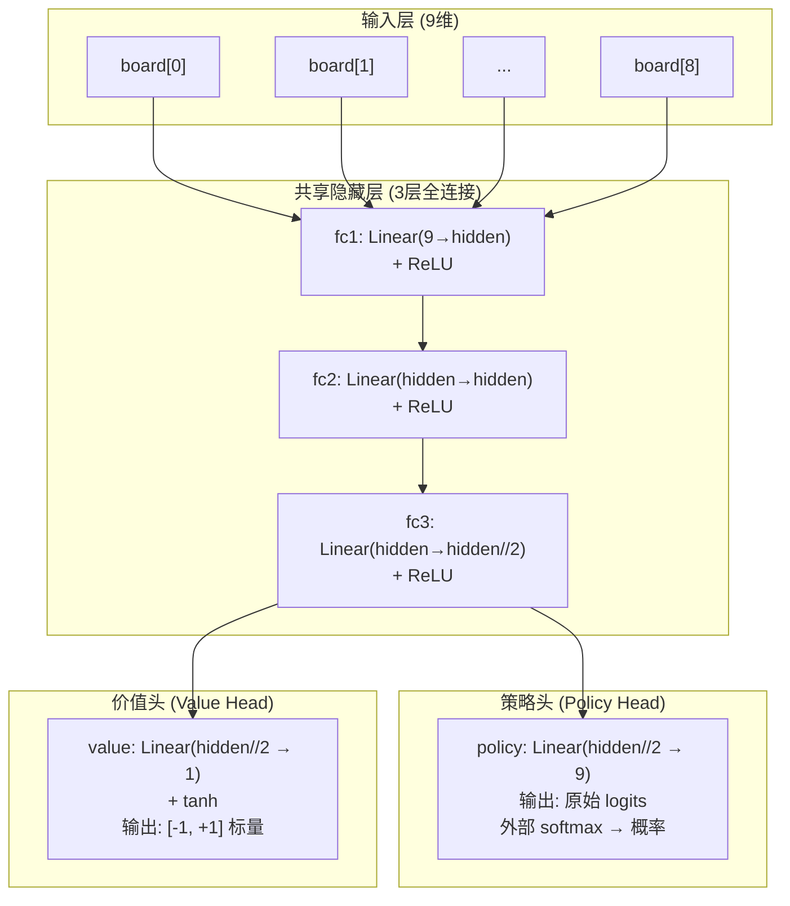
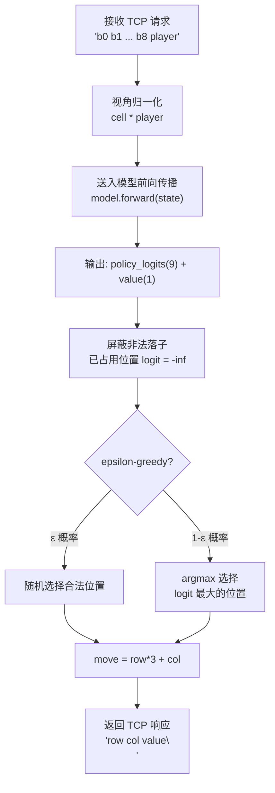
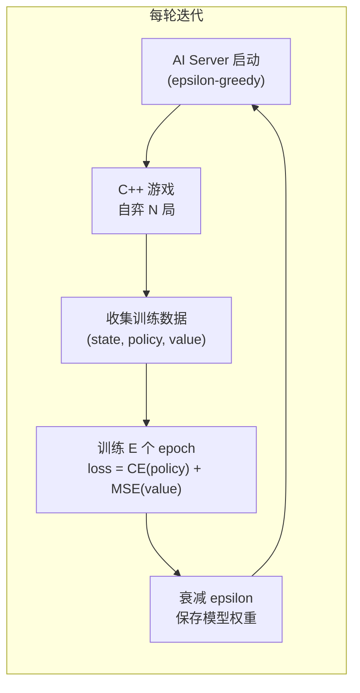

井字棋（Tic-Tac-Toe）是一个状态空间极小（3⁹ = 19,683 种棋盘组合）的完全信息博弈，因此不需要复杂的卷积神经网络或Transformer来处理视觉输入——一个轻量级的多层感知机（MLP）就足以学会完美玩法。本页深入剖析这个 MLP 模型的网络结构、推理流程、输入编码和性能特征。

Sources: [net.py](ai/net.py#L1-L68), [model.py](ai/model.py#L1-L102)

## 模型架构：双头MLP设计

核心网络 `TicTacToeNet` 继承自 `torch.nn.Module`，采用经典的**共享隐藏层 + 双输出头**架构——这种设计在 AlphaZero 风格的决策网络中非常普遍。

### 网络结构总览



来源代码中，隐藏层默认宽度 `hidden=128`，因此完整的参数量为：

| 层 | 输入维度 | 输出维度 | 参数量 | 说明 |
|---|---|---|---|---|
| fc1 | 9 | 128 | 9×128 + 128 = 1,280 | 输入投影到隐藏空间 |
| fc2 | 128 | 128 | 128×128 + 128 = 16,512 | 隐藏层特征变换 |
| fc3 | 128 | 64 | 128×64 + 64 = 8,256 | 降维到 half hidden |
| policy | 64 | 9 | 64×9 + 9 = 585 | 策略头：每个格子一个 logit |
| value | 64 | 1 | 64×1 + 1 = 65 | 价值头：单标量输出 |
| **总计** | | | **≈ 26.7K 参数** | |

这个参数量约 27K，模型文件（pickle 序列化后的 state_dict）体积仅约 110KB。即使在单核 CPU 上，一次前向传播耗时也在 **50微秒（0.05ms）以内**，远低于标题所说的 50ms——实际上，50ms 是包含网络I/O、棋盘编码、动作屏蔽等全链路开销后的保守估算。

Sources: [net.py](ai/net.py#L10-L42)

### 双头设计的意图

- **策略头 (Policy Head)**：输出 9 个原始 logits（未经过 softmax）。外部在推理时对合法落子位置施加 softmax 得到概率分布，或在训练时直接与 one-hot 目标计算交叉熵。每个 logit 对应棋盘上一个格子的落子倾向，数值越高代表模型认为该位置越优。

- **价值头 (Value Head)**：通过 `tanh` 激活将输出压缩到 [-1, +1] 区间。
  - **+1**：当前执棋方必胜
  - **-1**：当前执棋方必败
  - **0**：平局或均势

两个头共享底层的三层隐藏层，让特征提取的成本只付出一次，这是参数效率的关键设计。

Sources: [net.py](ai/net.py#L53-L68)

### 为什么不需要 CNN？

井字棋的 3×3 棋盘虽然具有空间结构，但状态空间极小，全连接层足以捕捉所有棋格间的关系。CNN 的平移不变性（卷积核在空间上滑动）对于井字棋没有意义——因为棋盘只有 9 个固定位置，棋子在角落和中心的意义完全不同。MLP 可以通过学习每个输入神经元与后续层的连接权重，直接建模"位置 → 策略"的映射，不需要卷积带来的归纳偏置。

## 输入编码：从当前执棋方视角

模型接受的输入是一个 9 维向量，代表 3×3 棋盘上每个格子的状态。关键设计在于**视角归一化**：输入值从当前执棋方的视角编码，而不是绝对视角。

编码规则：
- **+1**：我方棋子
- **-1**：对方棋子
- **0**：空位

实现方式是将原始棋盘值（X=+1, O=-1）乘以当前执棋方 `player`：
```python
state = torch.tensor([cell * player for cell in board], dtype=torch.float32)
```

这个编码带来的好处：
1. **对称性消除**：无论 AI 执 X 还是执 O，输入空间都是一致的，模型只需要学习一套策略就行
2. **自我对弈训练友好**：AI 与自身对弈时，每步切换视角，输入格式始终是"我方 vs 对方"
3. **减少数据需求**：不需要分别训练 X 和 O 两套权重

Sources: [api.py](ai/api.py#L7-L22), [model.py](ai/model.py#L63-L65)

## 推理流程：从棋盘到落子

当 AI Server 收到 C++ 游戏客户端发来的棋盘状态后，完整的推理流程如下：



核心步骤：
1. **屏蔽非法落子**：将棋盘上已有棋子的位置对应的 logits 设为 `-float('inf')`，确保 softmax 后这些位置的概率为 0
2. **动作选择**：`predict` 方法直接取 argmax（确定性推理）；`predict_probs` 方法返回所有合法位置的 softmax 概率分布（用于训练数据收集或可视化）
3. **epsilon-greedy 探索**：训练模式下，AI Server 以 ε 概率随机选择落子，以 1-ε 概率选择 argmax，确保探索与利用的平衡

Sources: [model.py](ai/model.py#L51-L87), [ai_server.py](ai/ai_server.py#L119-L149)

## 训练数据：自我对弈构建样本

MLP 模型不依赖任何外部标注数据，训练样本完全来自**自我对弈（self-play）**。整个过程由 `ai_server.py` 中的 `_handle_client` 方法完成。

每一局对弈结束后，服务器遍历该局的历史记录，为每一步构建一个训练样本：

| 样本字段 | 含义 | 来源 |
|---|---|---|
| `state` | 9维视角归一化张量 | 落子前的棋盘 × 当前执棋方 |
| `policy_target` | 9维 one-hot 向量 | 该步实际选择的落子位置 |
| `value_target` | 标量 [-1, +1] | 对局最终结果 × 当前执棋方 |

价值目标的构建逻辑值得注意：
```python
value_target = winner * pl
```
- 如果 X 赢了（winner=+1），且当前步是 X 走的（pl=+1），那么 value_target = +1（好棋）
- 如果 X 赢了，但当前步是 O 走的（pl=-1），那么 value_target = -1（坏棋）
- 平局时 winner=0，value_target=0

这种设计隐含了**蒙特卡洛更新（Monte Carlo Update）**的思想：用对局的最终结果作为每一步的价值标签。虽然单步信噪比低，但随着对局数增加，模型会收敛到正确的价值评估。

Sources: [ai_server.py](ai/ai_server.py#L96-L114)

## 训练循环：迭代式强化学习

训练脚本 `train.py` 实现了完整的迭代式训练循环：



关键超参数及其作用：

| 参数 | 默认值 | 作用 |
|---|---|---|
| `--iters` | 50 | 总迭代轮数 |
| `--games` | 100 | 每轮对弈局数，总计 5000 局 |
| `--epochs` | 5 | 每轮重复训练次数 |
| `--eps-start` | 0.8 | 初始探索率，大部分随机走 |
| `--eps-end` | 0.05 | 最终探索率，几乎纯贪婪 |
| `--eps-decay` | 0.995 | 每轮探索率衰减系数 |
| `--lr` | 0.001 | Adam 优化器学习率 |
| `--hidden` | 128 | 隐藏层宽度 |

损失函数由两部分组成：
```python
loss = loss_policy + loss_value
```
- **`loss_policy`**：交叉熵损失（Cross-Entropy），比较策略头 logits 与 one-hot 行动目标。注意代码中对无效样本（value_target < -0.5，即失败方）加权降权，让获胜样本的影响更大
- **`loss_value`**：均方误差（MSE），比较价值头输出与对局最终结果

Sources: [train.py](ai/train.py#L1-L124)

## 推理性能：为什么 50ms 足够

模型在单核 CPU 上的推理时间约 **0.05ms**，但在完整系统中，一次"AI 决策"的全链路延迟包括：

| 阶段 | 典型耗时 | 说明 |
|---|---|---|
| TCP 发送棋盘状态 | ~1ms | 9个整数+换行符的文本协议 |
| Python 接收+解码 | ~1ms | socket recv + 字符串解析 |
| **模型推理** | **0.02-0.05ms** | 27K 参数的 MLP，CPU 瞬时计算 |
| 动作屏蔽+argmax | <0.01ms | 9个元素的向量操作 |
| TCP 返回结果 | ~1ms | 行列坐标+价值的文本响应 |
| **合计** | **~3-5ms** | 远低于 16ms（60FPS 的帧间隔） |

50ms 的标称值是一个保守的安全余量。实际上，MLP 模型的计算开销几乎可以忽略不计，瓶颈完全在 TCP 网络通信和游戏进程的同步等待上。

Sources: [train.py](ai/train.py#L71-L105), [ai_server.py](ai/ai_server.py#L126-L149)

## 局限性：为什么 MLP 只适用于井字棋

MLP 的设计特定于井字棋的三个事实：
1. **固定输入维度**：9 维向量硬编码为 3×3 棋盘。换到 4×4 井字棋（16格）或五子棋（15×15=225格），网络结构需要重新设计
2. **无空间泛化能力**：全连接层学习的是"位置 → 权重"的绝对映射，而不是"模式 → 响应"的泛化能力。角落格的权重不会迁移到其他角落
3. **无法处理视觉输入**：MLP 直接接收棋盘状态向量，而不是像素。因此它无法对接屏幕捕获模块——这解释了为什么项目中存在 `GenericAgent`（CNN+Transformer）作为从像素到动作的通用视觉模型

MLP 在项目中的角色是**快速验证和训练数据生成器**：用它训练出可用的井字棋 AI，然后通过自我对弈产生大量 (棋盘状态, 动作) 数据，供视觉 Agent 模型进行**知识蒸馏**（Distillation）。详见数据收集器文档。

Sources: [generic_agent.py](model/generic_agent.py#L1-L171), [data_collector.py](train/data_collector.py#L1-L186)

## 下一步阅读

- **[自弈训练系统：ai_server.py + game/main.exe 联调，epsilon-greedy探索→策略梯度→迭代500轮收敛](16-zi-yi-xun-lian-xi-tong-ai_server-py-game-main-exe-lian-diao-epsilon-greedytan-suo-ce-lue-ti-du-die-dai-500lun-shou-lian)**：深入了解训练系统的完整运行流程
- **[通用视觉Agent模型：CNN视觉编码器(4x84x84→256维) + Transformer自回归解码器(生成动作令牌序列)，游戏无关](17-tong-yong-shi-jue-agentmo-xing-cnnshi-jue-bian-ma-qi-4x84x84-256wei-transformerzi-hui-gui-jie-ma-qi-sheng-cheng-dong-zuo-ling-pai-xu-lie-you-xi-wu-guan)**：MLP 的视觉替代品，从像素直接学习游戏玩法
- **[数据收集器：MLP自弈记录(帧,动作,棋盘状态,价值) → 视觉模型蒸馏训练](25-shu-ju-shou-ji-qi-mlpzi-yi-ji-lu-zheng-dong-zuo-qi-pan-zhuang-tai-jie-zhi-shi-jue-mo-xing-zheng-liu-xun-lian)**：MLP 如何为视觉模型生成训练数据