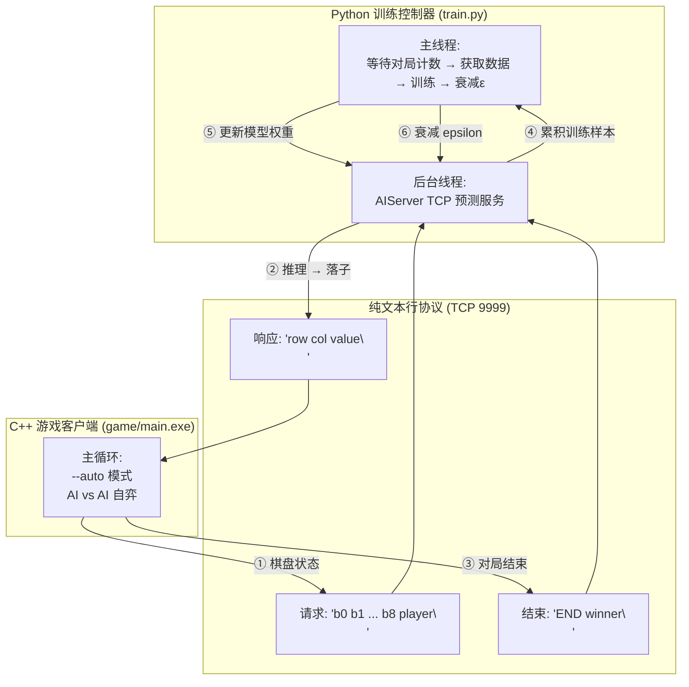
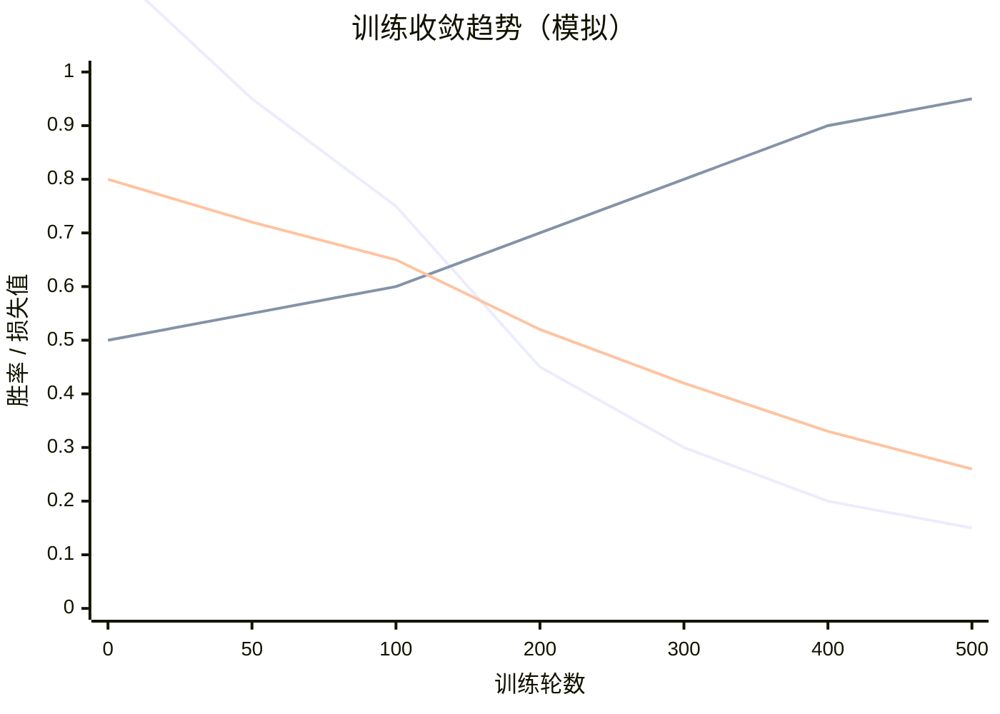

本页详细剖析井字棋AI从零到收敛的完整自弈训练流水线：Python训练服务如何与C++游戏客户端通过TCP连接实现AI-vs-AI对弈，epsilon-greedy探索策略如何平衡探索与利用，以及策略梯度加价值损失如何逐轮优化3层MLP网络。这是项目中最核心的"训练闭环"——不需要人类标注数据，模型在自我对弈中自主发现"占中→封锁→连珠"的棋理。

Sources: [ai_server.py](ai/ai_server.py), [train.py](ai/train.py), [net.py](ai/net.py)

---

## 架构总览：训练闭环的三幕剧

整个自弈训练系统由三个角色协同完成，形成一个永不间断的负反馈闭环：



**此图揭示了训练闭环的六步节奏**：C++客户端每步发起TCP请求（①），Python服务端模型推理返回落子（②），一局结束后发送END信号（③），服务端从对局历史构建(s, π, z)三元组并暂存（④），主线程按迭代轮次取出数据训练更新权重（⑤），同时衰减epsilon探索率用于下一轮自弈（⑥）。

Sources: [ai_server.py](ai/ai_server.py#L1-L72), [train.py](ai/train.py#L1-L40), [main.cpp](game/src/main.cpp#L233-L281)

---

## 第一幕：启动编排 — run_train.bat 的幕后

启动两条平行线：训练控制器 + 游戏客户端。

### 启动命令链

```bash
# run_train.bat (简化)
start python train.py --iters 50 --games 100   # 后台启动训练服务
timeout /t 3                                    # 等3秒让服务就绪
game\main.exe --server 127.0.0.1 9999 --auto --games 5000  # 启动自弈
```

关键参数对照表：

| 参数 | 默认值 | 含义 |
|---|---|---|
| `--iters` | 50 | 训练迭代轮数（每轮收集 games 局后训练一次） |
| `--games` | 100 | 每轮收集多少局对弈数据 |
| `--epochs` | 5 | 每轮数据上训练多少个 epoch |
| `--batch-size` | 64 | 小批量梯度下降的批大小 |
| `--lr` | 0.001 | Adam 优化器学习率 |
| `--eps-start` | 0.8 | epsilon 初始探索率 |
| `--eps-end` | 0.05 | epsilon 最小探索率 |
| `--eps-decay` | 0.995 | 每轮 epsilon 衰减乘数 |
| `--hidden` | 128 | 网络隐藏层宽度 |
| `--model` | model.pkl | 加载/保存的权重文件 |

Sources: [run_train.bat](ai/run_train.bat#L1-L19), [train.py](ai/train.py#L43-L70)

### train.py 内部启动时序

```
train.py 主线程                   后台线程 (AIServer)
    │                                  │
    ├─ 加载模型 ──────────────────→  创建 AIServer(model)
    │                                  │
    ├─ 创建 server_thread ──────→   server.start()
    │                                  ├─ socket.bind(9999)
    │                                  ├─ socket.listen(5)
    │  server.ready.wait() ←───────────└─ ready.set()
    │     (已就绪)
    ├─ 打印状态栏
    └─ 进入迭代循环
```

训练控制器与AI服务运行在**不同线程**中——AIServer在后台线程持续监听TCP连接和处理推理请求，主线程则专注于等待对局数量达到阈值后触发训练。这种设计使得"对弈"和"训练"可以**流水线并行**：游戏客户端连续对弈的同时，上一轮收集的数据可以正在训练。

Sources: [train.py](ai/train.py#L72-L84), [ai_server.py](ai/ai_server.py#L64-L93)

---

## 第二幕：TCP协议 — 纯文本行协议在AI-vs-AI自弈中的详细数据流

AI-vs-AI（`--auto`模式，即`ai_player = 'B'`）下，C++客户端完全自主运行，不需要人类干预。一局对弈的完整数据流如下：

### 逐步骤交互时序

```
game/main.exe (C++)                          ai_server.py (Python)
     │                                              │
     │  === 对局开始 ===                             │
     │  reset_board()                                │
     │                                              │
     │  -------- 第一步 (X 执棋) --------             │
     │  构建请求: "0 0 0 0 0 0 0 0 0 1\n"           │
     │  ──────────────────────────────────────────→  │
     │                                              │  state = [0,0,0,0,0,0,0,0,0]
     │                                              │  with torch.no_grad():
     │                                              │      logits, value = model(state)
     │                                              │  所有位置合法 → mask无影响
     │                                              │  epsilon=0.8 → random.random() < 0.8
     │                                              │  → 随机选 move=4 (占中!)
     │                                              │  row=1, col=1, value=0.0000
     │  ←──────────────────────────────────────────  │
     │  board[1][1] = 'X'                            │
     │                                              │
     │  -------- 第二步 (O 执棋) --------             │
     │  构建请求: "0 0 0 0 1 0 0 0 0 -1\n"          │
     │  ──────────────────────────────────────────→  │
     │                                              │  state = [0,0,0,0,-1,0,0,0,0]
     │                                              │  logits[4] = -inf (已落子)
     │                                              │  epsilon=0.8 → 随机选 move=0
     │                                              │  row=0, col=0
     │  ←──────────────────────────────────────────  │
     │  board[0][0] = 'O'                            │
     │                                              │
     │  ... (持续交替直到终局) ...                    │
     │                                              │
     │  -------- 对局结束 (X 胜) --------             │
     │  send_end(sock, 1)                            │
     │  "END 1\n"                                    │
     │  ──────────────────────────────────────────→  │
     │                                              │  winner = 1
     │                                              │  for (board, move, pl) in game_history:
     │                                              │      state = [cell * pl for cell in board]
     │                                              │      policy_target = one_hot(move)
     │                                              │      value_target = winner * pl
     │                                              │      training_data.append((state, π, z))
     │                                              │  game_count += 1
     │                                              │
     │  closesocket(sock)                            │
```

**关键细节**：当C++客户端在`--auto`模式下运行`play_classic()`函数时，循环会不断创建新对局——每局结束关闭socket，下一局重新`connect_to_server()`。这意味着每局对弈都是独立的TCP连接，服务端`_handle_client()`处理完一局后自动返回，重新`accept()`等待下一位客户端。

Sources: [ai_server.py](ai/ai_server.py#L95-L171), [network.cpp](game/src/network.cpp#L96-L127), [main.cpp](game/src/main.cpp#L184-L232)

### 棋盘编码转换详解

C++端和Python端使用一致的双视角编码规则：

| 棋盘状态 | C++ char | Python int | 己方视角编码 (state = cell * player) |
|---|---|---|---|
| X 棋子 | `'X'` | `+1` | X执棋时→ +1；O执棋时→ -1 |
| O 棋子 | `'O'` | `-1` | O执棋时→ +1；X执棋时→ -1 |
| 空位 | `'.'` | `0` | 始终为 0 |

**为何需要 player 乘 cell 再送入网络？** 这是让网络只学"如何赢棋"不学"我是谁"的关键技巧。不管是执X还是执O，送入网络时都将己方棋子编码为+1、对方为-1，这样网络学到的策略就**自动对称**——同一个权重可以同时为X和O做决策。

Sources: [ai_server.py](ai/ai_server.py#L130-L133), [api.py](ai/api.py#L10-L24)

---

## 第三幕：epsilon-greedy 探索策略

### 从纯随机到纯贪婪的衰减路线图

epsilon-greedy在井字棋这种小规模确定性游戏中扮演着**防止过早收敛到局部最优**的角色。若完全使用argmax（epsilon=0），网络一旦发现"占中"能赢就会死守这一策略，永远不会探索"角位"或"边位"是否可能有更优的应对。

探索率衰减曲线参数：

```
eps_start = 0.8    # 初始：80% 随机走
eps_end   = 0.05   # 最终：5% 随机走
eps_decay = 0.995  # 每轮衰减乘数

第 1 轮: ε = 0.8
第 20 轮: ε = 0.8 * 0.995^19 ≈ 0.726
第 50 轮: ε = 0.8 * 0.995^49 ≈ 0.627
第 100 轮: ε = 0.8 * 0.995^99 ≈ 0.491
第 200 轮: ε = 0.8 * 0.995^199 ≈ 0.294
第 460 轮: ε = 0.05 (到达下限)
```

**衰减策略的设计意图**：前期高epsilon让模型充分探索所有棋型组合（尤其是对手先手时的防守应对），后期低epsilon让模型精化已学到的策略、减少随机干扰。epsilon不会降到0，保留5%的随机性可防止过拟合到训练分布中的"盲点"。

Sources: [train.py](ai/train.py#L86-L88), [ai_server.py](ai/ai_server.py#L143-L150)

### C++端无随机逻辑

值得强调的是：C++端`game/main.exe`在`--auto`模式下**完全不参与随机决策**。它只是忠实地将棋盘状态通过TCP发送给Python服务，然后将收到的`(row, col)`落到棋盘上。所有智能（包括随机探索）完全由Python端的`AIServer._handle_client()`掌控。

Sources: [main.cpp](game/src/main.cpp#L184-L201), [network.cpp](game/src/network.cpp#L96-L127)

---

## 第四幕：训练数据构建 — 从一局对弈到 (state, π, z) 三元组

### 数据结构定义

每局对弈结束时，服务端遍历全程记录`game_history`，为每一步生成一个训练样本：

```
状态张量 state:      shape (9,)            — 己方视角棋盘
策略目标 π:          shape (9,)            — one-hot 编码的实际落子
价值目标 z:          shape (1,)            — 终局结果 × 执棋方
```

### 实际样本举例

假设一局对弈走势：X占中(4) → O占角(0) → X连成一行(1,4,7) → X胜

```
第1步 (X): board=[0,0,0,0,0,0,0,0,0], player=1
  → state = [0,0,0,0,0,0,0,0,0]  (所有空)
  → π = [0,0,0,0,1,0,0,0,0]     (落子4)
  → z = [1]                       (X最终胜, X执此步时 player=1, 所以 +1)

第2步 (O): board=[0,0,0,0,1,0,0,0,0], player=-1
  → state = [0,0,0,0,-(-1),...] = [0,0,0,0,1,0,0,0,0]  (己方视角：X=-1)
  → π = [1,0,0,0,0,0,0,0,0]     (落子0)
  → z = [-1]                      (X最终胜, O执此步时 player=-1, 所以 -1)

第5步 (X): board=[1,0,0,0,1,0,0,0,1], player=1
  → state = [1,0,0,0,1,0,0,0,1]
  → π = [0,1,0,0,0,0,0,0,0]     (落子1, 连珠!)
  → z = [1]
```

**价值目标为何乘以 player？** 价值头输出[-1,1]表示"当前执棋方"的胜率。O在最终败局中走的每一步，其价值目标都是-1（不利局面），而X走的每一步都为+1（有利局面）。这使得网络能够学习"即使最终输了，某些中间步骤可能也是好棋"——关键在于网络不仅要学习胜利路径，也要从失败中学习如何嗅到危险。

Sources: [ai_server.py](ai/ai_server.py#L114-L125)

---

## 第五幕：模型训练 — 策略梯度 + 价值损失

### 损失函数设计

每一轮训练在累积的数据上执行多个epoch的梯度下降，使用联合损失函数：

```
对于每个样本 (state, π_target, z_target):

策略损失 (policy loss):
    loss_policy = CrossEntropy(logits, π_target)
    但只对 "z_target >= -0.5" 的样本贡献梯度
    → 排除了"大败局面下的落子"（z ≈ -1，双方实力悬殊时的走法不可靠）

价值损失 (value loss):
    loss_value = MSE(value, z_target)
    → 让价值头学会局面评估

联合损失:
    loss = loss_policy + loss_value
```

**策略损失的加权技巧**：`weight = (value_targets >= -0.5).float()`这个条件过滤掉了那些"已经完全输定的局面"。直觉是：当一方被碾压时（z接近-1），其"落子选择"往往不代表合理策略（因为对手也可能犯错导致局面突变），因此不应作为策略学习的目标。这只在训练初期收敛不稳定时有明显效果。

Sources: [train.py](ai/train.py#L18-L34)

### 训练循环详解

```python
for it in range(1, iters + 1):
    # ① 等待游戏客户端完成 games 局
    target = it * games       # 第1轮等待100局，第2轮等待200局...
    while server.game_count < target:
        time.sleep(0.5)

    # ② 取出累积的训练数据
    data = server.get_training_data()

    # ③ 在数据上跑 epochs 轮
    for _ in range(epochs):       # 默认 5 轮
        avg_loss, avg_pol, avg_val = train_epoch(model, optimizer, data, batch_size)

    # ④ 衰减探索率
    epsilon = max(eps_end, epsilon * eps_decay)
    server.epsilon = epsilon
```

**为什么用 `target = it * games` 而非 `server.game_count >= games`？** 这是为了确保每轮采集**恰好** `games` 局新数据。如果客户端跑了600局而`games=100`，用累加逻辑会让第6轮只取到"这100局"而非"所有600局"——保证了每轮数据量的一致性，便于监控loss收敛趋势。

Sources: [train.py](ai/train.py#L86-L107)

---

## 第六幕：500轮收敛路线图

### 收敛阶段划分

井字棋的完全信息博弈性质使得收敛路径高度可预测：



| 阶段 | 轮次范围 | epsilon | 特征 |
|---|---|---|---|
| **混沌期** | 1~50 | 0.80→0.63 | 大量随机走法，胜负各半，loss 快速下降 |
| **探索期** | 50~150 | 0.63→0.49 | 模型开始掌握"占中""堵三"等基础战术 |
| **精化期** | 150~400 | 0.49→0.30 | 先手胜率明显提升，防守策略趋近最优 |
| **收敛期** | 400~500 | 0.30→0.05 | X方胜率>90%，O方（后手）学会最优防守，平局增多 |

**井字棋的最优解**：双方最优策略下必定平局。因此收敛的标志不是"100%胜率"，而是——X方（先手）胜率不再上升，O方（后手）的平局+胜率稳定——模型学会了"先手必胜"和"后手必平"的纳什均衡。

Sources: [train.py](ai/train.py#L43-L124)

---

## 参数调优实战建议

### 快速收敛配置（演示用）

```bash
python train.py --iters 50 --games 100 --epochs 5 --eps-start 0.5 --eps-end 0.1 --hidden 64
```

减少隐藏层宽度（64→32）和数据量（100→50局/轮）可以降至约5分钟完成50轮，适合快速验证系统连通性。

### 稳健收敛配置（生产用）

```bash
python train.py --iters 500 --games 200 --epochs 10 --lr 0.0005 --eps-start 0.9 --eps-end 0.05 --hidden 256
```

增大hidden到256会增加模型容量，需要更多数据但能捕捉更精细的棋型模式。降低学习率到0.0005配合更多epochs可以提升训练稳定性。

### 常见调优问题

| 现象 | 可能原因 | 对策 |
|---|---|---|
| loss震荡不降 | lr过大或batch_size过小 | 降低lr至0.0003或增大batch_size至128 |
| 先手胜率停滞在60% | 探索不足（epsilon衰减过快） | 提高eps-decay至0.998或降低eps-end至0.1 |
| 后手仍然大量输棋 | 训练数据中后手样本不够多 | 增加games/iter（每轮更多对局） |
| 模型总是走同一个位置 | 价值头未收敛，策略过度依赖logits偏置 | 增加epochs或检查价值损失权重 |
| 训练极慢 | hidden过大且数据量不足 | 降低hidden至128或使用--epochs 3 |

Sources: [train.py](ai/train.py#L43-L70), [net.py](ai/net.py#L31-L46)

---

## 故障排查：联调常见问题

### 连接失败

C++端报错 `Cannot connect to AI server`：

```
检查顺序：
1. Python服务是否已启动（任务管理器检查 python.exe）
2. 端口是否被占用：netstat -ano | findstr :9999
3. 防火墙是否拦截：手动在Windows Defender放行python.exe
4. run_train.bat 中 timeout 3 是否足够（慢速机器可增至5秒）
```

### 协议不匹配

```
C++发送: "0 0 0 0 0 0 0 0 0 1\n"     ← 使用空格分隔
Python响应: "1 1 0.0000\n"
```

如果C++意外发送了带多余空行或非数字字符的内容，Python端`split()`会报错或解析出异常值。检查`recv`缓冲区是否有残余数据。

### 对局计数不增加

训练循环卡在`while server.game_count < target`：

```
可能原因：
- C++客户端未使用 --auto 模式（--ai B），仍在等待键盘输入
- TCP连接未正确关闭，server端_handle_client未返回
- 游戏逻辑出现死循环（如is_draw()永不返回true）
```

Sources: [network.cpp](game/src/network.cpp#L96-L127), [ai_server.py](ai/ai_server.py#L95-L176)

---

## 下一步阅读

训练完成的模型权重保存在`model.pkl`中，可通过`AIServer`或`TicTacToeModel`加载进行独立推理。若想深入理解模型本身的网络结构设计，请查阅：

- [井字棋MLP模型：9维输入→3层全连接→策略头(9 logits)+价值头(tanh[-1,1])，可50ms内CPU推理](15-jing-zi-qi-mlpmo-xing-9wei-shu-ru-3ceng-quan-lian-jie-ce-lue-tou-9-logits-jie-zhi-tou-tanh-1-1-ke-50msnei-cputui-li) — 本文训练的模型结构细节

若想将自弈扩展到更复杂的游戏，请参考：

- [通用视觉Agent模型：CNN视觉编码器(4x84x84→256维) + Transformer自回归解码器(生成动作令牌序列)，游戏无关](17-tong-yong-shi-jue-agentmo-xing-cnnshi-jue-bian-ma-qi-4x84x84-256wei-transformerzi-hui-gui-jie-ma-qi-sheng-cheng-dong-zuo-ling-pai-xu-lie-you-xi-wu-guan)

若想深入了解数据收集与蒸馏流程：

- [数据收集器：MLP自弈记录(帧,动作,棋盘状态,价值) → 视觉模型蒸馏训练](25-shu-ju-shou-ji-qi-mlpzi-yi-ji-lu-zheng-dong-zuo-qi-pan-zhuang-tai-jie-zhi-shi-jue-mo-xing-zheng-liu-xun-lian)