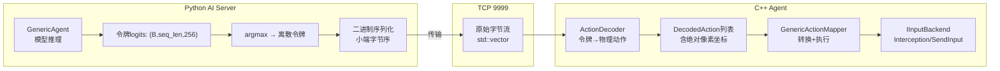
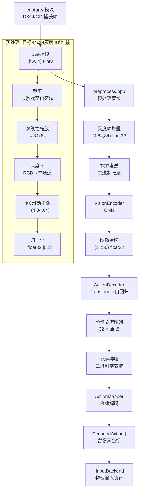

本文档深入剖析系统中最具通用性的 AI 组件——**视觉 Agent 模型**。与井字棋特化的 MLP 模型不同，该模型的设计核心原则是**游戏无关性**：它不依赖任何游戏规则知识，仅从像素输入中学习，输出通用的动作令牌序列。这是系统从"特定游戏 AI"迈向"通用视觉游戏 AI"的关键架构层。

## 设计哲学：为什么是 CNN + Transformer？

要理解这个架构，需要先回答一个根本问题：**为什么不能用井字棋 MLP 模型（9维输入→策略头+价值头）直接处理像素？**

答案在于两个核心矛盾。第一，**输入维度的数量级差异**——MLP 的 9 维棋盘状态本质上是人类设计的符号化抽象，而像素输入是（4×84×84=）28224 维的原始信号，全连接网络在如此高维的输入上参数量会爆炸。第二，**动作空间的表达粒度**——MLP 只需要输出 9 个位置的落子概率，而通用模型需要表达鼠标移动、点击、键盘按键、等待等多种操作，输出必须是结构化的序列而非单个选择。

这两个矛盾引出了 CNN + Transformer 的组合方案。CNN（卷积神经网络）天然具备空间局部性归纳偏置——它通过局部感受野和参数共享，在参数量可控的前提下高效提取视觉特征。Transformer 的自回归解码器则提供了输出结构化的序列的能力——每一步生成一个令牌（token），令牌的内容和顺序共同构成完整的动作序列。这就像从"选一个格子"升级到了"写一段操作指令"。

该模型位于 `model/generic_agent.py`，是整个模型体系（model/ 目录）中的核心组件，在架构层次中对应第3层（L3，单体模型），独立于处于第4层（L4）的层次化架构（`model/hierarchical.py`）。

Sources: [generic_agent.py](model/generic_agent.py#L1-L30), [hierarchical.py](model/hierarchical.py#L1-L13)

## 模型架构总览

模型由两大模块串联构成——视觉编码器（`VisionEncoder`）和动作解码器（`ActionDecoder`），组合为 `GenericAgent` 类。数据流如下：

```mermaid
flowchart LR
    Pixels["输入: (B,4,84,84)<br/>灰度帧堆叠"] --> VE[VisionEncoder<br/>CNN编码器]
    VE --> M["记忆 (B,1,d_model)<br/>d_model=256"]
    M --> AD[ActionDecoder<br/>Transformer解码器]
    AD --> AT["输出: (B,seq_len,vocab_size)<br/>动作令牌logits"]

    subgraph VE_detail[VisionEncoder 细节]
        Conv["Conv2D堆叠<br/>32→64→64通道<br/>84→20→9→7"]
        FC["nn.Linear<br/>3136→d_model"]
    end

    subgraph AD_detail[ActionDecoder 细节]
        TE[令牌嵌入<br/>Embedding(256, d_model)]
        PE[位置编码<br/>Parameter(1,32,d_model)]
        TF[TransformerDecoder<br/>2层,4头, d_ff=512]
        Head["输出头<br/>Linear(d_model, 256)"]
    end

    Pixels --> Conv --> FC --> M
    M --> TF
    TE --> TF
    PE --> TF
    TF --> Head --> AT
```

这种"编码器-解码器"结构与神经机器翻译中常用的序列到序列（Seq2Seq）模型有深刻的相似性。视觉编码器扮演了"源语言编码器"的角色——它把像素"翻译"成高维语义向量；而动作解码器扮演了"目标语言解码器"——它从这个语义向量出发，自回归地生成动作令牌序列。区别在于这里的"源语言"是视觉信号，"目标语言"是动作指令。

Sources: [generic_agent.py](model/generic_agent.py#L33-L171)

## VisionEncoder：CNN 视觉编码器

### 网络结构

编码器采用 Nature CNN 架构的现代化变体，经过三层卷积逐步压缩空间维度并提升通道数：

| 层 | 输入尺寸 | 输出尺寸 | 卷积核/步长 | 作用 |
|:--|:--|:--|:--|:--|
| Conv1 | (4, 84, 84) | (32, 20, 20) | 8×8 / stride=4 | 快速下采样，捕获大尺度特征 |
| Conv2 | (32, 20, 20) | (64, 9, 9) | 4×4 / stride=2 | 中等尺度特征提取 |
| Conv3 | (64, 9, 9) | (64, 7, 7) | 3×3 / stride=1 | 精细特征保留 |
| Linear | 3136 (64×7×7) | d_model(256) | — | 扁平化后投影到语义空间 |

### 为什么选择这个结构？

这并非随意选择，而是三个设计约束共同作用的结果。首先是**输入特性**——4 帧堆叠的 84×84 灰度图（4 通道），这是 Ding 等人 2015 年 Nature 论文中确立的标准预处理格式，已被 DQN、Rainbow、PPO 等大量工作在无数游戏中验证为有效的状态表示。4 帧堆叠提供了一阶时间差分信息（物体的运动方向、速度），对于理解游戏动态至关重要。

其次是**感受野覆盖**——第一层 8×8 步长 4 的卷积将 84×84 映射到 20×20，每个卷积核的接收野覆盖了约 10% 的输入宽度。这确保了模型能感知到棋盘格子（约 28×28 像素）这样的中等大小物体。后续两层逐步精细，最终 3×3 步长 1 的卷积保留了 7×7 的精细空间布局。

第三是**计算效率**——编码器参数量约为 32×4×8×8 + 64×32×4×4 + 64×64×3×3 + 3136×256 ≈ 0.9M 参数。在 CPU 上推理约 3-5ms，GPU 上 < 1ms。

### 从图像到"图像令牌"

编码器的输出经过 `unsqueeze(1)` 变为 shape `(B, 1, d_model)`——这实质上是一个**图像令牌**（image token），长度为 d_model 的向量代表整个视觉场景的压缩语义。为什么要保持序列长度为 1？因为后续的 Transformer 解码器将图像令牌视为 memory（即交叉注意力中的 key/value 源），而自回归生成的是动作令牌序列。这与 DALL-E、Parti 等文本到图像生成模型相反——那些模型中视觉令牌是生成目标，而这里视觉令牌是生成条件。

Sources: [generic_agent.py](model/generic_agent.py#L33-L78), [action_space.py](model/action_space.py#L1-L35)

## ActionDecoder：Transformer 自回归解码器

### 解码器的核心机制

动作解码器是一个标准的 Transformer 解码器，包含四个关键组件：

- **令牌嵌入层**（`token_embed`）：将离散的动作令牌 ID（范围 0-255）映射到 d_model 维的连续向量空间。这是模型学习动作令牌语义的基础——相似的令牌在嵌入空间中距离更近。
- **位置编码**（`pos_embed`）：可学习的位置编码，为不同时序位置的动作令牌赋予独特的位置信号。最大长度为 `MAX_ACTION_TOKENS = 32`，意味着模型每帧最多生成 32 个动作令牌。
- **Transformer 解码器层**：2 层，每层 4 个注意力头，前馈网络维度为 `d_model × 2 = 512`。这个规模较小（相比于 GPT-3 的 96 层），因为输入信息量（一个 256 维的图像令牌）远小于语言模型的万亿 token 级语料。
- **输出头**（`head`）：线性层 `d_model → ACTION_VOCAB_SIZE(256)`，输出每个令牌位置的 256 类 logits。

### 训练模式 vs 推理模式

解码器支持两种运行模式，这是理解其行为的关键。

**训练模式**（teacher forcing）中，真实动作令牌序列作为 `target_tokens` 输入。解码器对所有位置并行计算——第 t 个位置的输出只依赖前 t-1 个真实令牌（通过因果掩码 `generate_square_subsequent_mask` 实现）。这种方式的好处是训练效率高（一次前向传播计算整个序列），且避免了自回归推理时的误差累积问题。

**推理模式**（自回归生成）中，解码器从零开始逐令牌生成。流程如下：

1. 创建起始令牌（BOS，token ID = 0），嵌入后与第一个位置编码相加
2. Transformer 解码器以图像令牌为 memory，生成第一个输出令牌
3. 取 argmax 得到离散令牌 ID，检查是否为 NOOP（255）
4. 若为 NOOP，终止生成；否则将该令牌嵌入并加上下一个位置编码，拼接到输入序列
5. 重复步骤 2-4，最多生成 MAX_ACTION_TOKENS（32）个令牌

### 因果性训练

值得注意的是，即使训练中使用了 teacher forcing，解码器仍然通过因果掩码保证了自回归属性。这意味着模型在训练时学到的因果依赖关系（"先移动鼠标，再点击"）与推理时完全一致，不会出现训练-推理不一致（exposure bias）问题。

Sources: [generic_agent.py](model/generic_agent.py#L80-L145), [action_space.py](model/action_space.py#L28-L30)

## 动作令牌词汇表：模型与物理世界的桥梁

该模型输出的不是游戏语义，而是纯物理操作指令。词汇表共 256 个令牌，分为 10 种操作类型：

| 操作类型 | 令牌ID | 参数 | 总字节数 | 说明 |
|:--|:--|:--|:--|:--|
| MOUSE_MOVE_ABS | 0 | x_norm(float), y_norm(float) | 9 | 鼠标绝对移动，坐标归一化到 [0,1] |
| MOUSE_MOVE_REL | 1 | dx(int), dy(int) | 9 | 鼠标相对移动，像素增量 |
| MOUSE_CLICK | 2 | x_norm(float), y_norm(float), btn(uint8) | 10 | 在指定位置点击 |
| MOUSE_DOWN/UP | 3/4 | btn(uint8) | 2 | 按下/释放鼠标按钮 |
| KEY_PRESS/RELEASE | 5/6 | vk_code(uint16) | 3 | 按下/释放键盘按键 |
| KEY_TAP | 7 | vk_code(uint16), duration_ms(int) | 7 | 点按（按下+等待+释放） |
| WAIT | 8 | ms(int) | 5 | 等待指定毫秒数 |
| NOOP | 255 | 无 | 1 | 序列结束/填充令牌 |

**为什么选择 256 个令牌？** 256 = 2^8，刚好是一个字节。模型输出的 logits 对应一个字节的 256 种取值，每个令牌可以用单个 uint8 表示。这使得令牌序列可以被紧凑地序列化为二进制流，在 C++ agent 端进行高效的协议解码。

**为什么坐标要归一化？** 屏幕分辨率因机器而异（1920×1080 vs 1366×768）。通过归一化到 [0,1]，模型不需要针对特定分辨率重新训练——Agent 端（`ActionDecoder`）负责将归一化坐标乘以实际屏幕尺寸转换为像素坐标。

Sources: [action_space.py](model/action_space.py#L1-L51), [action_mapper.hpp](agent/include/action_mapper.hpp#L1-L86)

## C++ Agent 端的令牌解码与执行

模型在 Python 端输出令牌 logits 后，通过 TCP 传输到 C++ Agent 端进行解码和执行。整个管线如下：



`ActionDecoder::decode()` 方法（`agent/src/action_mapper.cpp`）按以下规则解析字节流：读取第一个字节作为令牌类型，根据类型读取固定长度的参数，然后循环处理下一个令牌，直到遇到 NOOP（255）或字节流耗尽。解析过程中，归一化坐标被转换为绝对像素坐标（`x = (int)(xn * screen_w)`），按钮索引被映射为 `MouseButton` 枚举值。

`GenericActionMapper` 进一步将 `DecodedAction` 转换为 `GameAction`（`input/` 模块的输入后端接口），最终由 Interception 驱动层或 SendInput 系统层执行物理输入。从模型输出到鼠标在屏幕上移动，整个过程完全不需要任何游戏特定知识。

Sources: [action_mapper.cpp](agent/src/action_mapper.cpp#L1-L131), [agent.cpp](agent/src/agent.cpp#L1-L200)

## 数据流全景：从像素到动作的完整路径

综合以上分析，可以将 Agent 主循环中的视觉模型链路总结为完整的张量变形图：



---

## 扩展性与泛化路径

该模型的设计天然支持两个方向的扩展。

**其他游戏的适配**：由于模型只依赖像素输入和通用动作输出，切换到新游戏只需要调整预处理中的裁剪区域和窗口标题。动作词汇表已经覆盖了绝大多数 2D/3D 游戏所需的基本操作类型。这与井字棋 MLP 模型形成对比——后者需要重新设计输入编码和输出层。

**规模扩展**：`create_general_agent()` 函数提供了更大的配置（d_model=256, nhead=8, n_layers=4，约 3M 参数），适合需要更复杂策略的游戏。编码器的 CNN 部分可以换成更深的 ResNet 或 Vision Transformer（ViT）骨干，解码器可以增加到 6-12 层以处理更长的动作序列。

**训练方式**：该模型支持监督学习（从 MLP 教师的 self-play 中蒸馏，见 `train/data_collector.py`）和强化学习（PPO）。通过蒸馏，MLP 已有的游戏知识可以被迁移到视觉模型中，大幅缩短训练时间。

Sources: [generic_agent.py](model/generic_agent.py#L147-L171), [data_collector.py](train/data_collector.py#L1-L186)

## 下一步阅读

此页面属于 **AI 模型体系** 深度分支的核心环节。推荐按以下路径继续探索：

- 了解更简约的替代方案：[井字棋MLP模型：9维输入→3层全连接→策略头+价值头](15-jing-zi-qi-mlpmo-xing-9wei-shu-ru-3ceng-quan-lian-jie-ce-lue-tou-9-logits-jie-zhi-tou-tanh-1-1-ke-50msnei-cputui-li)——当游戏规则已知时的高效选择
- 了解更高层次的进化方案：[层次化架构：L1感知专家 + L2策略推理器](18-ceng-ci-hua-jia-gou-l1gan-zhi-zhuan-jia-xiang-su-16wei-ya-suo-yin-bian-liang-z-l2ce-lue-tui-li-qi-z-li-shi-dong-zuo-duan-dao-duan-xin-xi-ping-jing-xun-lian)——引入信息瓶颈的端到端压缩范式
- 了解视觉模型如何从 MLP 自弈中蒸馏数据：[数据收集器：MLP自弈记录→视觉模型蒸馏训练](25-shu-ju-shou-ji-qi-mlpzi-yi-ji-lu-zheng-dong-zuo-qi-pan-zhuang-tai-jie-zhi-shi-jue-mo-xing-zheng-liu-xun-lian)
- 了解 C++ Agent 如何调用这个模型完成闭环：[Agent主循环管线](13-agentzhu-xun-huan-guan-xian-bu-huo-yu-chu-li-tcpfa-song-jie-shou-dong-zuo-ling-pai-jie-ma-zhi-xing-shu-ru)