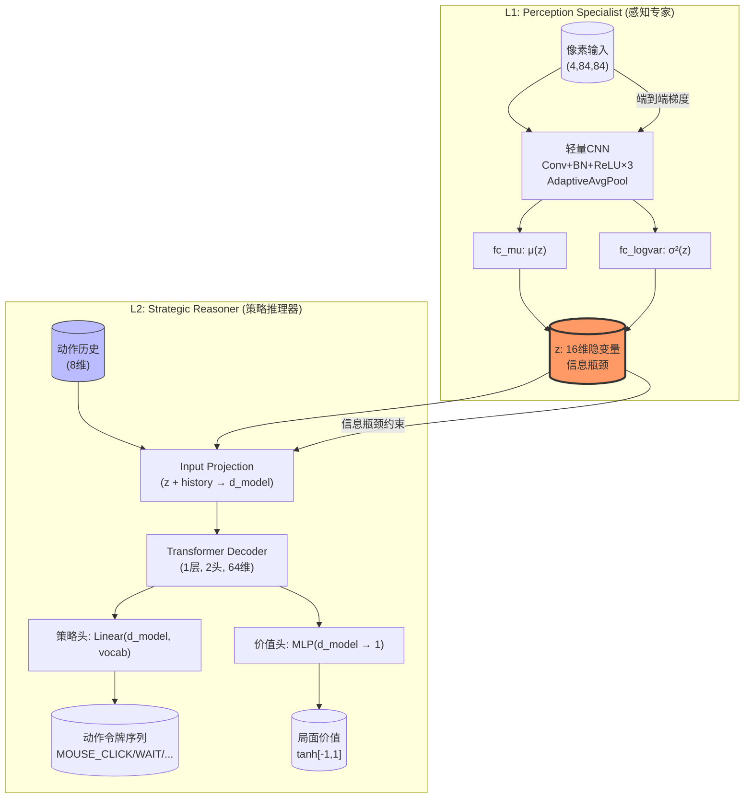

层次化架构是本项目视觉AI系统的**核心理论创新**——它不是简单地把CNN和Transformer拼接成"黑箱端到端"，而是引入了一个经过精心设计的**信息瓶颈**（Information Bottleneck），将视觉感知与策略推理显式解耦为两个可独立优化、可独立提取的子系统。这一设计的终极目标是为**自组织层次化视觉AI**（见[长期愿景](5-chang-qi-yuan-jing-zi-zu-zhi-ceng-ci-hua-shi-jue-ai-cong-jing-zi-qi-dao-tong-yong-you-xi-de-fan-hua-lu-jing)）奠定基础，使感知能力成为可复用的基础设施层，而非每次重新训练。

Sources: [hierarchical.py](model/hierarchical.py#L1-L22)

## 架构全景：双层次信息流



该架构与[通用视觉Agent模型](17-tong-yong-shi-jue-agentmo-xing-cnnshi-jue-bian-ma-qi-4x84x84-256wei-transformerzi-hui-gui-jie-ma-qi-sheng-cheng-dong-zuo-ling-pai-xu-lie-you-xi-wu-guan)中描述的"L3单体模型"的关键区别在于：单体模型中，CNN编码器输出256维向量直接送入Transformer解码器，中间没有显式的压缩瓶颈；而层次化架构强制将视觉信息压缩到**仅16维**的隐变量 `z`，迫使模型学到最核心的视觉模式。

Sources: [hierarchical.py](model/hierarchical.py#L24-L50), [generic_agent.py](model/generic_agent.py#L1-L15)

## L1感知专家：从像素到16维压缩隐变量

L1子网络 `PerceptionSpecialist` 的设计核心是**用极小的输出维度倒逼特征抽象**。其CNN管线通过三次步长2的卷积实现从84×84→11×11的快速空间降维，随后的 `AdaptiveAvgPool2d((3,3))` 进一步将特征图压缩为3×3=9个空间位置的32通道特征，展平后得到288维中间表示——但这还不是输出。最终瓶颈由两个线性层完成：`fc_mu` 投影到16维的均值向量 μ(z)，`fc_logvar` 投影到16维的 log 方差 log σ²(z)。

这种"均值-方差"的双头设计借鉴了VAE（变分自编码器）的reparameterization trick：训练时，`z = μ + ε * σ` 其中 ε∼N(0,I)，使得梯度可以通过采样层回传；推理时则直接取 `z = μ`，保证确定性。关键区别在于，**这里没有VAE中常见的解码器重构损失**——信息瓶颈的约束不是通过像素级重构实现的，而是通过下游任务（策略推理）的损失函数和显式的KL正则化项共同作用于 `z` 的形态。

L1的参数量极小：卷积部分约0.03M参数，瓶颈线性层约0.009M参数，总计不到0.04M。这意味着推理时可以用极小的计算代价从像素中提取出16维的"游戏状态摘要"。

Sources: [hierarchical.py](model/hierarchical.py#L52-L98)

## L2策略推理器：从隐变量到动作序列

L2子网络 `StrategicReasoner` 接收L1输出的16维 `z`，拼接8维的动作历史嵌入 `history`（编码过去若干步的执行动作），构成24维输入向量。这个向量通过一个线性投影层映射到64维的 `d_model` 空间，作为Transformer解码器的"memory"（即交叉注意力中的key/value来源）。

Transformer解码器设计极为轻量：1个decoder layer，2个注意力头，前馈网络维度为128（等于d_model×2）。嵌入层使用 `nn.Embedding` 将256种动作令牌（\~0-254为具体动作类型，255为NOOP终止符）映射到64维空间，配合可学习的位置编码 `pos_embed`。解码器支持两种模式：**训练时**的teacher forcing——接收目标令牌序列 `target_tokens`，生成因果掩码防止窥视未来；**推理时**的自回归生成——从BOS令牌开始逐个预测，遇到NOOP终止。

L2还包括一个独立的价值头 `value_head`：MLP(64→64→1) + Tanh，输出范围[-1,1]的局面评估值，用于后续的强化学习（如PPO）训练。这个价值头与L1的"局面价值"概念完全不同——L1的编码自始至终是无监督的，价值评估完全由L2负责。

Sources: [hierarchical.py](model/hierarchical.py#L100-L168)

## 端到端训练与信息瓶颈损失函数

层次化模型通过 `HierarchicalAgent` 类将L1和L2组合为一个端到端可训练的单元。前向传播方法 `forward(pixels, history, target_tokens, sample)` 依次调用L1编码和L2推理，返回包含 `action_logits`, `value`, `z`, `z_mu`, `z_logvar` 的字典。

其损失函数 `loss()` 定义了三项之和的总目标：

| 损失分量 | 来源 | 作用 | 默认权重 |
|----------|------|------|----------|
| L_action | 动作令牌交叉熵 | 让模型学会正确选择动作 | 1.0 |
| L_value | 价值MSE | 让价值头准确评估局面 | 1.0 |
| L_KL | KL散度 | 约束z服从标准正态先验N(0,I)，防止维度坍塌 | γ=0.001 |

**L_action** 使用 `CrossEntropyLoss` 并忽略NOOP令牌（`ignore_index=TOK_NOOP`），这意味着模型不需要学习精确预测序列长度——只需在有效动作令牌上正确。**L_KL** 是真正的信息瓶颈引擎：`-0.5 * Σ(1 + log σ² - μ² - exp(log σ²))`。这个项强制隐变量 `z` 的各维度保持单位方差、零均值的高斯分布形态。它的微妙之处在于：如果某个维度变得"无信息"（即模型学会忽略该维度），KL散度会惩罚logvar偏离0；反过来，如果某个维度承载了关键信息，其均值μ会偏离0，KL散度也会相应惩罚。这就是信息瓶颈的本质——**每个维度都必须为承载信息付出KL代价**，从而迫使模型只保留必要的信息。

γ=0.001的极小权重意味着L_KL只是作为一个**正则化项**，确保 `z` 的分布形态合理，而非主导训练。这种软约束允许视觉信息自由流动，同时防止隐变量空间退化。

Sources: [hierarchical.py](model/hierarchical.py#L215-L278)

## 信息瓶颈的深层解读

为什么是16维？这并非随意选取。对于井字棋而言，理论上的信息论下限是：9个格子×每个格子3种状态（X/O/空）= 3⁹ ≈ 19,683种棋盘状态，约需log₂(19683) ≈ 14.3比特。16维连续向量在理论上足以编码所有可能的棋盘状态，且留有冗余。更为重要的是，**16维的z是一个"可解释性接口"**——训练完成后，我们可以逐维度地分析z的每个分量编码了什么视觉概念（如"我方是否占中"、"对方是否形成双线"等），这种可解释性是256维密集向量难以提供的。

更大的意义在于**感知与推理的分离**。一旦L1在某个游戏上训练收敛，其感知能力（从像素中提取游戏态的能力）可以被**冻结并复用**到其他游戏中。这正是[长期愿景](5-chang-qi-yuan-jing-zi-zu-zhi-ceng-ci-hua-shi-jue-ai-cong-jing-zi-qi-dao-tong-yong-you-xi-de-fan-hua-lu-jing)中描述的"自组织层次化"的起点：L1成为通用的视觉感知模块，不同的L2可以接入同一个L1来处理不同的游戏，上层只需重新训练策略推理器即可。

Sources: [hierarchical.py](model/hierarchical.py#L170-L213), [数据收集器与蒸馏训练](25-shu-ju-shou-ji-qi-mlpzi-yi-ji-lu-zheng-dong-zuo-qi-pan-zhuang-tai-jie-zhi-shi-jue-mo-xing-zheng-liu-xun-lian)

## 推理管线与Fast Path

推理时的数据流如下：

```
像素(4x84x84) → L1编码 → z(16维) → L2解码 → 动作令牌序列
                                   ↗
                            动作历史(8维)
```

`HierarchicalAgent.act()` 方法使用 `sample=False` 强制L1走确定性路径（取μ而非采样），L2使用贪婪解码（`argmax`）逐令牌生成。训练完成后，可以通过 `encode()` 方法单独提取 `z`，用于可视化分析或作为下游任务的输入特征。对于井字棋PoC版本，`create_hierarchical_tictactoe()` 创建了一个仅约0.05M总参数量的微型层次化模型，单次CPU推理时间远低于5ms，满足实时游戏需求。

Sources: [hierarchical.py](model/hierarchical.py#L215-L254)

## 层次化 vs 单体模型：架构对比

| 维度 | L3单体模型 (GenericAgent) | 层次化模型 (HierarchicalAgent) |
|------|--------------------------|-------------------------------|
| 视觉编码维度 | 256维（直接送解码器） | 16维（通过信息瓶颈） |
| 压缩比 | 像素→256≈1.1×10⁻³ | 像素→16≈7.1×10⁻⁵（**15倍压缩**） |
| 感知/推理耦合 | 紧密耦合，无法单独提取 | 显式分离，L1可独立使用 |
| 可解释性 | 256维向量难以分析 | 16维z可逐维度分析 |
| 泛化路径 | 每个游戏重训全部参数 | L1冻结→仅重训L2 |
| 参数量 | ~0.8M (默认配置) | ~0.05M (PoC配置) |
| 训练复杂度 | 端到端，无中间约束 | 端到端 + KL正则化 |
| 信息保留 | 最大（无瓶颈损失） | 选择性保留（通过KL约束） |

单体模型的优势在于**信息无损**——256维足以编码所有视觉细节，理论上可以达到更高的任务准确率。层次化模型的优势在于**结构化的信息压缩**——通过瓶颈强制模型学到的视觉表示具有更高的抽象层级，使得感知模块成为可迁移的"视觉语言"。

Sources: [generic_agent.py](model/generic_agent.py#L129-L171), [hierarchical.py](model/hierarchical.py#L256-L278)

## 实施路线图

层次化架构目前位于 `model/hierarchical.py` 中，完成了完整的模型定义和损失函数设计，但**尚未集成到实际的训练管线中**。当前的训练系统（[自弈训练系统](16-zi-yi-xun-lian-xi-tong-ai_server-py-game-main-exe-lian-diao-epsilon-greedytan-suo-ce-lue-ti-du-die-dai-500lun-shou-lian)）使用 `ai/train.py` 配合MLP模型进行训练，而[数据收集器](25-shu-ju-shou-ji-qi-mlpzi-yi-ji-lu-zheng-dong-zuo-qi-pan-zhuang-tai-jie-zhi-shi-jue-mo-xing-zheng-liu-xun-lian)负责收集MLP自弈的帧-动作对用于蒸馏训练。

要将层次化架构投入实际训练，建议的路线为：
1. **阶段一**：使用数据收集器产出的 `(frame, action_tokens)` 样本，对 `HierarchicalAgent` 进行监督式预训练
2. **阶段二**：冻结L1，使用强化学习（PPO）微调L2，提升策略质量
3. **阶段三**：提取L1为独立模块，接入新的游戏环境验证泛化能力

这种渐进式策略与"从井字棋到通用游戏的泛化路径"完全一致，每一步都在复用之前的知识。