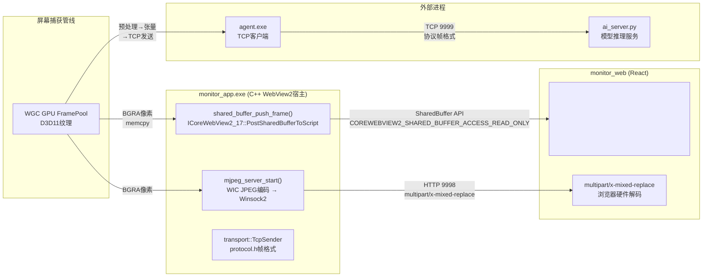

监控桌面应用（`monitor_app`）将捕获的屏幕帧推送到前端展示，面对**本地WebView2内嵌UI**与**外部AI进程**两类消费场景，设计了三种传输方式。它们按优先级形成一条降级链：**SharedBuffer零拷贝（主路径）→ MJPEG HTTP流式（回退）→ TCP二进制协议（外部通信）**，分别针对GPU到Canvas的最短路径、浏览器兼容性、以及跨进程AI推理三者的权衡。

## 架构全景：三条路径与各自的边界

下图展示了三种传输方式在系统架构中的位置和流向：



**三条路径的职责分界明确**：SharedBuffer与MJPEG服务于**监控UI的实时预览**场景，两者互斥切换；TCP端口9999服务于**agent.exe → AI服务器**的外部推理链路，与监控UI完全独立。

Sources: [main.cpp](monitor_app/src/main.cpp#L1-L247), [commands.cpp](monitor_app/src/commands.cpp#L1-L643)

## SharedBuffer零拷贝：GPU→Canvas的主路径

### 技术基础：WebView2 SharedBuffer API

这是最高效的传输方式，依赖WebView2提供的`ICoreWebView2Environment12` (创建共享缓冲区) 与`ICoreWebView2_17` (推送到脚本侧) 两个COM接口。工作流程如下：

1. **C++宿主侧**：流线程每捕获一帧BGRA像素后，调用`shared_buffer_push_frame()`。该函数通过`g_env12->CreateSharedBuffer(size)`分配一块共享内存，将像素数据`memcpy`进去，然后通过`g_webview17->PostSharedBufferToScript(buf, READ_ONLY, L"{}")`推送。第三个参数是`additionalDataJson`——目前为空对象`{}`，但在查看前端代码时发现，实际使用时**C++侧并未在JSON中嵌入宽高信息**，而是由前端直接从原始Buffer大小推算。

2. **前端React侧**：监听`chrome.webview`对象的`sharedbufferreceived`事件。事件处理函数通过`e.getBuffer()`获得`ArrayBuffer`、通过`e.getAdditionalData()`解析元数据JSON（含`w`, `h`, `ts`等字段）。然后将`ArrayBuffer`直接包装为`Uint8ClampedArray`，构造`ImageData`对象，调用`ctx.putImageData()`绘制到`<canvas>`。**整个过程没有额外的编解码或内存拷贝**——GPU纹理→CPU像素→SharedBuffer→Canvas ImageData，是一条平坦路径。

```cpp
// main.cpp — SharedBuffer推送核心（14行）
void shared_buffer_push_frame(const uint8_t* bgra, int w, int h) {
    if (!g_env12 || !g_webview17) return;
    size_t size = (size_t)w * h * 4;
    ComPtr<ICoreWebView2SharedBuffer> buf;
    if (FAILED(g_env12->CreateSharedBuffer((UINT)size, &buf))) return;
    BYTE* dst = nullptr;
    if (FAILED(buf->get_Buffer(&dst)) || !dst) return;
    memcpy(dst, bgra, size);    // 唯一的一次拷贝：GPU→共享内存
    buf->Close();
    g_webview17->PostSharedBufferToScript(buf.Get(),
        COREWEBVIEW2_SHARED_BUFFER_ACCESS_READ_ONLY, L"{}");
}
```

Sources: [main.cpp](monitor_app/src/main.cpp#L210-L223), [App.tsx](monitor_web/src/App.tsx#L502-L530)

### 为何称为"零拷贝"

严格来说，SharedBuffer路径仍然存在**一次`memcpy`**（从捕获线程的临时buffer复制到共享内存）。所谓的"零拷贝"指相对于替代方案MJPEG而言：后者需要**BGRA→JPEG编码（有损压缩）→HTTP传输→浏览器JPEG解码**，而SharedBuffer路径省去了编码/解码两个计算密集型环节。在物理层面，从GPU到屏幕的完整链路是：

| 阶段 | SharedBuffer | MJPEG |
|---|---|---|
| GPU纹理→CPU | D3D11 Map → memcpy | 同左 |
| 像素编码 | **无** | WIC JPEG压缩（CPU密集） |
| 进程间传输 | 共享内存（同一进程内，零开销） | HTTP环回（localhost，TCP栈） |
| 浏览器解码 | **无**（原生BGRA） | JPEG硬件解码（GPU/CPU） |
| 绘制 | Canvas putImageData | 浏览器渲染管线自动处理 |

共享内存分配使用`CreateSharedBuffer(UINT size)`，每次调用分配新buffer。这带来一个微妙的生命周期问题：前端何时可以释放Buffer？代码中`buf->Close()`在C++侧推送后立即调用，而WebView2运行时保证在前端事件处理完成前保持数据有效。这是一种**引用计数机制**——Close()只是减少引用，实际释放由前端消费完成后触发。

Sources: [main.cpp](monitor_app/src/main.cpp#L210-L223), [mjpeg_server.cpp](monitor_app/src/mjpeg_server.cpp#L42-L79)

## MJPEG HTTP 9998端口回退：当SharedBuffer不可用时

### 触发场景

当前端检测到`chrome.webview`对象不存在或`sharedbufferreceived`事件不支持时，自动回退到MJPEG路径。典型场景包括：在普通浏览器中调试UI（而非WebView2宿主）、WebView2运行时版本过旧（不支持`ICoreWebView2_17`）、或用户通过`transportMethod`参数强制选择MJPEG。

```typescript
// App.tsx — 降级逻辑（简化）
if (transportMethod === 'shared') {
    sharedBufActiveRef.current = true
    setupSharedBufferListener()      // 尝试SharedBuffer
} else {
    setImgSrc(`${MJPEG_URL}?t=${Date.now()}`)  // 直接使用加载MJPEG流
}
// 若SharedBuffer不可用，自动切换
if (!wv) {
    sharedBufActiveRef.current = false
    setImgSrc(`${MJPEG_URL}?t=${Date.now()}`)
}
```

Sources: [App.tsx](monitor_web/src/App.tsx#L506-L544)

### MJPEG服务器实现架构

`mjpeg_server.cpp`实现了一个独立的HTTP流媒体服务器，监听`127.0.0.1:9998`，使用`multipart/x-mixed-replace` MIME类型推送JPEG帧。其组件结构如下：

| 组件 | 文件 | 职责 |
|---|---|---|
| WIC JPEG编码器 | `bgra_to_jpeg()` (mjpeg_server.cpp:42-79) | 将BGRA像素通过WIC `IWICBitmapEncoder` + `GUID_ContainerFormatJpeg` 编码为JPEG字节流，质量默认70% |
| 帧缓存 | `g_last_jpeg` + `g_frame_mutex` | 全局保存最新一帧的JPEG数据，编码线程与发送线程通过互斥锁同步 |
| 客户端管理器 | `g_clients` + `g_clients_mutex` (mjpeg_server.cpp:30-35) | 向量管理多个并发客户端连接，每个客户端一个分离的`std::thread` |
| HTTP应答 | `client_handler()` (mjpeg_server.cpp:84-119) | 发送HTTP 200头（`Content-Type: multipart/x-mixed-replace; boundary=frame`），然后循环推送`--frame`边界分隔的JPEG帧 |

### 多客户端并发模型

服务器使用**独立accept线程 + 每个客户端一个detached线程**的模型。当一个新客户端连接时，`accept_loop()`创建`Client`对象并立即detach其线程。客户端线程循环读取全局帧缓存（通过互斥锁保护），以约60fps（`Sleep(16)`）的速率推送帧。

停止服务器时使用了一个精妙的技巧：`mjpeg_server_stop()`在设置`g_running=false`后，主动向自己（`127.0.0.1:9998`）发起一个TCP连接（`poke socket`），从而唤醒阻塞在`accept()`上的监听线程，避免死锁。

```cpp
// 唤醒accept()的技巧
SOCKET poke = socket(AF_INET, SOCK_STREAM, IPPROTO_TCP);
sockaddr_in addr = {};
addr.sin_family = AF_INET;
addr.sin_port = htons(9998);
addr.sin_addr.s_addr = inet_addr("127.0.0.1");
connect(poke, (sockaddr*)&addr, sizeof(addr));
closesocket(poke);
```

Sources: [mjpeg_server.cpp](monitor_app/src/mjpeg_server.cpp#L206-L248), [mjpeg_server.cpp](monitor_app/src/mjpeg_server.cpp#L200-L218)

### MJPEG的代价

每个帧经历**BGRA→JPEG编码（CPU密集型WIC操作）→TCP传输→浏览器JPEG解码**的完整链路。WIC编码在软件层面完成，约消耗数毫秒到十余毫秒（取决于分辨率）。由于JPEG是有损压缩，图像质量损失不可避免（代码中默认quality=0.70）。这是SharedBuffer主路径不可用时的可靠回退方案，但不应作为默认选择。

Sources: [mjpeg_server.cpp](monitor_app/src/mjpeg_server.cpp#L42-L79)

## TCP 9999端口外部通信：agent.exe ↔ AI服务器

### 与前两条路径的本质区别

SharedBuffer和MJPEG服务于**监控UI的实时预览**需求，两者都在`monitor_app.exe`内部。而TCP 9999端口则用于**agent.exe与AI服务器之间的外部通信**，传输的不是原始BGRA像素，而是经过预处理的**浮点张量**（4×84×84灰度堆叠帧 → 归一化float32）。这是一个完全独立的路径，不经过WebView2，也不经过HTTP。

### 发送端：agent.exe的TCP客户端

`agent/src/agent.cpp`中的`AiServerClient`类封装了TCP客户端逻辑。它采用**阻塞式socket**设计，超时时间为5秒：

1. **连接建立**：通过`getaddrinfo`解析主机名（默认`127.0.0.1:9999`），使用`SO_RCVTIMEO`设置5秒接收超时。
2. **张量发送**：`send_tensor()`将4×84×84的float32数组打包为二进制协议——`[total_size:4 LE][C:4 LE][H:4 LE][W:4 LE][data: C*H*W*4 bytes]`。总数据量约为`4*84*84*4=112,896`字节，在局域网延迟下约需0.5-1毫秒传输。
3. **动作令牌接收**：`recv_action_tokens()`阻塞等待服务器返回的原始字节序列，将结果解析为`std::vector<uint8_t>`，供后续`ActionDecoder`解析。

```cpp
// agent.cpp — 张量发送协议（21行）
bool send_tensor(const float* data, int channels, int height, int width) {
    int data_size = channels * height * width * (int)sizeof(float);
    uint32_t header[4] = {
        htonl((uint32_t)(data_size + 12)),
        htonl((uint32_t)channels),
        htonl((uint32_t)height),
        htonl((uint32_t)width)
    };
    if (!send_all((char*)header, sizeof(header))) return false;
    return send_all((char*)data, data_size);
}
```

注意这里使用了**网络字节序（大端）**——`htonl`将主机字节序转为网络字节序，而前面的SharedBuffer和MJPEG路径都使用小端（x86原生）。这种不一致是因为agent.exe与AI服务器可能运行在不同字节序的架构上，而WebView2一定在本地x86/ARM平台。

Sources: [agent.cpp](agent/src/agent.cpp#L1-L100), [agent.cpp](agent/src/agent.cpp#L44-L60)

### 接收端：ai_server.py的TCP服务

`ai/ai_server.py`中的`AIServer`类监听9999端口，接收棋盘文本协议（非二进制张量——注意，当前井字棋阶段的agent发送的是文本协议，而通用视觉agent发送的是二进制张量协议）。端口号`9999`在[protocol.h](protocol/protocol.h#L72)中定义为`PROTOCOL_DEFAULT_TCP_PORT`常量，作为整个项目的默认TCP端口标准。

### 与通用协议框架的关系

本项目在`common/transport/`下定义了两套通用传输封装：

| 封装 | 文件 | 用途 |
|---|---|---|
| `transport::TcpSender` | [common/transport/tcp.hpp](common/transport/tcp.hpp) | TCP广播，使用`protocol.h`帧格式（魔数FRAM + 载荷大小 + 类型标签），用于监控app向外部广播帧 |
| `transport::PipeSender/Receiver` | [common/transport/pipe.hpp](common/transport/pipe.hpp) | 标准输入输出管道传输，同样使用`protocol.h`帧格式，用于capture_stream.exe等子进程 |

这两套封装与`agent.exe`中的TCP客户端**不是同一回事**——agent.exe使用了自己的简单二进制协议（大端头 + float32数据），而`TcpSender`使用protocol.h定义的标准帧格式（小端FRAM魔数）。这种差异反映了**两种不同的抽象层级**：

- **protocol.h帧格式**（端口9999的服务器广播）用于系统内部组件间传输携带类型标签的通用数据帧（BGRA帧、控制消息等）
- **agent.exe的简单协议**（端口9999的客户端请求）用于与AI模型服务器之间传输特定格式的推理数据（预处理张量）

两者使用相同的端口号但协议不兼容，由不同的进程监听。

Sources: [tcp.hpp](common/transport/tcp.hpp#L1-L76), [protocol.h](protocol/protocol.h#L66-L80)

## 传输方式选择逻辑

在前端React UI中，`ScreenshotPanel`组件通过`transportMethod`属性控制传输方式选择。逻辑链如下：

```
transportMethod === 'shared' ?
    ├─ chrome.webview 存在 ?
    │   ├─ 是 → 启用SharedBuffer监听 → 隐藏，显示<canvas>
    │   └─ 否 → 自动降级到 MJPEG  加载
    └─ transportMethod !== 'shared' ?
        └─ 直接使用 
```

当前端切换到SharedBuffer模式时，`setImgSrc('')`清空MJPEG的``源，转而显示`<canvas>`元素。两者在UI中是互斥的——同一个时刻只有一种传输方式活跃。

Sources: [App.tsx](monitor_web/src/App.tsx#L555-L595)

## 性能和场景对比

| 维度 | SharedBuffer | MJPEG HTTP | TCP 9999 (agent→AI) |
|---|---|---|---|
| 编码阶段 | 无 | WIC JPEG编码 (质量70%) | 无（原始float32） |
| 传输媒介 | 共享内存（同一进程） | localhost TCP环回 | 网络TCP |
| 解码阶段 | 无（原生BGRA→Canvas） | 浏览器JPEG解码 | 无（服务端直接消费） |
| 端到端延迟 | <1ms（不含捕获） | 5-20ms（含编解码） | 取决于网络RTT |
| CPU负载 | 极低（仅memcpy） | 中（编码+解码） | 低（仅TCP传输） |
| 适用场景 | WebView2内嵌UI实时预览 | 浏览器调试 / WebView2不兼容 | agent.exe → AI模型推理 |
| 依赖条件 | WebView2 Runtime ≥ 对应版本 | 任意浏览器 | 网络连通 |
| 代码复杂度 | 低（~20行C++ + ~30行TS） | 中（~250行C++服务器） | 中（~80行TCP封装） |

## 阅读进阶

理解三种传输方式后，推荐继续阅读以下文档深化理解：

- [流式传输管线：WGC→GPU拷贝→SharedBuffer直推Canvas（主路径）/ WIC JPEG编码→MJPEG HTTP多部分传输（回退）](23-liu-shi-chuan-shu-guan-xian-wgc-gpukao-bei-sharedbufferzhi-tui-canvas-zhu-lu-jing-wic-jpegbian-ma-mjpeg-httpduo-bu-fen-chuan-shu-hui-tui) — 完整的数据管线和stream start/stop生命周期
- [二进制线缆协议：魔数"FRAM" + 小端载荷大小/类型标签 + 体](19-er-jin-zhi-xian-lan-xie-yi-mo-shu-fram-xiao-duan-zai-he-da-xiao-lei-xing-biao-qian-ti-c-pythonshuang-duan-tong-bu) — protocol.h帧格式的详细定义
- [Agent主循环管线：捕获→预处理→TCP发送→接收动作令牌→解码→执行输入](13-agentzhu-xun-huan-guan-xian-bu-huo-yu-chu-li-tcpfa-song-jie-shou-dong-zuo-ling-pai-jie-ma-zhi-xing-shu-ru) — agent.exe如何利用TCP链路完成AI自弈