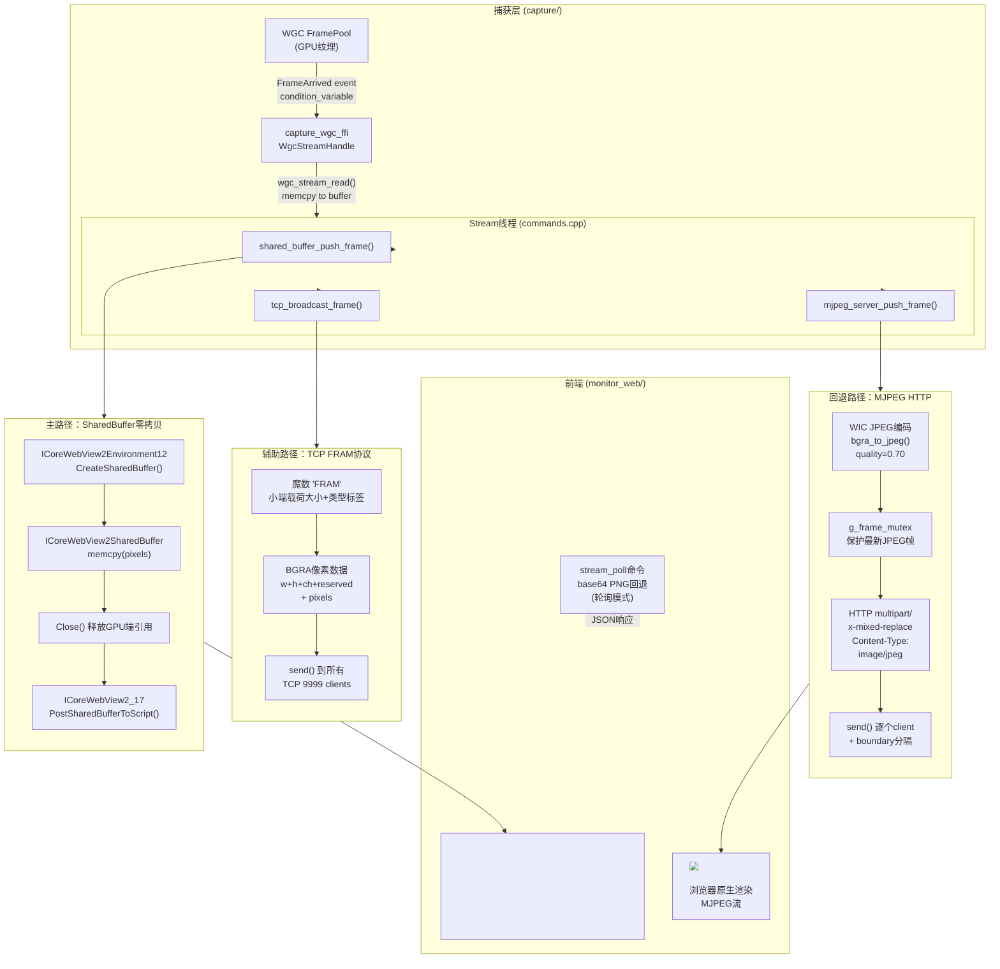

监控桌面应用的核心挑战在于：如何以最低延迟将WGC捕获的GPU帧送到WebView2前端的Canvas画布上。本页剖析两条路径——一条基于WebView2 SharedBuffer API的零拷贝主路径，另一条通过WIC JPEG编码→HTTP多部分响应的MJPEG回退路径——以及第三条TCP 9999端口线缆协议广播路径。

## 架构总览：三分支并发分发模型

stream线程是架构中枢。WGC捕获线程（`capture_wgc_ffi.cpp`中的WgcStreamHandle）在后台运行，每当有新帧到来，通过`wgc_stream_read()`将像素数据（BGRA格式）拷贝到用户缓冲区。`commands.cpp`中的stream线程则调用这三个函数实现并发分发：

```cpp
// 来自 commands.cpp 的 stream 线程核心循环
shared_buffer_push_frame(buf.data(), w, h);  // 主路径：GPU→SharedBuffer→Canvas
mjpeg_server_push_frame(buf.data(), w, h);   // 回退路径：JPEG编码→HTTP多部分流
tcp_broadcast_frame(buf.data(), w, h);       // 辅助路径：FRAM协议→TCP 9999
```

三条路径**同时运行**，互不阻塞。前端根据传输模式（`transport`参数）决定消费哪一条：`shared`模式使用SharedBuffer主路径，否则使用MJPEG回退。



**图注**：主路径（SharedBuffer）和回退路径（MJPEG）同时运行，前端根据`transportMethod`参数决定使用哪个。辅助路径TCP 9999供第三方Agent使用。

Sources: [commands.cpp](monitor_app/src/commands.cpp#L399-L424), [main.cpp](monitor_app/src/main.cpp#L210-L224), [mjpeg_server.cpp](monitor_app/src/mjpeg_server.cpp#L1-L19)

---

## 主路径：SharedBuffer零拷贝直推Canvas

### 设计动机

WebView2的SharedBuffer API（`ICoreWebView2Environment12::CreateSharedBuffer` + `ICoreWebView2_17::PostSharedBufferToScript`）允许C++宿主在进程共享内存中分配一块缓冲区，将引用传递给JavaScript端。前端通过`chrome.webview`的`sharedbufferreceived`事件获取`ArrayBuffer`，直接构造`ImageData`写入Canvas。整个过程**无需编码、无需HTTP、无需Base64**——从GPU纹理到Canvas仅一次`memcpy`（GPU→SharedBuffer）。

### C++端：shared_buffer_push_frame

```cpp
// main.cpp 中定义的共享缓冲区推送函数
void shared_buffer_push_frame(const uint8_t* bgra, int w, int h) {
    if (!g_env12 || !g_webview17) return;              // 检查接口可用性
    size_t size = (size_t)w * h * 4;                    // BGRA 4字节每像素
    ComPtr<ICoreWebView2SharedBuffer> buf;
    if (FAILED(g_env12->CreateSharedBuffer((UINT)size, &buf))) return;
    BYTE* dst = nullptr;
    if (FAILED(buf->get_Buffer(&dst)) || !dst) return;
    memcpy(dst, bgra, size);                            // 唯一一次拷贝
    buf->Close();                                        // 释放宿主端引用
    g_webview17->PostSharedBufferToScript(              // 传递给JS
        buf.Get(),
        COREWEBVIEW2_SHARED_BUFFER_ACCESS_READ_ONLY,
        L"{}");                                          // 附加元数据占位
}
```

关键设计点：

1. **`ICoreWebView2Environment12`** — 在`InitWebView2`的`EnvCreatedHandler`回调中获取。SharedBuffer是WebView2 SDK 1.0.1518+引入的功能，需`queryInterface`到`Environment12`接口。
2. **`ICoreWebView2_17`** — 同样通过`QueryInterface`从`g_webview`获取，提供`PostSharedBufferToScript`方法。版本号对应WebView2 SDK 1.0.1905+。
3. **`Close()`** — 调用后宿主端不能再访问缓冲区，但SharedBuffer对象仍在进程中存活直到JavaScript端释放引用。这是WebView2共享内存的正确用法。
4. **元数据JSON** — 第三个参数`L"{}"`目前为空对象。实践中可以在这里传递宽高和时间戳，前端在`getAdditionalData()`中获取。当前实现通过固定帧尺寸解决宽高问题。

Sources: [main.cpp](monitor_app/src/main.cpp#L39-L46), [main.cpp](monitor_app/src/main.cpp#L210-L224)

### 前端端：SharedBuffer → Canvas

```typescript
// App.tsx 中的 SharedBuffer 监听器
const setupSharedBufferListener = () => {
    const wv = (window as any).chrome?.webview;
    if (!wv) {
        // WebView2不可用 → 退回到MJPEG
        sharedBufActiveRef.current = false;
        setImgSrc(`${MJPEG_URL}?t=${Date.now()}`);
        return;
    }
    const handler = (e: any) => {
        if (!previewingRef.current || !sharedBufActiveRef.current) return;
        try {
            const buf: ArrayBuffer = e.getBuffer();          // 获取共享缓冲区
            const metaStr: string = e.getAdditionalData();   // 获取元数据JSON
            const meta = JSON.parse(metaStr) as { w: number; h: number; ts: number };
            // 零拷贝：ArrayBuffer → Uint8ClampedArray → ImageData → Canvas
            const imgData = new ImageData(
                new Uint8ClampedArray(buf, 0, meta.w * meta.h * 4),
                meta.w, meta.h
            );
            if (canvasRef.current) {
                canvasRef.current.width = meta.w;
                canvasRef.current.height = meta.h;
                const ctx = canvasRef.current.getContext('2d');
                if (ctx) ctx.putImageData(imgData, 0, 0);  // 写入Canvas
            }
            // FPS统计
            framesRef.current++;
            const now = Date.now();
            const elapsed = now - lastFpsRef.current;
            if (elapsed >= 1000) {
                setFps(Math.round(framesRef.current * 1000 / elapsed));
                framesRef.current = 0;
                lastFpsRef.current = now;
            }
        } catch (_) { /* 跳过损坏帧 */ }
    };
    wv.addEventListener('sharedbufferreceived', handler);
};
```

前端渲染时根据`sharedBufActiveRef.current`控制显示canvas还是img：

```tsx
// 条件渲染
{sharedBufActiveRef.current ? (
    <canvas ref={canvasRef} ... />     // SharedBuffer主路径
) : (
      // MJPEG回退
)}
```

Sources: [App.tsx](monitor_web/src/App.tsx#L440-L483), [App.tsx](monitor_web/src/App.tsx#L617-L623)

### 传输模式选择

`togglePreview()`函数中决定使用哪种传输方式：

```typescript
if (transportMethod === 'shared') {
    sharedBufActiveRef.current = true;
    setImgSrc('');                       // 隐藏，显示<canvas>
    setupSharedBufferListener();
} else {
    setImgSrc(`${MJPEG_URL}?t=${Date.now()}`);  // MJPEG模式
    sharedBufActiveRef.current = false;
}
```

`transportMethod`参数来自`ConnectionPanel`组件的设置，用户可以在配置中切换。`shared`为默认主路径。

Sources: [App.tsx](monitor_web/src/App.tsx#L595-L601)

---

## 回退路径：WIC JPEG编码 → MJPEG HTTP多部分流

### 设计动机

当SharedBuffer API不可用（例如WebView2运行时版本过旧、或渲染发生在常规浏览器而非WebView2中），需要一条与浏览器兼容的通用回退路径。MJPEG（Motion JPEG）使用HTTP `multipart/x-mixed-replace` 响应类型，将每一帧编码为独立的JPEG图像，通过"\r\n--frame\r\n"边界分隔。所有现代浏览器原生支持这种流式传输——只需一个``标签即可。

### C++端：MJPEG服务器架构

`mjpeg_server.cpp`是一个完整的Winsock2 HTTP服务器，监听`127.0.0.1:9998`，使用WIC（Windows Imaging Component）进行JPEG编码。

**初始化流程**：

```cpp
bool mjpeg_server_start() {
    // 1. 初始化WIC工厂（全局单例）
    CoCreateInstance(CLSID_WICImagingFactory, nullptr, CLSCTX_INPROC_SERVER,
                     IID_PPV_ARGS(&g_wic));
    // 2. 启动Winsock2
    WSADATA wsa;
    WSAStartup(MAKEWORD(2, 2), &wsa);
    // 3. 创建TCP套接字 + bind + listen
    g_listen = socket(AF_INET, SOCK_STREAM, IPPROTO_TCP);
    setsockopt(g_listen, SOL_SOCKET, SO_REUSEADDR, ...);
    bind(g_listen, ...);  // 绑定127.0.0.1:9998
    listen(g_listen, SOMAXCONN);
    // 4. 启动accept线程
    g_accept_thread = std::thread(accept_loop);
}
```

**JPEG编码管线**（`bgra_to_jpeg`函数）：

1. `IWICBitmap::CreateBitmapFromMemory` — 将BGRA像素数据包装为WIC Bitmap，不拷贝像素（仅引用）
2. `CreateStreamOnHGlobal` — 创建内存IStream，作为编码输出目标
3. `IWICBitmapEncoder`（GUID_ContainerFormatJpeg）— 创建JPEG编码器
4. `IWICBitmapFrameEncode` — 设置质量参数（默认0.70 = 70%），写入帧
5. `Commit()` → 从IStream读取编码后的JPEG字节

**客户端处理**：

`client_handler`为每个连接的客户端发送HTTP头（`Content-Type: multipart/x-mixed-replace; boundary=frame`），然后循环发送：
```
--frame\r\n
Content-Type: image/jpeg\r\n
Content-Length: <JPEG大小>\r\n
\r\n
<JPEG二进制数据>
\r\n
```
每帧之间`Sleep(16)` ≈ 60 FPS节流。

多客户端支持：每个accept连接创建一个`Client`对象，包含独立线程和active标志。`g_clients_mutex`保护共享client列表，`mjpeg_server_stop()`通过连接自身（`connect`到127.0.0.1:9998）来唤醒阻塞的`accept()`。

Sources: [mjpeg_server.cpp](monitor_app/src/mjpeg_server.cpp#L1-L14), [mjpeg_server.cpp](monitor_app/src/mjpeg_server.cpp#L38-L80), [mjpeg_server.cpp](monitor_app/src/mjpeg_server.cpp#L81-L107)

### 帧推送机制

```cpp
void mjpeg_server_push_frame(const uint8_t* pixels, int w, int h) {
    std::vector<uint8_t> jpeg;
    if (!bgra_to_jpeg(pixels, w, h, jpeg, 0.70f)) return;  // WIC编码

    std::lock_guard<std::mutex> lk(g_frame_mutex);
    g_last_jpeg = std::move(jpeg);   // 替换最新帧（跳过旧帧）
    g_last_w = w;
    g_last_h = h;
}
```

**关键设计**：只保留最新编码的JPEG帧。如果编码速度低于显示帧率（例如4K分辨率下WIC JPEG编码可能耗时>16ms），`g_last_jpeg`会被覆盖，client_handler始终获取最新帧而非排队等待——这是流式传输的正确行为，避免累积延迟。

### 前端端：MJPEG接收

前端使用标准的``标签，src指向MJPEG端点：

```tsx
// MJPEG模式：浏览器原生处理 multipart/x-mixed-replace

```

浏览器内核自动解析HTTP流，每收到一个完整的JPEG帧就更新``的渲染，无需任何JavaScript代码。`?t=${Date.now()}`用于缓存破坏，确保每次启动预览都能从新连接开始。

Sources: [App.tsx](monitor_web/src/App.tsx#L620-L626)

---

## 两条路径的性能特征对比

| 维度 | SharedBuffer主路径 | MJPEG回退路径 |
|---|---|---|
| **数据传输** | 进程内共享内存，0次网络传输 | HTTP本地回环（127.0.0.1），TCP开销 |
| **编码开销** | 无编码，仅memcpy | WIC JPEG编码（质量70%），CPU密集型 |
| **内存拷贝次数** | GPU纹理→SharedBuffer：1次memcpy | GPU纹理→JPEG编码→send()：1次memcpy + 1次JPEG压缩 + 网络拷贝 |
| **延迟** | 约1-2ms（memcpy + WebView2消息传递） | 通常5-20ms（编码质量70%时，取决于分辨率） |
| **帧率上限** | 无上限（取决于捕获帧率，通常60 FPS） | 受JPEG编码速度限制（1080p约100 FPS，4K约30 FPS） |
| **浏览器兼容** | 仅WebView2（`chrome.webview`专属API） | 所有现代浏览器（Chrome/Firefox/Edge/Safari） |
| **Canvas操作** | ImageData.putImageData()直接写入 | URL.src赋值，浏览器解压渲染 |
| **分辨率影响** | 线性放大（仅影响memcpy大小） | 非线性放大（JPEG编码时间随分辨率显著增长） |
| **CPU负载** | 极低（仅memcpy） | 中等（JPEG DCT压缩计算） |

**适用场景结论**：
- SharedBuffer主路径适合WebView2宿主内的低延迟监控，尤其是需要高帧率（>30 FPS）的场景
- MJPEG回退路径适合外部浏览器访问、远程监控、或WebView2版本过低的兼容性场景
- 两条路径并行运行，前端按需选择，不互斥

Sources: [commands.cpp](monitor_app/src/commands.cpp#L407-L410), [capture_wgc.cpp](capture/src/capture_wgc.cpp#L339-L410)

---

## 辅助路径：TCP 9999 FRAM协议广播

第三条路径通过TCP 9999端口广播原始BGRA帧，遵循protocol.h中定义的二进制线缆协议格式：

```
魔数 "FRAM" (4字节) + 载荷大小 (小端4字节) + 类型标签 (小端4字节) + 体
```

类型标签1表示BGRA帧，体结构为：
```
w (4字节) + h (4字节) + ch (4字节) + reserved (4字节) + pixels (w*h*ch 字节)
```

此路径供外部AI Agent（如Python端的agent）通过TCP连接消费原始帧数据，用于视觉模型推理。

Sources: [commands.cpp](monitor_app/src/commands.cpp#L269-L286)

---

## 结论：三层流式传输架构的设计哲学

WGC→GPU拷贝→SharedBuffer的主路径体现了一个核心原则：**尽可能在GPU内存域中完成数据传输，避免CPU编码和解码的往返消耗**。当难以满足此条件时（如非WebView2环境），MJPEG回退路径以JPEG编码为代价换取浏览器原生支持。

| 路径 | 核心能力 | 典型延迟 | 适合场景 |
|---|---|---|---|
| SharedBuffer主路径 | GPU→Canvas零拷贝，无需编码 | <2ms | WebView2宿主内实时监控 |
| MJPEG回退路径 | 浏览器原生流式，无需插件 | ~10ms | 远程浏览器访问/调试 |
| TCP FRAM广播 | 原始BGRA数据，无压缩 | <1ms | AI Agent模型推理输入 |

三条路径并行运行的模式确保了任一消费端都不会因为另一端的处理延迟而阻塞捕获帧的更新——stream线程以`Sleep(1)`的速率轮询WGC，每次读取最新帧后立即分发到所有路径，不会被任何路径阻塞。

Sources: [commands.cpp](monitor_app/src/commands.cpp#L399-L424), [wgc_ffi.h](capture/include/capture_wgc_ffi.h#L1-L59)

---

## 延伸阅读

- **WGC捕获深度解析**：[GPU FramePool + D3D11 + WinRT多线程MTA设计，Triple-buffered与条件变量同步](9-wgcbu-huo-shen-du-jie-xi-gpu-framepool-d3d11-winrtduo-xian-cheng-mtashe-ji-triple-bufferedyu-tiao-jian-bian-liang-tong-bu) — 本页的SharedBuffer数据来源
- **三种传输方式总览**：[SharedBuffer零拷贝GPU→Canvas、MJPEG HTTP 9998端口回退、TCP 9999端口外部通信](20-san-chong-chuan-shu-fang-shi-sharedbufferling-kao-bei-gpu-canvas-mjpeg-http-9998duan-kou-hui-tui-tcp-9999duan-kou-wai-bu-tong-xin) — 传输层全景图
- **WebMessage桥接**：[chrome.webview.postMessage → C++命令分发 → JSON响应](22-webmessageqiao-jie-chrome-webview-postmessage-c-ming-ling-fen-fa-jsonxiang-ying-qu-dai-tauri-invoke) — SharedBuffer元数据传递机制
- **监控面板功能**：[仪表盘/窗口捕获预览/FPS计数/日志环缓冲区](24-jian-kong-mian-ban-gong-neng-yi-biao-pan-chuang-kou-bu-huo-yu-lan-fpsji-shu-ri-zhi-huan-huan-chong-qu-chuang-kou-xuan-ze-qi-she-zhi-ye-mian) — 流的消费端UI