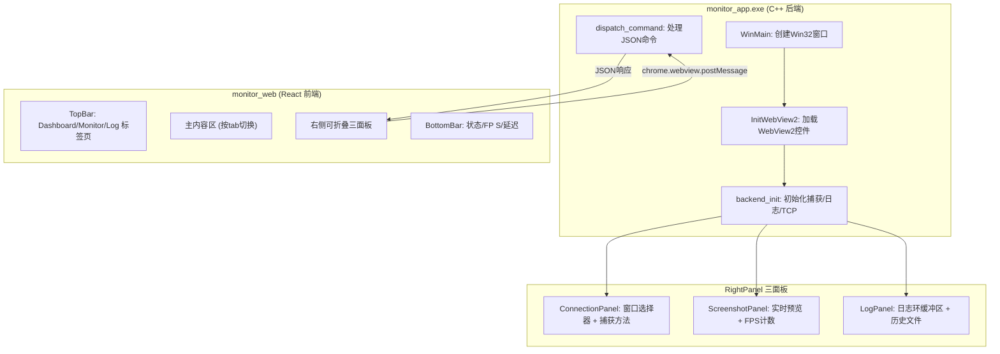
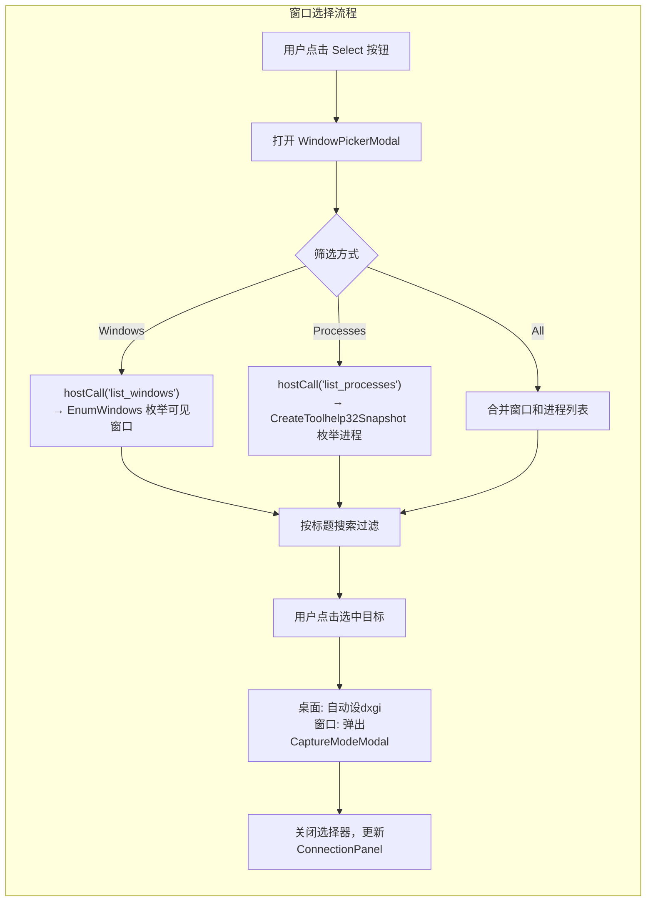
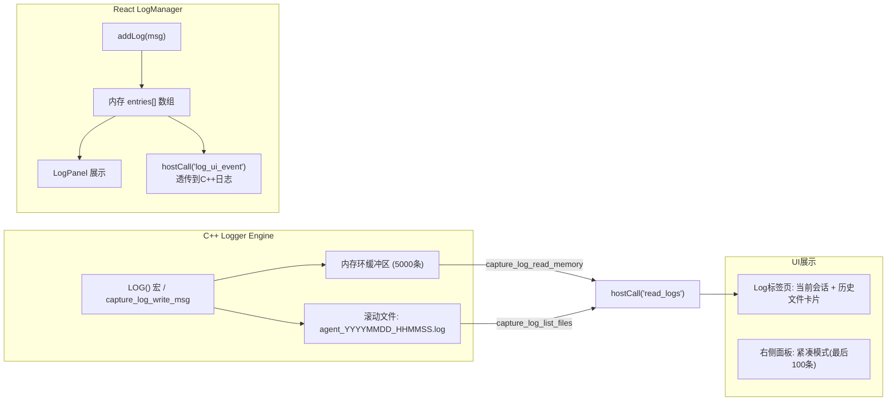

监控面板是 `monitor_app.exe`（纯C++ WebView2宿主）与 `monitor_web/`（React前端）协作组成的图形界面，提供对游戏Agent系统的实时可视化监控和操控能力。整个面板围绕**右侧三面板 + 底栏状态条 + 标签页切换**的布局展开，覆盖从"看什么"到"怎么配置"的完整交互链路。

Sources: [commands.h](monitor_app/src/commands.h#L1-L18), [main.cpp](monitor_app/src/main.cpp#L1-L247), [App.tsx](monitor_web/src/App.tsx#L1-L1308)

---

## 一、整体布局结构

面板采用经典的IDE式布局：左上为**标签页导航栏（TopBar）**，左下为**状态底栏（BottomBar）**，中央为主内容区（根据标签页切换），右侧为**可折叠的三面板**（Connection / Screenshot / Log）。右侧面板之间的分隔线可拖拽调整宽度，向右拖到底可完全折叠。



底栏状态条显示：运行状态指示圆点（绿=Running/灰=Idle）、实时FPS计数、实时延迟（Lat）。右侧三面板各自独立可折叠，且带有**自适应布局逻辑**：当窗口高度缩小时，面板按Log→Screenshot→Connection的顺序自动折叠以适应空间；当窗口拉大时，按相反顺序自动展开。

Sources: [App.tsx](monitor_web/src/App.tsx#L1100-L1299), [App.tsx](monitor_web/src/App.tsx#L153-L175)

---

## 二、仪表盘（Dashboard）

Dashboard 标签页以四个卡片展示系统概览信息：

| 卡片 | 展示内容 |
|------|---------|
| System | App版本号、资源版本号、屏幕分辨率（动态查询）、服务状态 |
| Capture Pipeline | 窗口捕获方式（WGC FramePool）、桌面捕获方式（DXGI Desktop Dup）、回退方案（GDI BitBlt）、编码格式（Raw RGBA Canvas） |
| Update | 当前版本、检查更新按钮、更新源选择（GitHub/Gitee/Local） |
| Resources | 日志目录、捕获后端、传输端口（TCP 9999）、UI技术栈 |

Dashboard 在挂载时自动调用 `hostCall('screen_info')` 获取屏幕分辨率，并设置状态为 "Ready"。

Sources: [App.tsx](monitor_web/src/App.tsx#L1068-L1095)

---

## 三、窗口选择器（Window Picker）

窗口选择器是一个模态窗口，提供三个筛选维度：All、Windows（窗口）、Process（进程）。还有一个 ` Entire Desktop` 入口用于桌面级捕获。



C++后端命令 `cmd_list_windows()` 通过 `EnumWindows` 回调过滤出带标题、可见、未cloaked、有有效矩形、非工具窗口的窗口列表，返回 JSON 数组 `[{title, category, hwnd}]`。`cmd_list_processes()` 则通过 `CreateToolhelp32Snapshot` 获取系统进程列表。

选择窗口后，若为桌面（hwnd=0）则自动设捕获方法为 `dxgi`；若为普通窗口则弹出 **CaptureModeModal**，让用户选择"前台"、"后台"或"最小化"以确定最佳捕获方案。被选中的窗口周围会显示**黄色半透明边框高亮**（由 `cmd_highlight_window` 创建4个Layered窗口实现）。

Sources: [commands.cpp](monitor_app/src/commands.cpp#L70-L109), [commands.cpp](monitor_app/src/commands.cpp#L109-L135), [commands.cpp](monitor_app/src/commands.cpp#L492-L534), [App.tsx](monitor_web/src/App.tsx#L176-L390)

---

## 四、窗口捕获预览（Screenshot Panel）

ScreenshotPanel 提供**单帧截图**和**实时流预览**两种模式：

### 单帧截图
用户点击 Camera 图标按钮，触发 `hostCall('capture_window', {hwnd, method})`。C++后端调用 `call_capture()` 方法链（WGC→GDI→PrintWindow→ScreenBitBlt → DesktopBlt），获得BGRA像素数据后，通过 WIC 编码为 PNG，再 base64 嵌入 JSON 返回前端。前端解析后以 `` 标签渲染，并**按比例定位**在屏幕尺寸容器中（以窗口左上角相对屏幕坐标定位）。

### 实时流预览（两种传输方式）

| 传输方式 | 路径 | 延迟特性 |
|----------|------|---------|
| **SharedBuffer (主路径)** | WGC捕获→GPU内存拷贝→`ICoreWebView2_17::PostSharedBufferToScript`→Canvas `putImageData` | 零拷贝，无编码延迟 |
| **MJPEG (回退)** | WGC捕获→WIC JPEG编码→HTTP multipart/x-mixed-replace→浏览器`` GPU硬解 | 有JPEG编码开销，但稳定兼容 |

SharedBuffer 路径是核心优化手段：C++端通过 `CreateSharedBuffer` 分配与WebView共享的内存，将BGRA数据直接 `memcpy` 写入，前端通过 `chrome.webview.addEventListener('sharedbufferreceived', handler)` 接收 `ArrayBuffer`，转化为 `ImageData` 后直接由 Canvas `putImageData` 渲染——全程无base64编码、无HTTP传输、无JPEG压缩，实现最高帧率的最低延迟预览。

MJPEG 回退路径在 SharedBuffer API 不可用时自动启用，由内置的 `mjpeg_server` 在 9998 端口提供 multipart/x-mixed-replace MJPEG 流。

Sources: [commands.cpp](monitor_app/src/commands.cpp#L140-L231), [main.cpp](monitor_app/src/main.cpp#L211-L223), [App.tsx](monitor_web/src/App.tsx#L404-L598), [mjpeg_server.cpp](monitor_app/src/mjpeg_server.cpp#L1-L248)

---

## 五、FPS计数

FPS 计算采用**每秒钟计数帧数**的方法，C++端和前端各有一份独立实现：

**前端FPS计算**（ScreenshotPanel 内）：

```typescript
const framesRef = useRef(0)
const lastFpsRef = useRef(Date.now())
// 每收到一帧（tick消息或SharedBuffer事件）：
framesRef.current++
const now = Date.now()
const elapsed = now - lastFpsRef.current
if (elapsed >= 1000) {
    setFps(Math.round(framesRef.current * 1000 / elapsed))
    framesRef.current = 0
    lastFpsRef.current = now
}
```

**C++后端FPS计数**（流线程内，通过 `tcp_broadcast_frame` 发送的 tick 消息同步）：

流循环中每读取到一帧数据就调用 `shared_buffer_push_frame`（推Canvas）+ `mjpeg_server_push_frame`（推MJPEG）+ `tcp_broadcast_frame`（推TCP），前端监听 `message` 事件中的 `tick` 类型消息来触发FPS计数。

前端同时将 FPS 显示在 Screenshot 面板标题旁（预览激活时）和底栏状态条中。底栏还有 Lat（延迟）显示，展示从捕获到渲染的端到端延迟。

Sources: [App.tsx](monitor_web/src/App.tsx#L554-L562), [commands.cpp](monitor_app/src/commands.cpp#L380-L410)

---

## 六、日志环缓冲区（Log Panel）

日志系统采用**前端 LogManager 单例 + 后端回环缓冲区**的双层设计：

### 架构层次



### 前端 LogManager

前端 `LogManager` 是一个全局单例，维护 `entries: LogEntry[]` 数组以及 `Set<() => void>` 的订阅者列表。每次调用 `addLog()` 时：
1. 添加带时间戳的条目到 entries 数组
2. 通知所有订阅者（触发 LogPanel 重渲染）
3. 同步调用 `hostCall('log_ui_event', { msg })` 将日志透传到C++后端，保证前后端日志一致

### 日志面板两种形态

| 形态 | 位置 | 显示行数 | 功能 |
|------|------|---------|------|
| **紧凑模式** | 右侧面板最下方 | 最后100条 | 滚动查看器，自动滚动到底部，手动上滚时暂停自动滚动 |
| **完整模式** | Log 标签页 | 最后500条 | 当前会话卡片 + 历史文件卡片列表（可展开查看） |

完整模式下，历史文件通过 `hostCall('read_logs', { max_files: 5 })` 调用C++后端的 `cmd_read_logs()`，该命令同时读取**内存环缓冲区**（`capture_log_read_memory`）和**磁盘日志文件列表**（`capture_log_list_files`），返回 JSON 供前端渲染为可折叠的日志文件卡片。

日志引擎使用高精度 `QueryPerformanceCounter` 生成时间戳（格式 `HH:MM:SS.mmm`），环缓冲区容量默认5000条，日志文件滚动保留最近5个文件。

Sources: [commands.cpp](monitor_app/src/commands.cpp#L449-L462), [App.tsx](monitor_web/src/App.tsx#L609-L860), [logger.h](logger/logger.h#L1-L64), [logger.cpp](logger/logger.cpp#L1-L297)

---

## 七、设置页面（Settings Page）

Settings 标签页集合了所有可配置项，以 `SettingsCard` 可折叠卡片为单位组织：

| 卡片 | 配置项 | 说明 |
|------|--------|------|
| Connection | 窗口选择、IP地址、端口号、捕获方法（WGC/GDI/PrintWindow/ScreenBitBlt/DesktopGDI）| 支持`自检`按钮：benchmark各方法速度并自动选最优 |
| Transport | SharedBuffer/MJPEG/Base64/H.264 四种传输方式 | SharedBuffer为零拷贝主路径，MJPEG为稳定回退 |
| Theme | 明/暗/系统主题、6色强调色选择 | 暗色主题设置CSS变量覆盖 |
| Model Context | Base Model名称、Adapter名称 | 预留的AI模型配置接口 |
| Update | 版本号显示、检查更新按钮 |更新源可选GitHub/Gitee/Local |
| Log | 日志目录路径、保留文件数 | 直接配置日志引擎参数 |
| Project | GitHub Star按钮、项目链接、技术栈致谢 | 外部链接导航 |

捕获方法自检（Benchmark）功能调用 `hostCall('benchmark_methods', { hwnd })`，C++后端对 WGC/DesktopBlt/GDI(GetWindowDC)/PrintWindow/ScreenBitBlt 五种方法逐一测试，记录耗时和成败，返回JSON后前端自动选中最快的可用方法。

Sources: [App.tsx](monitor_web/src/App.tsx#L862-L1068), [commands.cpp](monitor_app/src/commands.cpp#L464-L480)

---

## 关键设计决策

1. **WebMessage桥接替代Tauri invoke**：纯C++宿主不使用任何Rust/Tauri依赖，所有前后端通信通过 `chrome.webview.postMessage` + JSON 命令派发实现，保证了前端代码与Tauri版本100%兼容。

2. **SharedBuffer零拷贝预览**：利用 WebView2 的 `ICoreWebView2_17::PostSharedBufferToScript` API，实现GPU/CPU共享内存直接渲染到 Canvas，避免任何编码/解码开销。

3. **自适应右面板布局**：三面板的自动折叠/展开算法通过 `ResizeObserver` 风格的事件监听和 CSS `grid-template-rows` 动画实现流畅过渡，确保在任何窗口尺寸下都有合理的信息密度。

4. **前后端日志一致性**：前端 UI 操作日志通过 `log_ui_event` 命令同步到 C++ 后端，后端系统日志通过 `read_logs` 命令供前端读取，保证问题排查时日志信息完整。

Sources: [commands.cpp](monitor_app/src/commands.cpp#L536-L540), [main.cpp](monitor_app/src/main.cpp#L211-L223)

---

## 下一步阅读

完成监控面板功能的学习后，建议深入以下相关模块：

- [流式传输管线：WGC→GPU拷贝→SharedBuffer直推Canvas（主路径）/ WIC JPEG编码→MJPEG HTTP多部分传输（回退）](23-liu-shi-chuan-shu-guan-xian-wgc-gpukao-bei-sharedbufferzhi-tui-canvas-zhu-lu-jing-wic-jpegbian-ma-mjpeg-httpduo-bu-fen-chuan-shu-hui-tui)——理解SharedBuffer和MJPEG两条传输管线的完整数据流
- [纯C++ WebView2宿主：Win32窗口 + React UI（与Tauri解耦，同一份前端代码100%不变）](21-chun-c-webview2su-zhu-win32chuang-kou-react-ui-yu-taurijie-ou-tong-fen-qian-duan-dai-ma-100-bu-bian)——深入了解 WebMessage 桥接的底层实现
- [日志引擎：统一C API (capture_log_write_msg) + 线程安全环缓冲区 + 文件滚动，跨C++/Rust/工具使用](26-ri-zhi-yin-qing-tong-c-api-capture_log_write_msg-xian-cheng-an-quan-huan-huan-chong-qu-wen-jian-gun-dong-kua-c-rust-gong-ju-shi-yong)——了解更多日志引擎的内部机制