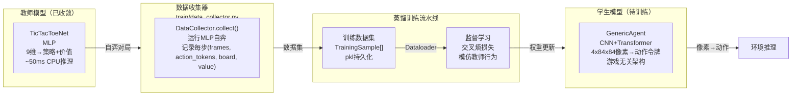
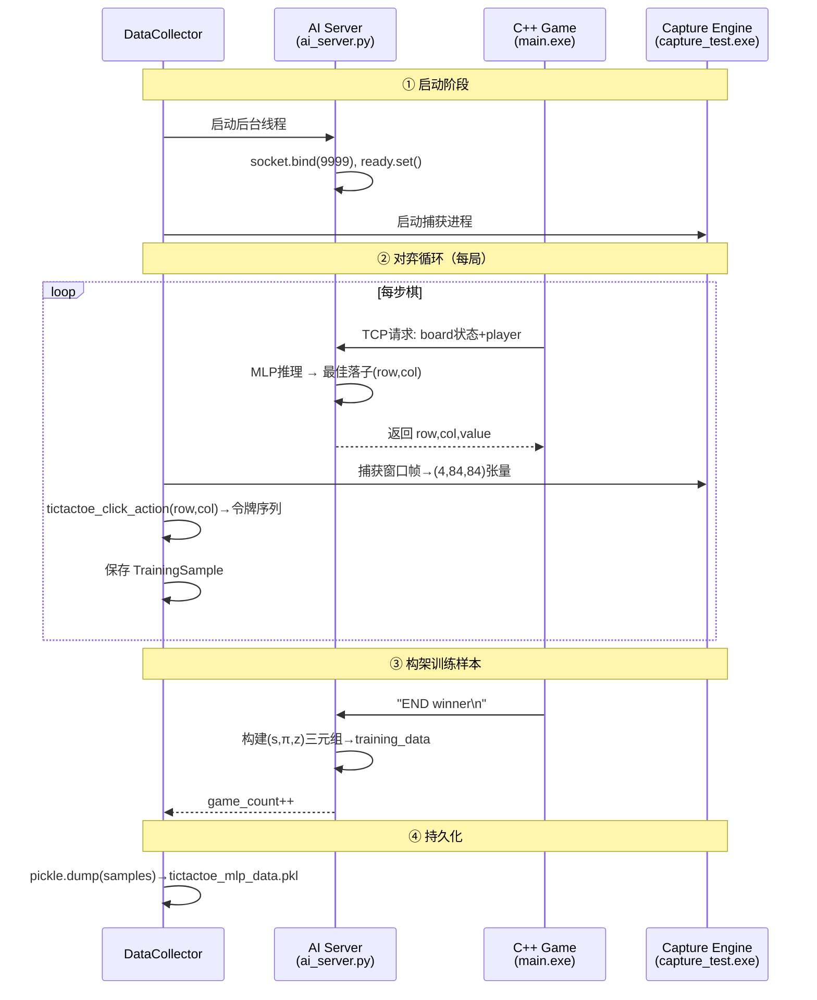
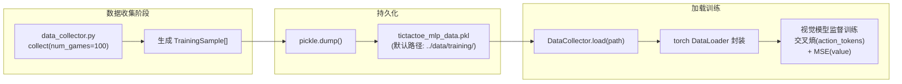

数据收集器是连接"井字棋MLP符号AI"与"通用视觉AI"的**蒸馏桥梁**。它的核心使命是：利用已收敛的MLP教师模型（3层全连接网络，9维棋盘输入→策略+价值输出）进行大规模自弈，收集每步决策时的屏幕帧、动作令牌、棋盘状态和局面价值，为视觉学生模型（CNN+Transformer，像素输入→动作令牌序列）提供监督训练信号。这是项目从"符号驱动的井字棋专用AI"迈向"像素驱动的通用游戏AI"的战略性中间步骤。

Sources: [data_collector.py](train/data_collector.py#L1-L32)

---

## 蒸馏设计：为什么需要数据收集器？

项目拥有两条并行的模型技术路线：左侧的MLP符号路线已成熟收敛（500轮自弈后可达接近完美玩法），右侧的视觉路线正处于建设阶段。数据收集器填补了两者之间的鸿沟。



**设计意图**：MLP教师通过抽象符号（9维棋盘向量）理解游戏——它"知道"自己在玩井字棋。视觉学生通过原始像素理解游戏——它只能看到屏幕上的X和O图案，没有任何棋类先验知识。数据收集器就是**翻译官**：将教师的符号决策（"在第3行第2列落子"）翻译为学生可学习的视觉决策（"看到这个像素图案时，应该输出鼠标移动到(320,240)然后点击左键"）。

Sources: [data_collector.py](train/data_collector.py#L34-L64), [model.py](ai/model.py#L31-L52), [net.py](ai/net.py#L1-L68)

---

## 核心数据结构：TrainingSample —— 蒸馏的基本单元

数据集中每条样本记录了MLP教师一步决策的完整上下文。这种数据格式的设计直接决定学生模型能学到什么。

| 字段 | 类型 | 维度 | 含义 | 蒸馏中的作用 |
|---|---|---|---|---|
| `frame` | np.ndarray(float32) | (4, 84, 84) | 灰度帧堆叠，4帧历史 | 视觉学生的输入——像素级棋盘图像 |
| `action_tokens` | List[int] | 1~32变长 | 动作令牌序列（如鼠标移动到格子+点击） | 视觉学生的监督目标——模仿教师的操作 |
| `board_state` | List[int] | 9 | 棋盘状态向量（+1=X, -1=O, 0=空） | 调试用，验证学生是否学到正确的棋盘表示 |
| `player` | int | 标量 | 1=X, -1=O | 区分当前视角 |
| `value` | float | 标量 | [-1,1] 局面评估 | 价值头监督信号，让学社学会评价局面 |

**动作令牌序列的例子**：当MLP教师选择在 (row=1, col=1) —— 即棋盘中央落子时，`tictactoe_click_action()` 会将它翻译为一系列通用动作令牌：

```
[TOK_MOUSE_MOVE_ABS] [x_norm] [y_norm]  → 鼠标移动到格子中心
[TOK_MOUSE_CLICK]    [x_norm] [y_norm] [BTN_LEFT]  → 左键点击
[TOK_NOOP]           → 序列结束
```

每一个动作令牌都是0~255范围内的整数，对应`action_space.py`定义的通用动作词汇表。这种**游戏无关的令牌化**正是视觉模型泛化的基础——它不学"落子"，只学"移动到(x,y)并点击"。

Sources: [data_collector.py](train/data_collector.py#L39-L53), [action_space.py](model/action_space.py#L1-L27)

---

## 收集流程：四步蒸馏管线

DataCollector 的设计遵循一个清晰的四阶段工作流，每步收集一个维度上的知识。



**关键观察**：当前实现中，`frame`被填充为全零的占位张量 `np.zeros((4, 84, 84))`。这是因为视觉捕获管线的集成尚未完成——真正的蒸馏部署需要将 `capture_test.exe`（或生产级的 `capture_wgc.dll`）集成到收集器中，在MLP每一步决策时同步抓取游戏窗口的屏幕截图。数据格式已为真实帧预留，接口定义已经完备。

Sources: [data_collector.py](train/data_collector.py#L67-L140)

---

## MLP教师推理：从符号到像素动作的翻译

DataCollector 的 `collect()` 方法执行完整的教师推理链，理解这条链是理解蒸馏本质的关键。

### 推理链分解

```python
# ① TCP连接AI服务器获取教师的符号决策
sock.connect(("127.0.0.1", self.server_port))
board_str = " ".join(str(b) for b in board) + f" {current_player}\n"
sock.sendall(board_str.encode())
resp = sock.recv(256).decode().strip()
row, col, value = int(parts[0]), int(parts[1]), float(parts[2])

# ② 将符号决策翻译为通用动作令牌序列
action_tokens = tictactoe_click_action(row, col)

# ③ 组合为训练样本
sample = TrainingSample(
    frame=frame,               # 真实视觉帧（当前为占位）
    action_tokens=action_tokens, # 教师动作令牌
    board_state=board.copy(),  # 棋盘状态（用于调试验证）
    player=current_player,     # 执棋方
    value=value,               # 教师的价值评估
)
```

这段代码揭示了蒸馏的核心逻辑：**教师的知识通过"符号→令牌"的翻译过程传递给学生**。学生不需要知道井字棋的规则，它只需要学习"看到某组像素时，模仿教师的令牌序列"。

Sources: [data_collector.py](train/data_collector.py#L87-L120)

---

## 持久化与加载：数据集的生命周期

收集完成后，数据以Python pickle格式持久化到磁盘，供后续视觉模型训练使用。



当前实现提供了静态 `load()` 方法用于加载已保存的数据集，以及 `main()` 入口用于快捷收集：

```
# 收集100局MLP自弈数据
python data_collector.py --games 100 --port 9999 --output ../data/training

# 加载数据集用于训练
samples = DataCollector.load("../data/training/tictactoe_mlp_data.pkl")
```

Sources: [data_collector.py](train/data_collector.py#L142-L186)

---

## 与视觉模型训练的衔接：蒸馏训练方案

收集到的数据集可以直接馈入视觉学生模型。下面是推荐的蒸馏训练方案：

### 训练数据映射

| 数据集字段 | 学生模型输入/输出 | 损失函数 | 说明 |
|---|---|---|---|
| `frame` | 输入: (B, 4, 84, 84) | — | 学生模型的视觉输入 |
| `action_tokens` | 目标: (B, seq_len) 长整型 | `CrossEntropyLoss` | 教师强制(teacher forcing)训练解码器 |
| `value` | 目标: (B, 1) | `MSELoss` | 价值头监督 |

### 训练脚本骨架（示意）

```python
# 加载教师数据集
samples = DataCollector.load("tictactoe_mlp_data.pkl")

# 构建视觉学生模型（游戏无关架构）
student = GenericAgent(d_model=128, nhead=4, n_layers=2)

# 蒸馏训练：帧→动作令牌
optimizer = torch.optim.Adam(student.parameters(), lr=1e-4)

for epoch in range(num_epochs):
    for sample in samples:
        frame = torch.tensor(sample.frame).unsqueeze(0)    # (1,4,84,84)
        tokens = torch.tensor(sample.action_tokens).unsqueeze(0)  # (1,seq_len)

        logits = student(frame, target_tokens=tokens)       # 教师强制
        loss = F.cross_entropy(
            logits.reshape(-1, ACTION_VOCAB_SIZE),
            tokens.reshape(-1),
            ignore_index=TOK_NOOP
        )
        loss.backward()
        optimizer.step()
```

**设计要点**：训练时使用教师强制（teacher forcing）——将真实的教师动作令牌序列作为解码器输入，让Transformer解码器学习"给定之前的真实令牌，预测下一个令牌"。推理时切换到自回归模式，逐个生成动作令牌直到遇到`TOK_NOOP`。

Sources: [generic_agent.py](model/generic_agent.py#L1-L171)

---

## 工程现状与下一步

当前数据收集器的实现是**功能完备但视觉输入尚未集成**。具体来说：

| 组件 | 状态 | 说明 |
|---|---|---|
| TCP连接获取教师决策 | ✅ 已完成 | 复用ai_server.py的协议，与训练系统一致的通信方式 |
| 动作令牌翻译 | ✅ 已完成 | `tictactoe_click_action()` 正确处理井字棋落子→令牌序列 |
| 棋盘状态记录 | ✅ 已完成 | 逐步记录9维棋盘向量，可验证教师决策的正确性 |
| 价值记录 | ✅ 已完成 | 记录教师的局面评估值，支持价值头蒸馏 |
| Pickle持久化 | ✅ 已完成 | 标准Python序列化，可跨训练会话复用数据集 |
| **视觉帧捕获** | ❌ 占位 | 当前用 `np.zeros()` 填充，需集成 `capture_test.exe` 或WGC后端 |
| 数据增强 | ❌ 待实现 | 可加入随机裁剪/亮度变化增强视觉鲁棒性 |
| 批量收集优化 | ❌ 待实现 | 当前为串行收集，可多进程并行加速 |

**集成视觉捕获的关键路径**：需要将 `capture/` 模块（DXGI/WGC后端）提供的帧捕获能力接入收集器。在MLP每步决策时，同步调用捕获引擎抓取游戏窗口的屏幕截图，经过预处理管线（裁剪→84x84缩放→灰度化→4帧堆叠→归一化）后填入`frame`字段。这一集成将使数据集从"符号可验证"升级为"像素可训练"。

Sources: [data_collector.py](train/data_collector.py#L1-L186)

---

## 总结与阅读路径

数据收集器在整个项目中的定位可概括为：**从MLP的符号智能中提取"像素级行为示范"，为视觉模型的知识蒸馏提供结构化训练数据**。它不是最终产品，而是赋能视觉模型从零学习的桥梁设施。

建议的后续阅读路径：
- [自弈训练系统：ai_server.py + game/main.exe 联调](16-zi-yi-xun-lian-xi-tong-ai_server-py-game-main-exe-lian-diao-epsilon-greedytan-suo-ce-lue-ti-du-die-dai-500lun-shou-lian) — 理解MLP教师是如何训练收敛的
- [通用视觉Agent模型：CNN视觉编码器 + Transformer自回归解码器](17-tong-yong-shi-jue-agentmo-xing-cnnshi-jue-bian-ma-qi-4x84x84-256wei-transformerzi-hui-gui-jie-ma-qi-sheng-cheng-dong-zuo-ling-pai-xu-lie-you-xi-wu-guan) — 理解视觉学生模型的架构设计
- [层次化架构：L1感知专家 + L2策略推理器](18-ceng-ci-hua-jia-gou-l1gan-zhi-zhuan-jia-xiang-su-16wei-ya-suo-yin-bian-liang-z-l2ce-lue-tui-li-qi-z-li-shi-dong-zuo-duan-dao-duan-xin-xi-ping-jing-xun-lian) — 理解蒸馏之后的模型压缩与分解
- [帧预处理管线](10-zheng-yu-chu-li-guan-xian-ren-yi-fen-bian-lu-bgra-cai-jian-84x84shuang-xian-xing-suo-fang-hui-du-hua-4zheng-dui-die-gui-hua-float32zhang-liang) — 理解视觉帧从捕获到张量的完整转换流程