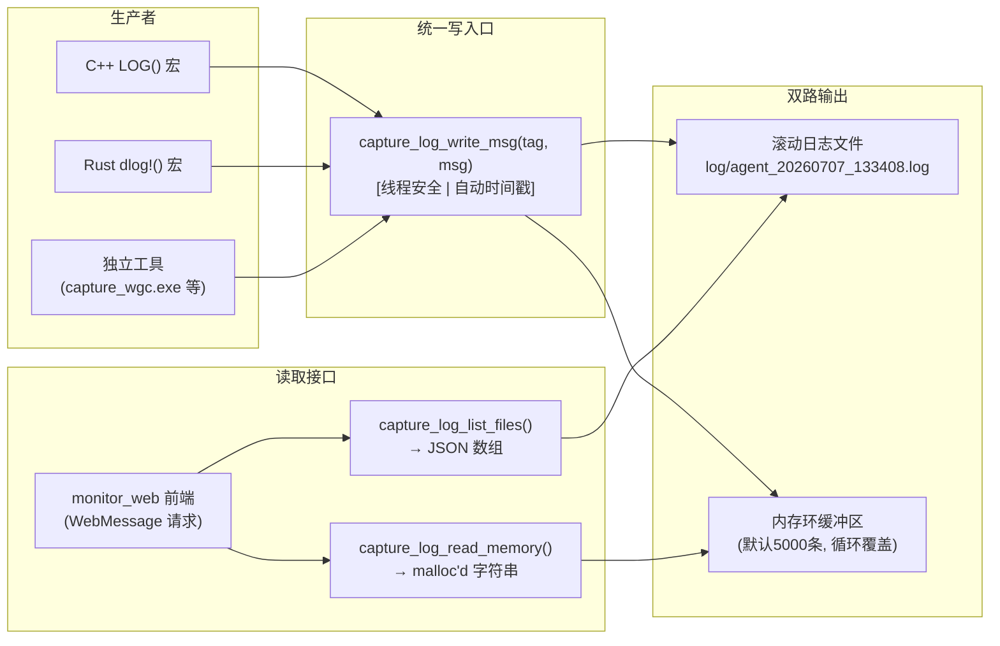

## 设计哲学：一条路径，多个入口

在视觉游戏AI系统的六层架构中，日志是唯一一个"所有模块都依赖却不应阻塞任何模块"的横切关注点。日志引擎的设计遵循**统一写入口（Single Write Gate）**原则：所有日志最终汇聚到同一个C函数 `capture_log_write_msg`，然后由该函数原子性地完成两件事——写入滚动日志文件 + 写入内存环缓冲区。这一设计确保了：

- **C++** 通过 `LOG()` 宏 → `snprintf` → `capture_log_write_msg` 写入
- **Rust** 通过 `dlog!()` 宏 → `format!()` → FFI调用 `capture_log_write_msg` 写入
- **独立工具**（如 `capture_wgc.exe`）直接链接 `logger.lib`，调用相同API

关键权衡：牺牲了日志分类过滤（如运行时调整日志级别），换来了极简的实现和维护成本。在游戏捕获这种"毫秒级延迟敏感、调试时再查日志"的场景下，这是刻意选择的设计取舍。Sources: [logger.h](logger/logger.h#L1-L29)

## 架构概览



与传统日志库（spdlog、glog）不同，该引擎不存在"日志级别"概念——所有消息都被写入。线程安全通过全局 `std::mutex` 实现，基准测试表明在单次日志写入微秒级操作下，锁竞争不是瓶颈。Sources: [logger.cpp](logger/logger.cpp#L1-L50)

## 核心API详解

### 生命周期管理

```c
// 初始化：创建日志目录、打开日志文件、清理旧文件
void capture_log_init(
    const char* app_name,     // "agent" — 用于日志文件名前缀
    const char* app_version,  // "0.2.0" — 写入文件头
    const char* log_dir,      // "log/" — 相对/绝对路径
    int max_files,            // 5 — 保留的滚动文件数
    int ring_size             // 5000 — 内存环缓冲区容量
);

// 关闭：刷写文件、释放资源
void capture_log_shutdown(void);
```

初始化流程包含三个隐式步骤：(1) `CreateDirectoryA`递归创建日志目录；(2) 以 `app_name_YYYYMMDD_HHMMSS.log` 格式生成日志文件，写入应用版本和PID头信息；(3) 调用 `_cleanup_old_logs()` 扫描已有日志文件，按最后写入时间排序，删除超出 `max_files` 的最旧文件。Sources: [logger.cpp](logger/logger.cpp#L107-L157)

### 统一写入口

```c
// 唯一写函数：自动添加 [HH:MM:SS.mmm] 时间戳前缀
void capture_log_write_msg(const char* tag, const char* msg);

// C++ 便捷宏
#define LOG(tag, ...) do { \
    char _lbuf[2048]; \
    snprintf(_lbuf, sizeof(_lbuf), __VA_ARGS__); \
    capture_log_write_msg(tag, _lbuf); \
} while(0)
```

时间戳使用 `QueryPerformanceCounter` 实现微秒级精度，格式化输出为 `[HH:MM:SS.mmm]`。写操作流程为：获取时间戳 → 格式化为 `[tag] msg` → 持有互斥锁 → 写入文件 → 写入环缓冲区 → `fflush`刷新磁盘。Sources: [logger.cpp](logger/logger.cpp#L159-L167)

### 缓冲区读取接口

```c
// 读取环缓冲区全部内容，返回 malloc'd 字符串
char* capture_log_read_memory(void);
// 调用者必须 free
void capture_log_free(char* s);

// 列出日志文件（按最新在前），返回 JSON 数组
// [{"name":"agent_20260707_133408.log","size":1234}]
char* capture_log_list_files(int max_files);

// 强制刷写日志文件到磁盘
void capture_log_flush(void);
```

`capture_log_read_memory` 会从环缓冲区中按时间顺序组装所有条目，处理循环覆盖的起始位置计算。`capture_log_list_files` 返回按 `FILETIME` 降序排列的JSON数组，供Web前端直接消费。Sources: [logger.cpp](logger/logger.cpp#L200-L270)

## 线程安全环缓冲区：循环覆盖的开销可控内存

环缓冲区是整个日志引擎的"实时窗口"——它是 monitor_web 前端日志面板的数据源，允许开发者在不打开日志文件的情况下，直接在Web UI上查看最近 5000 条日志。

| 属性 | 值 |
|------|-----|
| 容量 | 可配置，默认 5000 条 |
| 写入策略 | 满时循环覆盖最旧条目 |
| 线程安全 | `std::mutex` 保护 |
| 读取顺序 | 按写入时间顺序合并输出 |
| 条目格式 | `{ts: "HH:MM:SS.mmm", msg: "完整日志行"}` |

实现细节：使用 `std::vector<LogEntry>` 预分配，通过 `g_ring_idx`（写入位置游标）和 `g_ring_full`（是否已满标志）管理循环。读取时如有满标志，从 `g_ring_idx` 开始遍历；否则从索引 0 开始遍历。这种设计避免了链表节点分配的开销，保证了写入的确定性延迟。Sources: [logger.cpp](logger/logger.cpp#L35-L75)

## 文件滚动机制：自动清理的时序日志

日志文件名遵循 `{app_name}_{YYYYMMDD}_{HHMMSS}.log` 格式，每次进程启动生成新文件。滚动不是基于文件大小，而是**基于启动轮次**——`_cleanup_old_logs` 在每次初始化时执行，保留最新的 N 个文件。

清理算法：
1. 使用 `FindFirstFileW` / `FindNextFileW` 枚举日志目录下所有 `.log` 文件
2. 过滤出以 `{app_name}_` 开头、以 `.log` 结尾的文件
3. 按 `ftLastWriteTime` 排序（最旧在前）
4. 删除超出 `max_files` 的最旧文件

这意味着手动重命名或复制日志文件不会触发误删，但长时间运行的进程只有一个日志文件（直到重启）。Sources: [logger.cpp](logger/logger.cpp#L80-L105)

## 实际集成模式

### monitor_app（主要消费者）

`monitor_app` 是日志引擎的最完整集成者：它在 `backend_init()` 中初始化日志，在 `backend_shutdown()` 中刷写并关闭。日志被写入 `log/` 目录下的 `agent_{timestamp}.log` 文件，同时提供 `"log_read"` 和 `"log_list"` 两个 WebMessage 命令供前端调用。Sources: [commands.cpp](monitor_app/src/commands.cpp#L590-L643)

```c
void backend_init() {
    capture_log_init("agent", "0.2.0", "log/", 5, 5000);  // 初始化
    // ...
    LOG("cmd", "backend init OK");  // 使用宏
}

void backend_shutdown() {
    // ...
    capture_log_flush();     // 确保所有缓冲写入磁盘
    capture_log_shutdown();  // 关闭日志
}
```

### capture_wgc.exe（独立工具）

`capture_wgc.exe` 是一个特殊的 CLI 工具，它在 `capture_wgc_main.cpp` 中实现了自己的文件日志（基于 `FILE*`），而不是链接 `logger.lib`。这是因为该工具设计为"管道式"运行——输出到 stdout 的是二进制帧数据，日志信息走 stderr 和自有日志文件，不与统一日志引擎耦合。Sources: [capture_wgc_main.cpp](capture/src/capture_wgc_main.cpp#L35-L66)

### 跨语言支持（Rust FFI）

头文件以 `extern "C"` 导出所有函数，Rust 端可以通过 FFI 声明直接调用 `capture_log_write_msg`。这是通过 `capture_wgc_ffi.h` 中定义的纯C接口实现的——WGC捕获的Rust包装器在需要日志时调用统一写入口，而非实现独立的Rust日志方案。Sources: [logger.h](logger/logger.h#L9-L17)

## 构建与链接

日志引擎构建为静态库：

```bash
# 构建 logger.lib
cl.exe /EHsc /std:c++17 /c /Fo"build\\logger.obj" logger.cpp
lib.exe /OUT:build\logger.lib build\logger.obj

# 在 monitor_app 中链接
cl.exe ... /Fe:build\monitor_app.exe ... "%ROOT%\logger\build\logger.lib"
```

`monitor_app/build.cmd` 展示了完整链接链：`logger.lib` + `common.lib` + `wgc.lib` + `gdi.lib` + `pw.lib` + `screen.lib` + `desktop.lib`。Sources: [build_logger_lib.cmd](logger/build_logger_lib.cmd#L1-L12), [monitor_app/build.cmd](monitor_app/build.cmd#L1-L30)

## 设计决策与取舍

| 决策 | 选择 | 替代方案 | 理由 |
|------|------|----------|------|
| 日志级别 | **无** | DEBUG/INFO/WARN/ERROR | 游戏捕获场景每次日志都重要，减少运行时开销和API复杂度 |
| 写同步 | **全局锁** | 无锁环缓冲区 | 代码复杂度最低，微秒级写入锁竞争可忽略 |
| 文件滚动 | **按启动轮次** | 按大小/时间滚轮 | 避免运行时文件管理开销，重启自然分段 |
| 时间戳 | **QPC高精度** | `std::chrono` | Windows平台QPC稳定性优于`chrono::steady_clock` |

引擎不做的是：异步日志（写日志可能阻塞调用者）、网络日志（Syslog/远程收集）、格式化安全（`snprintf`缓冲区固定2048字节，超长截断）。这些取舍使得整个日志引擎只有约300行C++代码，一个头文件即可完全理解其设计。

---

**继续探索：** 日志引擎的输出是监控面板的核心数据源，了解更多请见 [监控面板功能：仪表盘/窗口捕获预览/FPS计数/日志环缓冲区/窗口选择器/设置页面](24-jian-kong-mian-ban-gong-neng-yi-biao-pan-chuang-kou-bu-huo-yu-lan-fpsji-shu-ri-zhi-huan-huan-chong-qu-chuang-kou-xuan-ze-qi-she-zhi-ye-mian)；它的二进制帧传输协议详情在 [二进制线缆协议：魔数"FRAM" + 小端载荷大小/类型标签 + 体，C++/Python双端同步](19-er-jin-zhi-xian-lan-xie-yi-mo-shu-fram-xiao-duan-zai-he-da-xiao-lei-xing-biao-qian-ti-c-pythonshuang-duan-tong-bu)。