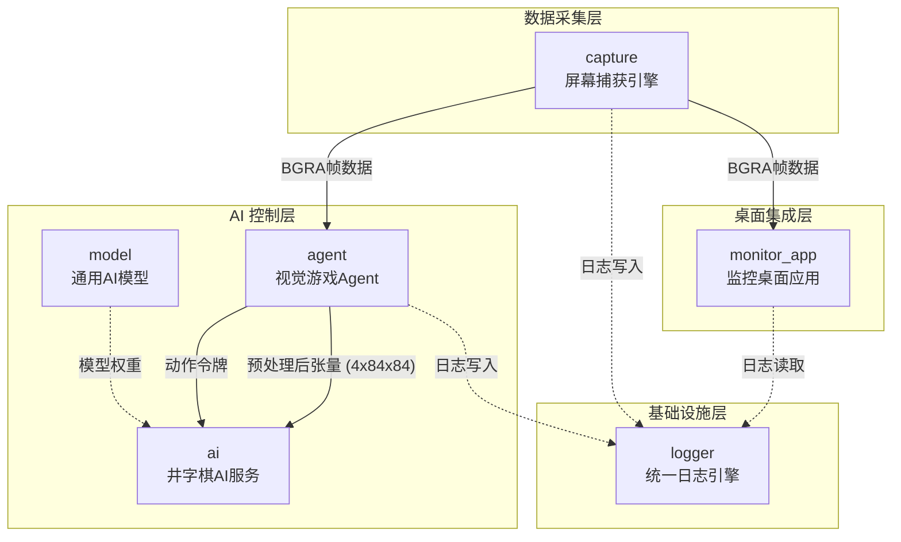

本项目本质上是一套**通用视觉游戏AI系统**，核心流水线为"像素输入 → 动作输出"。为了实现这条流水线，代码库被分解为六个职责明确的模块。本文档站在架构层面，阐述每个模块的边界、核心数据流和模块间依赖关系，帮助开发者在阅读源代码时快速定位。

> 如果你还不熟悉整体四层架构，建议先阅读 [设计哲学：四层架构与零Rust纯C++策略](3-she-ji-zhe-xue-si-ceng-jia-gou-you-xi-ben-ti-ping-mu-bu-huo-shu-ru-mo-ni-aimo-xing-yu-ling-rustchun-c-ce-lue)。

---

## 一、模块全景图

下图展示了六个模块之间的数据流和依赖关系。箭头方向代表数据流向，颜色分组代表它们在系统架构中的层次归属。



**核心观察**：六模块中，`logger` 是最底层的基础设施，被所有其他模块依赖；`monitor_app` 与 `agent` 是屏幕捕获数据的两个消费方，区别在于前者用于人类可视化监控，后者用于AI自动控制。

Sources: [目录结构](.) | [agent.cpp 主循环管线](agent/src/agent.cpp#L1-L31) | [monitor_app main.cpp](monitor_app/src/main.cpp#L1-L20)

---

## 二、logger — 统一日志引擎

**职责**：为整个系统（C++、Python、Rust FFI）提供一条线程安全的日志写入通道，同时维护内存环缓冲区和磁盘滚动文件。

**核心设计**：单入口点模式。所有日志最终收敛到 `capture_log_write_msg(tag, msg)` 这一个函数。C++ 端通过 `LOG(tag, ...)` 宏（内部用 `snprintf` 格式化后调用该函数）写入；Rust 端通过 FFI 的 `dlog!()` 宏同样调用同一入口。

**关键特性**：

| 特性 | 实现方式 |
|------|---------|
| 线程安全 | `std::mutex` 保护文件写入和环缓冲区写入 |
| 时间戳 | `QueryPerformanceCounter` 微秒级精度 → 格式化 `HH:MM:SS.mmm` |
| 环缓冲区 | 可配置大小（默认 5000 条），按序号循环覆盖 |
| 文件滚动 | 文件名模式 `{app_name}_{YYYYMMDD}_{HHMMSS}.log`，自动清理超出 `max_files` 的旧日志 |
| 内存读取 | `capture_log_read_memory()` 返回 `malloc` 字符串，供 UI 实时展示 |
| 文件列表 | `capture_log_list_files()` 返回 JSON 数组，供 Web 端查询 |

**使用示例**（多模块共享同一个 logger 实例）：

```
// capture 模块
LOG("capture", "WGC init OK: %dx%d", w, h);

// agent 模块
LOG("agent", "frame %d captured in %.1fms", frame_count, elapsed_ms);

// monitor_app 模块
LOG("cmd", "list_windows: %zu entries", list.size());
```

Sources: [logger.h](logger/logger.h#L1-L64) | [logger.cpp 实现](logger/logger.cpp#L1-L200) | [build_logger_lib.cmd](logger/build_logger_lib.cmd#L1-L12)

---

## 三、capture — 屏幕捕获引擎

**职责**：从 Windows 桌面或指定窗口捕获像素数据（BGRA 格式），提供统一的 `ICaptureBackend` 抽象接口，支持多个后端实现。

**架构**：工厂模式。`create_capture_backend()` 自动选择最佳可用后端（优先 DXGI Desktop Duplication）。同时保留一套 3-method 回退链（`capture_auto_detect`），用于无法使用 DXGI 的场景。

**后端矩阵**：

| 后端 | 源文件 | 原理 | 性能 | 适用场景 |
|------|--------|------|------|---------|
| **WGC** (Windows.Graphics.Capture) | `capture_wgc.cpp`, `capture_wgc_main.cpp` | WinRT API + GPU FramePool + D3D11 | ~1-3ms GPU | 首选，绕过 DXGI 限制 |
| **DXGI Desktop Duplication** | `capture_dxgi.cpp` | IDXGIOutputDuplication | ~1-2ms GPU | 全屏捕获 |
| **Desktop BitBlt** | `capture_desktop.cpp` | GDI BitBlt | ~5-10ms CPU | 桌面整体 |
| **GDI GetWindowDC** | `capture_gdi.cpp` | GetDC + BitBlt | ~3-8ms CPU | 窗口捕获（回退 1） |
| **PrintWindow** | `capture_pw.cpp` | WM_PRINT 消息 | ~10-30ms CPU | 窗口捕获（回退 2） |
| **Screen BitBlt** | `capture_screen.cpp` | 计算窗口屏幕位置后 BitBlt | ~5-15ms CPU | 窗口捕获（回退 3） |

**帧预处理管线**（`FramePreprocessor` 类）：捕获得到的任意分辨率 BGRA 帧经过以下流水线转换为模型输入张量：

```
任意分辨率 BGRA → 裁剪到游戏窗口 → 双线性缩放到 84×84
  → 灰度化（RGB→单通道） → 归一化 [0,255]→[0,1] → 4帧堆叠 → float32(4×84×84)
```

`capture` 模块是数据采集的起点，它的输出被两个下游模块消费：`monitor_app`（人类监控）和 `agent`（AI 自动控制）。

Sources: [capture.hpp 接口定义](capture/include/capture.hpp#L1-L67) | [capture_auto.cpp 回退链](capture/src/capture_auto.cpp#L1-L38) | [preprocess.hpp 预处理](capture/include/preprocess.hpp#L1-L58) | [capture_wgc_main.cpp WGC独立入口](capture/src/capture_wgc_main.cpp#L1-L200)

---

## 四、monitor_app — 监控桌面应用

**职责**：替代原先的 Rust/Tauri 架构，提供一个纯 C++ Win32 窗口宿主 + WebView2 内核的桌面监控应用，用于实时观察 AI 代理的游戏过程。

**架构**：单进程模型。一个 `WinMain` 入口同时管理 Win32 窗口、WebView2 控件、捕获后端和 MJPEG HTTP 服务。

```
monitor_app.exe
  ├── Win32 窗口 (WndProc)
  ├── WebView2 控件 (ICoreWebView2)
  │     └── React UI (monitor_web/dist)
  │           └── chrome.webview.postMessage → dispatch_command()
  ├── 捕获后端 (WGC/Desktop Duplication)
  ├── 共享缓冲区 (SharedBuffer → GPU零拷贝推送到Canvas)
  └── MJPEG HTTP Server (端口 9998, 回退方案)
```

**核心替代模式**：WebMessage 桥接取代了 Tauri invoke。前端通过 `chrome.webview.postMessage(JSON)` 发送命令，C++ 端的 `dispatch_command()` 函数解析 JSON、执行后端操作（如列出窗口、启动/停止流、查询日志），返回 JSON 响应。

**命令清单**（`commands.cpp` 实现）：

| 命令 | 功能 | 响应格式 |
|------|------|---------|
| `list_windows` | 枚举可见窗口 | JSON 数组 `[{title, category, hwnd}]` |
| `list_processes` | 枚举进程 | JSON 数组 `[{title, category, hwnd}]` |
| `start_stream` | 启动指定窗口的捕获流 | JSON 状态 |
| `stop_stream` | 停止捕获流 | 空/确认 |
| `get_log` | 读取内存环缓冲区日志 | JSON 字符串数组 |
| `get_log_files` | 列出日志文件 | JSON 文件列表 |
| `get_screen_info` | 屏幕分辨率等 | JSON 对象 |
| `get_window_state` | 窗口位置/可见性 | JSON 对象 |

**流式传输双路径**：
1. **主路径**：WGC 捕获 → GPU SharedBuffer → `PostSharedBufferToScript` → Canvas 直接渲染（零拷贝）
2. **回退路径**：WIC JPEG 编码 → MJPEG 多部分 HTTP 流（端口 9998）

Sources: [main.cpp 入口](monitor_app/src/main.cpp#L1-L247) | [commands.h 接口](monitor_app/src/commands.h#L1-L18) | [commands.cpp 实现](monitor_app/src/commands.cpp#L1-L200) | [mjpeg_server.cpp 实现](monitor_app/src/mjpeg_server.cpp#L1-L200)

---

## 五、agent — 视觉游戏 Agent

**职责**：作为 AI 控制循环的"眼睛和手"，负责循环执行**捕获 → 预处理 → TCP发送 → 接收动作令牌 → 解码 → 执行输入**。

**架构**：纯 C++ 实现，游戏无关。`agent.cpp` 中的 `run_agent()` 是整个循环的入口。它不包含任何游戏逻辑——只做像素→动作的映射。

```
Agent 主循环 (run_agent):

loop {
    1. capture->capture(frame_buf, &game_rect)          // 捕获像素
    2. preproc.process(frame_buf, tensor)               // 预处理 → (4,84,84) tensor
    3. server.send_tensor(tensor, 4, 84, 84)            // TCP发送给 AI server
    4. server.recv_action_tokens(raw_tokens)             // 接收二进制动作令牌
    5. decoder.decode(raw_tokens)                        // 解码令牌 → DecodedAction[]
    6. mapper.execute(decoded)                           // 执行输入（鼠标/键盘）
}
```

**动作令牌协议**（`ActionDecoder` + `GenericActionMapper`）：`ai` 或 `model` 端返回的是一串字节序列（token stream），由 `ActionDecoder` 解析为 `DecodedAction` 结构，再由 `mapper` 转换为 `GameAction` 最终通过 `IInputBackend` 执行。

**性能仪表盘**：Agent 在 verbose 模式下会输出每帧各阶段的微秒级耗时，帮助定位瓶颈：

```
[42] cap=2.1ms pre=0.8ms net=0.5ms act=3.2ms total=6.6ms tokens=12
```

Sources: [agent.hpp 接口](agent/include/agent.hpp#L1-L33) | [agent.cpp 主循环](agent/src/agent.cpp#L1-L216) | [action_mapper.cpp 动作解码](agent/src/action_mapper.cpp#L1-L131)

---

## 六、ai — 井字棋 AI 服务

**职责**：为井字棋游戏提供 TCP 网络 AI 预测服务。接收 C++ 游戏客户端（`game/main.exe`）发来的棋盘状态，返回最佳落子坐标。

**架构**：Python 实现的 TCP 服务器（`ai_server.py`），使用纯文本行协议与游戏客户端通信。模型基于 PyTorch MLP（`net.py: TicTacToeNet`），三隐藏层全连接网络。

**数据流**（井字棋 PoC 模式下的完整链路）：

```
game/main.exe (C++ 客户端)
  ↓ TCP "b0 b1 ... b8 player\n"
ai_server.py (Python AI 服务)
  ├── 棋盘编码（对称化：从 player 视角看）
  ├── TicTacToeNet.forward() → logits + value
  ├── ε-greedy 选择落子
  └── TCP "row col value\n"
game/main.exe 收到 → 执行落子 → 继续/结束
```

**TicTacToeNet 网络结构**：

| 层 | 输入 → 输出 | 激活 |
|----|-----------|------|
| fc1 | 9 → hidden(128) | ReLU |
| fc2 | hidden → hidden | ReLU |
| fc3 | hidden → hidden//2(64) | ReLU |
| policy | 64 → 9（策略logits） | 无（推理时 softmax） |
| value | 64 → 1（局面评分） | tanh → [-1, +1] |

**训练能力**：`train.py` + `ai_server.py` + `game/main.exe` 三点联动实现自弈（self-play）。AI 服务以 `epsilon-greedy` 探索，完成对局后将 `(state, policy_target, value_target)` 存入 `training_data`。500 轮迭代后模型收敛，推理可在 50ms 内完成（纯 CPU）。

Sources: [ai_server.py](ai/ai_server.py#L1-L214) | [net.py 网络结构](ai/net.py#L1-L68) | [model.py 推理接口](ai/model.py#L1-L102)

---

## 七、model — 通用 AI 模型

**职责**：承载走向"通用视觉游戏AI"远景的模型体系。包含三个演进阶段的模型定义：单体型（GenericAgent）、层次化（HierarchicalAgent），以及抽象动作空间（ActionSpace）。

**模型演进阶梯**：

| 阶段 | 模型 | 输入 | 输出 | 状态 |
|------|------|------|------|------|
| Phase 0 | **GenericAgent**（单体） | 像素 (4,84,84) | 动作令牌序列 | 已实现 |
| Phase 1 | **HierarchicalAgent**（层次化） | 像素 → L1: 16维隐变量z | L2: 动作令牌 + 价值 | 已实现 |
| Phase 2 | 自组织层次化（多个L1专家 + L2路由） | 像素 → 多个专家z | 路由选专家 → 动作 | 愿景规划 |

**GenericAgent**：CNN 视觉编码器（3层卷积，4×84×84 → 256 维） + Transformer 自回归解码器（2层，最大 32 个动作令牌）。训练方式包括监督蒸馏（从 MLP 自弈数据学习）和 RL（PPO）。

**HierarchicalAgent**：信息瓶颈架构。L1 感知专家通过 VAE 风格的 reparameterization trick 将像素压缩为 16 维隐变量 z；L2 战略推理器以 z + 动作历史为输入，生成动作令牌序列和价值评分。训练损失：`L = L_task + β * L_recon + γ * ||z||_2`。

**ActionSpace**（`action_space.py`）：定义了 10 种原子操作的 token 表示法，包括鼠标移动（绝对/相对）、点击、按键、等待等。每种操作由 1-4 个 token 编码，最大序列长度 32 token。这层抽象使模型输出与具体输入后端解耦。

Sources: [generic_agent.py](model/generic_agent.py#L1-L171) | [hierarchical.py](model/hierarchical.py#L1-L278) | [action_space.py](model/action_space.py#L1-L137)

---

## 八、模块依赖关系与构建顺序

六模块之间形成以下依赖层次：

```
logger           ← 无依赖，最底层
capture          ← 依赖 logger, common/
agent            ← 依赖 capture/ (ICaptureBackend), input/, common/, logger
ai               ← 依赖 model/, PyTorch 标准库
model            ← 依赖 PyTorch, 独立层
monitor_app      ← 依赖 capture/ (WGC FFI), logger/, WebView2 SDK
```

**构建建议**（按依赖顺序）：
1. 编译 `logger` → 生成 `logger.lib`
2. 编译 `capture` → 生成 `capture_lib.lib`
3. 编译 `agent` → 链接 `capture_lib.lib`, `logger.lib`
4. 编译 `monitor_app` → 链接 `capture_lib.lib`, `logger.lib`
5. `ai` 和 `model` 为 Python 模块，无需编译

Sources: [build_logger_lib.cmd](logger/build_logger_lib.cmd) | [build_capture_lib.cmd](capture/build_capture_lib.cmd) | [agent/build.cmd 存在](agent/build.cmd)

---

## 下一步阅读

根据你的兴趣方向，可以选择以下路径深入：

- **如果你想理解数据如何从屏幕流转到AI模型** → [Agent主循环管线：捕获→预处理→TCP发送→接收动作令牌→解码→执行输入](13-agentzhu-xun-huan-guan-xian-bu-huo-yu-chu-li-tcpfa-song-jie-shou-dong-zuo-ling-pai-jie-ma-zhi-xing-shu-ru)
- **如果你想深入屏幕捕获的底层实现** → [捕获引擎架构：抽象接口ICaptureBackend与五种后端](8-bu-huo-yin-qing-jia-gou-chou-xiang-jie-kou-icapturebackend-yu-wu-chong-hou-duan-wgc-desktopblt-getwindowdc-printwindow-screenbitblt)
- **如果你想理解监控桌面的流式传输管线** → [流式传输管线：SharedBuffer直推Canvas / MJPEG HTTP回退](23-liu-shi-chuan-shu-guan-xian-wgc-gpukao-bei-sharedbufferzhi-tui-canvas-zhu-lu-jing-wic-jpegbian-ma-mjpeg-httpduo-bu-fen-chuan-shu-hui-tui)
- **如果你想了解通用视觉模型如何训练** → [通用视觉Agent模型：CNN编码器+Transformer自回归解码器](17-tong-yong-shi-jue-agentmo-xing-cnnshi-jue-bian-ma-qi-4x84x84-256wei-transformerzi-hui-gui-jie-ma-qi-sheng-cheng-dong-zuo-ling-pai-xu-lie-you-xi-wu-guan)
- **如果你想看系统的整体长远方向** → [长期愿景：自组织层次化视觉AI](5-chang-qi-yuan-jing-zi-zu-zhi-ceng-ci-hua-shi-jue-ai-cong-jing-zi-qi-dao-tong-yong-you-xi-de-fan-hua-lu-jing)