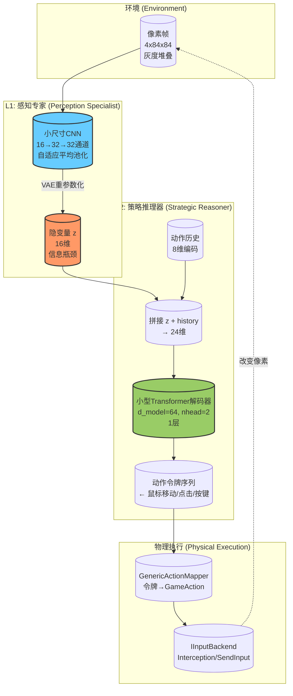

本文档阐述本项目的终极技术愿景：构建一个**自组织、层次化的视觉游戏AI系统**，使其能够从井字棋这一受限环境出发，逐步泛化至任意视窗游戏的通用玩法。这不是一个即期可交付的特性清单，而是指引架构演化的北极星——每一行代码的决策都应朝向这一方向收敛。

Sources: [ai/net.py](ai/net.py#L1-L68), [model/hierarchical.py](model/hierarchical.py#L1-L278), [model/generic_agent.py](model/generic_agent.py#L1-L171)

## 核心矛盾：游戏特定知识 vs 通用视觉智能

当前系统存在一个根本性的架构张力。井字棋MLP模型（`TicTacToeNet`）是领域特化的极致——它接收9维编码的棋盘状态，输出9个格子的落子概率。它的"视野"仅限于3×3网格的抽象符号表示，对像素、颜色、形状一无所知。这种设计在井字棋场景下极为高效（50ms内CPU推理，500轮自弈收敛），但其泛化能力为零：换一个4×4井字棋棋盘，模型就需要完全重新训练。

对比之下，`GenericAgent`（通用视觉Agent）采用CNN视觉编码器将原始像素（4×84×84灰度帧堆叠）直接映射为256维特征，再由Transformer自回归解码器生成动作令牌序列。这个模型完全不理解"井字棋"——它只知道像素模式与动作序列之间的统计关联。理论上，只要改变训练数据，它就能适应任何游戏。

```
┌─────────────────────────────────────────────────────────────┐
│              泛化能力 vs 样本效率的权衡                        │
├───────────────┬──────────────────┬──────────────────────────┤
│               │  井字棋MLP模型    │  通用视觉Agent模型         │
├───────────────┼──────────────────┼──────────────────────────┤
│ 输入          │ 9维棋盘编码       │ 4×84×84 像素帧堆叠        │
│ 架构          │ 3层MLP (128)     │ CNN(32→64→64) + Transformer│
│ 参数规模      │ ~33K            │ ~0.8M (轻量) / ~3M (通用) │
│ 推理速度(CPU) │ <1ms             │ <5ms / <15ms              │
│ 样本效率      │ 极高高(500局)    │ 低(需数万局)              │
│ 泛化能力      │ 零(仅3×3井字棋)  │ 高(理论任意游戏)          │
│ 知识表示      │ 符号化(人类定义)  │ 像素级(模型自学习)        │
└───────────────┴──────────────────┴──────────────────────────┘
```

这引出了核心问题：如何在不牺牲样本效率的前提下获得泛化能力？答案在于**层次化架构**——让不同层次以不同的抽象级别理解世界。

Sources: [ai/net.py](ai/net.py#L29-L68), [model/generic_agent.py](model/generic_agent.py#L101-L171), [model/action_space.py](model/action_space.py#L1-L137)

## 三阶段演化路线图

本项目规划了一条清晰的三阶段演进路径，从当前的井字棋特化系统逐步过渡到通用视觉游戏AI。

### Phase 0 — 当前基石：MLP自弈闭环

当前系统已经完整实现了井字棋场景下的闭环自弈。`ai_server.py` 作为TCP服务端托管训练好的MLP模型（`TicTacToeNet`），`game/main.exe` 作为C++客户端读取网络协议并执行落子，通过 `ai/train.py` 编排500轮迭代完成收敛。`agent/main.exe` 则扮演"虚拟人类"——它通过 `capture/` 引擎捕获游戏窗口像素，经过预处理管线（BGRA→84×84灰度→4帧堆叠→归一化float32），通过TCP发送给AI服务端，接收动作令牌，再由 `input/` 输入模拟引擎执行鼠标点击。

```
┌──────────────┐    TCP     ┌──────────────┐
│  game/main   │◄──────────►│ ai_server.py │
│  (C++ 客户端) │ 文本协议   │ (MLP 模型)   │
└──────────────┘            └──────────────┘
       ↑                            ↑
       │                            │
┌──────┴──────────────┐  ┌──────────┴──────────┐
│ agent/main (视觉)    │  │ train.py (训练)     │
│ 捕获→预处理→发送→执行 │  │ 自弈→收集→梯度更新 │
└─────────────────────┘  └─────────────────────┘
```

关键洞察：即使在这个最基础的阶段，`agent/` 模块的代码已经设计为**游戏无关**的——它不包含任何井字棋特定逻辑。`capture/` 引擎可以捕获任何窗口，`input/` 模拟可以执行任意鼠标键盘操作，`action_mapper.hpp` 中的 `GenericActionMapper` 直接将模型输出的标准化动作令牌转化为物理输入事件。井字棋的知识完全封装在MLP模型和游戏服务器中。这意味着将当前系统从井字棋迁移到其他游戏的核心工作在于**替换模型**和**调整捕获目标**。

Sources: [agent/src/agent.cpp](agent/src/agent.cpp#L1-L216), [agent/src/action_mapper.cpp](agent/src/action_mapper.cpp#L1-L131), [agent/include/agent.hpp](agent/include/agent.hpp#L1-L33), [ai/net.py](ai/net.py#L1-L68), [ai/ai_server.py](ai/ai_server.py#L1-L214)

### Phase 1 — 视觉蒸馏：从MLP教师到CNN学生

第二阶段的核心目标是将MLP的"符号化知识"蒸馏到一个视觉可理解的CNN学生模型中。具体方法是通过 `train/data_collector.py` 数据收集器，在MLP自弈过程中同步捕获游戏窗口的像素帧和MLP的决策（落子位置 + 局面评估值），生成 `(帧, 动作令牌, 价值)` 三元组。

```
MLP自弈循环 (教师)           数据收集                    视觉模型训练 (学生)
┌──────────┐  棋盘状态  ┌──────────────┐  (帧, 动作)  ┌──────────────────┐
│ MLP模型  │──────────►│ data_collector│────────────►│ GenericAgent    │
│ (符号)   │           │ 捕获窗口像素  │             │ CNN+Transformer │
└──────────┘           └──────────────┘             │ (像素→动作)     │
                                                     └──────────────────┘
```

`GenericAgent`（定义于 `model/generic_agent.py`）是这个阶段的目标模型。它的 `VisionEncoder` 使用三层CNN（32→64→64通道，步长4/2/1的卷积核）将4×84×84的灰度帧堆叠压缩为256维特征向量，`ActionDecoder` 使用两层Transformer解码器自回归地生成动作令牌序列。模型完全不知道自己在玩井字棋——它只知道"看到特定像素模式 → 产生特定动作令牌序列"。训练完成后，可以移除MLP教师，仅凭视觉输入驱动游戏操作。

这种方法的关键优势是**解耦了感知与推理**。CNN编码器学习的是通用的像素到特征映射——这对任何游戏都有效。Transformer解码器学习的是特征到动作序列的映射——这在游戏间可能不同，但可以通过微调迁移。

Sources: [train/data_collector.py](train/data_collector.py#L1-L186), [model/generic_agent.py](model/generic_agent.py#L1-L171), [capture/src/preprocess.cpp](capture/src/preprocess.cpp#L1-L127)

### Phase 2 — 层次化自组织架构：L1感知专家 + L2策略推理器

第三阶段是本项目最核心的架构创新：从单块模型（Phase 1的`GenericAgent`）进化为**层次化自组织架构**（`HierarchicalAgent`，定义于 `model/hierarchical.py`）。



**信息瓶颈原理**：层次化架构的核心设计理念是**信息瓶颈**（Information Bottleneck）。L1感知专家（`PerceptionSpecialist`）不是简单地将像素编码为特征向量，而是通过VAE风格的编码器（输出均值μ和对数方差log σ²）将输入压缩为一个**16维的隐变量z**。这个z不是人类预定义的——它是在端到端训练中，由模型自己"发明"的、对当前任务最有效的视觉状态表示。信息瓶颈（loss中的KL项 `L_kl = -0.5 * Σ(1 + log σ² - μ² - σ²)` ）强制z丢弃与决策无关的视觉细节（如窗口边框颜色、背景纹理），只保留对策略推理至关重要的信息。

**端到端训练损失函数**：
```
L_total = L_action(交叉熵) + L_value(MSE) + γ * L_KL(信息瓶颈正则化)
```

其中 `γ = 0.001` 控制压缩强度。三个损失的合力确保了z既是紧凑的（KL惩罚），又是信息充分的（动作预测成功率）。

L2策略推理器（`StrategicReasoner`）接收16维z和8维动作历史编码（为时序决策提供上下文），通过一个只有64维隐藏维度、2注意力头、1层的轻量Transformer解码器生成动作令牌序列。之所以可以如此轻量，是因为视觉感知的重担已经从推理层剥离——L2不需要理解"像素"，只需要理解"z语义"。

Sources: [model/hierarchical.py](model/hierarchical.py#L1-L278)

## 层次化架构的核心优势

### 1. 感知与推理的解耦

在单块模型中，CNN编码器必须同时学习"什么看起来重要"和"什么样的动作序列是合理的"。层次化架构将这两个任务分离：
- L1只学习**信息压缩**：如何将4×84×84=28,224维的像素空间压缩到16维的语义空间。这个过程是游戏无关的——任何游戏的视觉输入都可以压缩。
- L2只学习**策略推理**：给定低维语义表示z（以及动作历史），应该执行哪些动作。这个过程是游戏相关的，但输入维度极低（16维），少样本迁移成为可能。

### 2. 快速推理路径（Fast Path）

一旦L1训练收敛，z编码器可以部署为**独立的前馈网络**（确定性模式，`sample=False` 跳过重参数化）。推理时，z的计算只有3层轻量CNN + 1层线性投影，在CPU上可以在<2ms内完成。L2的Transformer解码器虽然有自回归循环，但隐藏维度仅64维、单层解码器，最大令牌数32，推理延迟也控制在<5ms。整体端到端延迟（不含捕获和预处理）理论上可控制在10ms以内，满足实时交互需求。

### 3. L1作为可迁移的"视觉语汇"

这是本项目最具野心的设计点。在井字棋上训练收敛后，L1感知专家学会了将游戏窗口的像素压缩为16维的z向量——它本质上发明了一种**视觉语汇**来描述"棋盘的空格位置"、"X的形状"、"O的形状"、"当前轮到谁"。如果更换游戏（例如改为四子棋或扫雷），只需要在L1之上重新训练L2推理器（甚至微调L1的最后几层），而不需要从头开始学习像素到特征的映射。

更进一步的设想是：当系统接触了足够多的游戏后，L1感知专家可以泛化为一个**通用视觉前端**——任何游戏的窗口像素都可以被压缩到同一语义空间，L2推理器可以在不同游戏的z之间迁移知识。这类似于人类学习阅读不同棋类棋盘的能力：一旦掌握了"从视觉中提取棋盘状态"的技能，学习新棋类的规则就变得容易得多。

Sources: [model/hierarchical.py](model/hierarchical.py#L17-L104), [model/hierarchical.py](model/hierarchical.py#L106-L277)

## 行动空间设计：游戏无关的"通用交互语"

层次化架构的推理成果——动作令牌序列——依赖一个精心设计的、游戏无关的行动空间（`model/action_space.py`）。这个空间定义了10种原子操作：

| 令牌 | 操作 | 参数字段 | 语义 |
|------|------|----------|------|
| 0 | MOUSE_MOVE_ABS | x_norm, y_norm (float, 0..1) | 鼠标绝对移动（归一化坐标） |
| 1 | MOUSE_MOVE_REL | dx, dy (int, 像素增量) | 鼠标相对移动 |
| 2 | MOUSE_CLICK | x_norm, y_norm, btn_idx | 在指定位置点击 |
| 3 | MOUSE_DOWN | btn_idx | 按下鼠标键 |
| 4 | MOUSE_UP | btn_idx | 释放鼠标键 |
| 5 | KEY_PRESS | vk_code (uint16) | 按下键盘键 |
| 6 | KEY_RELEASE | vk_code (uint16) | 释放键盘键 |
| 7 | KEY_TAP | vk_code, duration_ms | 敲击键盘键（按下+释放） |
| 8 | WAIT | ms (int) | 等待指定毫秒数 |
| 255 | NOOP | 无 | 序列结束/填充令牌 |

这个行动空间的关键设计决策是**坐标归一化**：鼠标位置使用 `[0, 1]` 范围的浮点数而非绝对像素。这使得模型可以适应任意分辨率的窗口——模型只需要学会"点击屏幕中心附近"而不需要知道当前窗口是800×600还是1920×1080。在C++端的 `ActionDecoder`（`agent/src/action_mapper.cpp`）中，归一化坐标根据当前窗口尺寸反算为绝对像素位置。

```
模型输出:  [2, 0.52, 0.38, 0]  →  在归一化坐标(0.52, 0.38)处左键点击
ActionDecoder:  解码 → x=0.52*840=437, y=0.38*680=258  (假设窗口840×680)
InputBackend:   执行 → SendInput/Interception 鼠标移到(437,258)并左键点击
```

Sources: [model/action_space.py](model/action_space.py#L1-L137), [agent/src/action_mapper.cpp](agent/src/action_mapper.cpp#L1-L131), [agent/include/action_mapper.hpp](agent/include/action_mapper.hpp#L1-L101)

## 从井字棋到通用游戏的泛化路径

```
时间线 →
┌─────────────────────────────────────────────────────────────────────────┐
│ Phase 0          Phase 1             Phase 2              Phase 3       │
│ 井字棋MLP        视觉蒸馏            层次化架构            跨游戏泛化     │
├─────────────────────────────────────────────────────────────────────────┤
│                                                                         │
│ MLP模型           GenericAgent        HierarchicalAgent    L1共享       │
│ 9→128→128→64→9   CNN+Transformer     L1(z编码器)          多个L2切换    │
│ (符号输入)       (像素输入)          +L2(推理器)           L1不变        │
│                                                                         │
│ 知识: 规则硬编码   知识: 像素模式      知识: L1学习"看"     知识: L1理解    │
│                    →动作统计关联       L2学习"决策"        "游戏界面"     │
│                                                                         │
│ 泛化: 零          泛化: 同架构不同     泛化: 更换L2        泛化: 零样本    │
│                    训练数据可换游戏    可换游戏            切换游戏       │
└─────────────────────────────────────────────────────────────────────────┘
```

**Phase 3（跨游戏泛化）** 是最终的愿景状态：一个经过充分训练的L1感知专家，能够理解"游戏窗口"的通用视觉结构——按钮的样式、棋盘网格的布局、状态文本的位置、鼠标光标的反馈。当面对一个从未见过的游戏时，系统只需加载一个针对该游戏微调的L2推理器（甚至零样本推理），L1即可将新游戏的像素压缩到已经熟悉的语义空间中进行推理。

这一愿景借鉴了认知科学中的**感知学习**（perceptual learning）原理：人类专家棋手在不同棋类之间转换时，基础的"从视觉中提取结构化信息"能力是跨领域通用的，只有高层策略需要重新适应。

Sources: [model/generic_agent.py](model/generic_agent.py#L149-L171), [model/hierarchical.py](model/hierarchical.py#L131-L278)

## 下一步阅读

如果您希望深入理解当前系统的具体实现细节，建议按以下路径阅读：

- **了解通用视觉Agent的CNN+Transformer架构细节** → [通用视觉Agent模型：CNN视觉编码器 + Transformer自回归解码器](17-tong-yong-shi-jue-agentmo-xing-cnnshi-jue-bian-ma-qi-4x84x84-256wei-transformerzi-hui-gui-jie-ma-qi-sheng-cheng-dong-zuo-ling-pai-xu-lie-you-xi-wu-guan)
- **深入层次化架构的端到端训练实现** → [层次化架构：L1感知专家 + L2策略推理器，端到端信息瓶颈训练](18-ceng-ci-hua-jia-gou-l1gan-zhi-zhuan-jia-xiang-su-16wei-ya-suo-yin-bian-liang-z-l2ce-lue-tui-li-qi-z-li-shi-dong-zuo-duan-dao-duan-xin-xi-ping-jing-xun-lian)
- **理解动作令牌如何映射为物理输入** → [通用动作编解码：ActionPool二进制协议](14-tong-yong-dong-zuo-bian-jie-ma-actionpooler-jin-zhi-xie-yi-shu-biao-yi-dong-dian-ji-an-jian-deng-dai-deng-10chong-cao-zuo-you-xi-wu-guan-de-biao-zhun-hua-ge-shi)
- **了解数据收集器如何为视觉蒸馏准备训练数据** → [数据收集器：MLP自弈记录→视觉模型蒸馏训练](25-shu-ju-shou-ji-qi-mlpzi-yi-ji-lu-zheng-dong-zuo-qi-pan-zhuang-tai-jie-zhi-shi-jue-mo-xing-zheng-liu-xun-lian)
- **回看当前井字棋MLP模型的结构** → [井字棋MLP模型：9维输入→3层全连接→策略头+价值头](15-jing-zi-qi-mlpmo-xing-9wei-shu-ru-3ceng-quan-lian-jie-ce-lue-tou-9-logits-jie-zhi-tou-tanh-1-1-ke-50msnei-cputui-li)