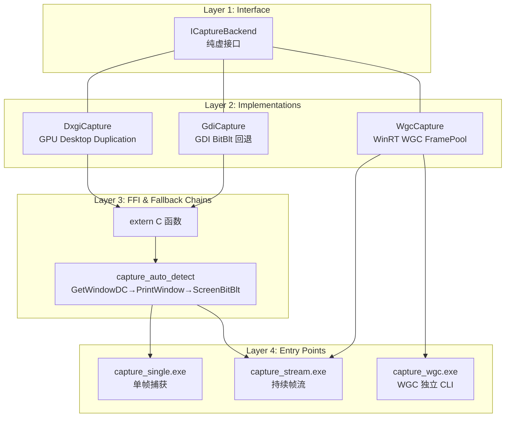
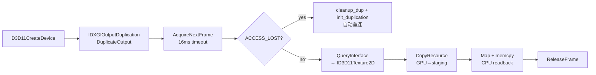
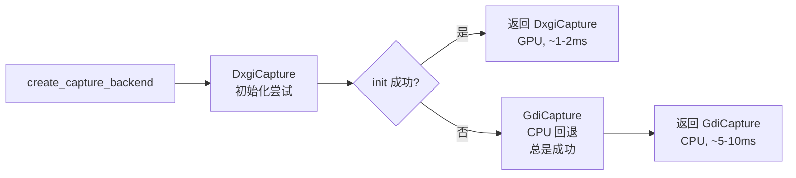

屏幕捕获是视觉AI管线的起点——它决定了原始像素数据的来源、获取速度与可靠性。捕获引擎围绕一条核心原则设计：**用统一的抽象接口屏蔽异构实现，让上层代码无需关心像素从何而来**。无论是GPU加速的DXGI Desktop Duplication、CPU回退的GDI BitBlt，还是处理被遮挡窗口的PrintWindow，所有捕获方法都遵循 `ICaptureBackend` 契约，通过工厂函数自动选择最优方案。

## 四层抽象架构

捕获引擎的架构以四个清晰的层次组织，每层解决一个关注点：



Sources: [capture.hpp](capture/include/capture.hpp#L1-L67), [capture_dxgi.cpp](capture/src/capture_dxgi.cpp#L1-L427)

## ICaptureBackend：统一契约

`ICaptureBackend` 是捕获引擎的抽象基类，定义了五个纯虚方法构成的核心生命周期：

```mermaid
flowchart LR
    init[init()<br/>初始化后端资源] --> capture[capture()<br/>捕获当前帧到 FrameBuffer]
    capture --> get_window_rect[get_window_rect()<br/>查询窗口坐标]
    capture --> name[name()<br/>返回后端名称标识]
    capture --> shutdown[shutdown()<br/>释放所有资源]
```

所有捕获后端的实现都遵循**先 init 后 capture** 的调用顺序。`FrameBuffer` 是跨后端的统一输出格式，包含宽度、高度、通道数、BGRA像素数据和微秒级时间戳：

```cpp
struct FrameBuffer {
    int width = 0;
    int height = 0;
    int channels = 0;   // 3=BGR, 4=BGRA
    std::vector<uint8_t> data;
    uint64_t timestamp_us = 0;
};
```

`Rect` 结构体定义了可选的捕获区域裁剪，允许在不捕获全屏的情况下针对特定窗口区域优化性能：

```cpp
struct Rect { int x, y, w, h; };
```

Sources: [capture.hpp](capture/include/capture.hpp#L1-L67), [types.hpp](common/include/types.hpp#L1-L12)

## 五种捕获后端全景

下表从**原理、性能、适用场景、局限性**四个维度对比五种捕获后端：

| 后端 | 接口层 | 典型延迟 | 优势 | 限制 |
|---|---|---|---|---|
| **WGC** (Windows.Graphics.Capture) | WinRT + D3D11 GPU | ~1-3ms | 捕获被遮挡/后台窗口，Win11无边框捕获 | 不支持最小化窗口，需要DispatcherQueue，Win10 1803+ |
| **DXGI Desktop Duplication** | D3D11 + DXGI 1.2 | ~1-2ms | GPU零拷贝，最低延迟，多输出支持 | 只能捕获整个桌面（不能直接捕获窗口），独占模式可能失败 |
| **DesktopBlt** (GDI BitBlt 全屏) | GDI CreateDC + BitBlt | ~5-10ms | 兼容性无双，任何Windows版本都可用 | CPU密集，只能捕获桌面，无法获取窗口内容 |
| **GetWindowDC** | GDI GetDC + BitBlt | ~5-15ms | 获取窗口客户区内容，DpiGuard高DPI适配 | 只返回客户区，窗口被遮挡时可能获得空白 |
| **PrintWindow** | GDI PrintWindow + 品红哨兵 | ~10-30ms | 捕获被遮挡窗口的内容，含完整窗口框架 | 部分窗口不响应PrintWindow，品红哨兵检测不渲染的情况 |
| **ScreenBitBlt** | 虚拟屏幕DC + BitBlt | ~5-10ms | 从屏幕截取窗口区域，支持多显示器负坐标 | 窗口被完全遮挡时只能捕获遮挡物 |

Sources: [capture.hpp](capture/include/capture.hpp#L1-L67), [capture_internal.h](capture/include/capture_internal.h#L1-L131)

## WgcCapture：GPU加速的窗口捕获

`WgcCapture` 是捕获引擎中技术最复杂的后端，它利用 Windows.Graphics.Capture API，通过**GPU FramePool + D3D11 + WinRT 多线程MTA** 架构实现高效窗口捕获。其设计模式借鉴 OBS 的 winrt-capture 实现：

```mermaid
flowchart TD
    subgraph "初始化路径"
        A[init(hwnd)] --> B[create_d3d_device<br/>按窗口所在显示器选择GPU]
        B --> C[create_capture_item<br/>IGraphicsCaptureItemInterop<br/>CreateForWindow]
        C --> D[create_frame_pool<br/>Direct3D11CaptureFramePool<br/>3缓冲 + FrameArrived事件]
        D --> E[CreateCaptureSession<br/>IsBorderRequired=false Win11<br/>IsCursorCaptureEnabled=false]
        E --> F[StartCapture]
    end

    subgraph "帧捕获循环"
        G[FrameArrived 回调] --> H[frame_cv.notify_one<br/>条件变量唤醒]
        H --> I[capture() TryGetNextFrame]
        I --> J[GPU CopyResource<br/>→ staging texture]
        J --> K[CPU Map + Readback<br/>RowPitch 适配填充行]
        K --> L[FRAME_READY]
    end

    subgraph "资源管理"
        M[on_closed 事件] --> N[ok_=false, notify_all]
        O[格式变化检测] --> N
        P[shutdown] --> Q[Unregister 事件]
        Q --> R[Close WinRT 对象]
        R --> S[Reset D3D 资源]
    end

    A --> G
    L --> timing[WgcTiming 时序分解<br/>cap_us / copy_us / readback_us]
```

三个关键设计决策：

1. **DispatcherQueue 前置**：`FrameArrived` 事件需要线程上存在活跃的 `DispatcherQueueController`（STA 模式），否则事件永远不会触发。FFI 层的 `wgc_stream_start` 初始化时先创建 DispatcherQueue、再 init、再等待初始化完成信号量——三重屏障确保时序正确。

2. **Triple-buffered staging**：使用 3 个 staging 纹理循环轮转（OBS 用 2 个，此处增加 1 个以适应 CPU readback 的额外延迟），通过 `ensure_staging` 安全创建模式（先全量创建新纹理，成功后才替换旧纹理），避免中途失败留下半残状态。

3. **条件变量等待**：`wait_frame()` 使用 `std::condition_variable` 而非轮询，`FrameArrived` 回调仅设置标志位、通知等待线程，实际帧处理在捕获线程上完成，避免回调中的耗时操作阻塞 WinRT 事件派发。

```cpp
// 条件变量等待模式：wait_frame() 核心逻辑
bool WgcCapture::wait_frame(WgcFrame& out, int timeout_ms, WgcTiming* timing) {
    if (!ok_) return false;
    if (capture(out, timing)) return true;  // 快速路径：帧已就绪
    
    std::unique_lock<std::mutex> lk(frame_mtx_);
    if (!frame_cv_.wait_for(lk, std::chrono::milliseconds(timeout_ms),
                            [this] { return frame_ready_ || !ok_; })) {
        return false; // 超时
    }
    if (!ok_) return false;
    lk.unlock();
    return capture(out, timing);
}
```

Sources: [capture_wgc.hpp](capture/include/capture_wgc.hpp#L1-L200), [capture_wgc.cpp](capture/src/capture_wgc.cpp#L1-L507), [capture_wgc_ffi.cpp](capture/src/capture_wgc_ffi.cpp#L1-L371)

## DXGI Desktop Duplication：GPU 零拷贝主路径

`DxgiCapture` 是桌面捕获的主路径，通过 IDXGIOutputDuplication 直接访问 GPU 的桌面副本。它比 GDI 路径快 5-10 倍，且不增加 CPU 负载：



`DxgiOptions` 提供了四个配置项来适应不同 GPU 环境：

| 选项 | 类型 | 缺省值 | 用途 |
|---|---|---|---|
| `skip_virtual_adapters` | bool | false | 跳过 "Virtual"/"Remote"/"Indirect" 虚拟适配器，避免 Remote Desktop 场景 |
| `skip_solid_outputs` | bool | false | 跳过返回纯色帧的输出（通常是未连接的虚拟显示器），自动切换到下一个输出 |
| `min_output_width` | int | 0 | 输出最小宽度过滤，0 不过滤 |
| `min_output_height` | int | 0 | 输出最小高度过滤，0 不过滤 |

当 `skip_solid_outputs` 启用时，捕获到全黑帧（虚拟显示器的典型标志）后会调用 `try_next_output()` 自动切换到下一个输出重试——这对多显示器环境和远程桌面场景至关重要。

Sources: [capture_dxgi.cpp](capture/src/capture_dxgi.cpp#L1-L427)

## GDI 三后端：窗口捕获的降级链

当目标不是桌面而是特定窗口时，`capture_auto_detect()` 提供了**三层 GDI 降级链**，依次尝试不同的 GDI 方法直到成功：

```mermaid
flowchart TD
    A[hwnd 有效?] -->|否| B[DesktopBlt 返回]
    A -->|是| C[方法1: GetWindowDC<br/>获取窗口DC + BitBlt<br/>DpiGuard 高DPI]
    C -->|成功| D[返回 GDI(GetWindowDC)]
    C -->|失败: 无数据/纯色| E[方法2: PrintWindow<br/>品红哨兵预填充<br/>PW_RENDERFULLCONTENT]
    E -->|成功| F[返回 PrintWindow]
    E -->|失败: 纯色/品红>5%| G[方法3: ScreenBitBlt<br/>虚拟屏幕DC<br/>多显示器负坐标支持]
    G -->|成功| H[返回 ScreenBitBlt]
    G -->|失败| I[返回 ALL_FAILED]
```

每个 GDI 后端的实现都包含一个关键的细节——**内容验证**：

- **纯色检测（`capture_is_solid_color`）**：以 ~400 像素步长采样整个缓冲区，若所有采样点 RGB 值均相同则认为纯色。这捕获了"窗口未渲染任何内容"的情况。
- **品红哨兵（`capture_has_magenta`）**：PrintWindow 在不响应某些窗口时不会绘制任何内容，`capture_pw.cpp` 在调用 PrintWindow 前先用品红（R=255,G=0,B=255）填充整个缓冲区，若结果中品红像素超过 5% 则判定 PrintWindow 失败。
- **DPI 感知（`DpiGuard`）**：所有 GDI 后端在操作前通过 `SetThreadDpiAwarenessContext` 设置线程 DPI 上下文为目标窗口的 DPI 级别，确保在高 DPI 系统上坐标正确。

Sources: [capture_auto.cpp](capture/src/capture_auto.cpp#L1-L38), [capture_gdi.cpp](capture/src/capture_gdi.cpp#L1-L34), [capture_pw.cpp](capture/src/capture_pw.cpp#L1-L56), [capture_screen.cpp](capture/src/capture_screen.cpp#L1-L53), [capture_common.cpp](capture/src/capture_common.cpp#L1-L48)

## 工厂模式：自动选择最优后端

`create_capture_backend()` 是捕获引擎的入口工厂函数。它的选择策略清晰地反映了性能优先的设计哲学：



引擎总是优先尝试 GPU 加速的 DXGI Desktop Duplication——因为它延迟最低（1-2ms）、不占用 CPU。只有当 DXGI 不可用时（如远程桌面、虚拟机或无 D3D11 硬件支持）才回退到 GDI BitBlt。

工程实现上，`capture_stream.exe` 展示了更细粒度的选择逻辑：

- 窗口捕获（hwnd ≠ 0）：优先 WGC → 失败后 PrintWindow → 再失败后 DXGI crop → 最后 GDI GetWindowDC
- 桌面捕获（hwnd = 0）：优先 DXGI → 检测到纯色则切换 GDI

```cpp
// capture_stream.cpp 的选择逻辑
if (!desk) {
    use_wgc = wgc_cap.init(hwnd);           // 第一优先：WGC
    if (!use_wgc) {
        // PrintWindow fallback
        method = "PrintWindow";
    }
} else {
    // 桌面：测试 DXGI，检测到纯色则回退 GDI
    if (dxgi_backend->capture(fb) && !ch::is_solid_color(...)) 
        method = "DXGI";
}
```

Sources: [capture_dxgi.cpp](capture/src/capture_dxgi.cpp#L399-L427), [capture_stream.cpp](capture/src/capture_stream.cpp#L1-L213)

## 帧输出格式与边带信息

所有捕获方法的输出遵循统一的二进制协议，便于管道传递和外部消费：

| 协议 | 字段 | 类型 | 说明 |
|---|---|---|---|
| capture_single.exe (stdout) | `[w:4][h:4][ch:4][BGRA...]` | LE u32 × 3 + bytes | 单帧，二进制输出到 stdout |
| capture_stream.exe (stdout) | 首行: `"WGC"\n` 或 `"DXGI"\n` 等 | UTF-8 文本 + 换行 | 握手行，告知消费者使用的方法 |
| capture_stream.exe (后续帧) | `[w:4][h:4][ch:4][size:4][BGRA...]` | LE u32 × 4 + bytes | size=0 表示帧未变化（帧差优化） |
| capture_wgc.exe (stdout) | `[timestamp_us:8][w:4][h:4][ch:4][reserved:4][BGRA...]` | LE u64 × 1 + u32 × 3 + bytes | 含微秒级时间戳 |
| stderr | `[capture]` 前缀文本 | UTF-8 | 调试信息，不影响二进制流 |

`capture_stream.exe` 实现了**帧差检测**——通过 `capture_helpers::frames_equal()` 比较当前帧与前帧的字节级等价性。当帧未变化时输出 size=0，让消费者可以跳过处理。这对静态游戏界面的 AI 观察效率至关重要。

Sources: [capture_single.cpp](capture/src/capture_single.cpp#L1-L178), [capture_stream.cpp](capture/src/capture_stream.cpp#L1-L213), [capture_wgc_main.cpp](capture/src/capture_wgc_main.cpp#L1-L245), [capture_helpers.hpp](common/include/capture_helpers.hpp#L1-L93)

## 共享工具层

在 `common/include/capture_helpers.hpp` 中定义的共享工具函数被多个捕获入口点复用，避免了代码重复：

- **`scale_bgra(src, w, h, max_dim=640)`**：最近邻缩放，保持宽高比，限制最大尺寸。用于 capture_stream.exe 在传输前缩小帧以减少带宽。
- **`is_solid_color(pixels, len)`**：按步长采样 ~400 个点，全同则返回 true。被所有 GDI 后端用于检测"空帧"。
- **`has_magenta_sentinel(pixels, len)`**：检测品红比例 >5%。专门用于验证 PrintWindow 是否实际渲染了内容。
- **`frames_equal(a, b, len)`**：字节级 memcmp 比较，用于 capture_stream.exe 的帧差检测。
- **`w32_le / r32_le / w64_le`**：小端序列化/反序列化辅助，确保跨进程、跨语言的兼容性。

Sources: [capture_helpers.hpp](common/include/capture_helpers.hpp#L1-L93)

## 五种捕获方法的选择决策树

在实际应用中，选择哪个捕获方法取决于三个因素：**目标类型**（桌面 vs 窗口）、**窗口可见性**（前台 vs 背景 vs 被遮挡）、**操作系统版本**：

```mermaid
flowchart TD
    A{目标类型?} -->|桌面| B[DXGI Desktop Duplication<br/>~1-2ms]
    A -->|特定窗口| C{窗口是否最小化?}
    C -->|是| D[不可用: WGC/PrintWindow<br/>均不支持最小化窗口<br/>建议恢复窗口再捕获]
    C -->|否| E{窗口是否被遮挡?}
    E -->|否| F[WGC (首选) ~1-3ms<br/>或 DXGI crop ~1-2ms]
    E -->|是| G{窗口是否可见?}
    G -->|可见但被遮挡| H[WGC ~3-5ms<br/>后台窗口捕获最佳方案]
    G -->|完全不可见| I[PrintWindow ~10-30ms<br/>部分窗口支持]
    I -->|失败| J[ScreenBitBlt ~5-10ms<br/>但只能捕获遮挡物内容]
    
    B --> K{GPU可用?}
    K -->|否| L[DesktopBlt ~5-10ms<br/>兼容性最好]
```

这条决策树体现了工程中的务实权衡：**优先追求最小延迟（GPU 路径），仅在 GPU 不可用或目标窗口特殊时依次降级，并在每层降级前进行内容验证确认真的失败而非暂时无数据**。

Sources: [capture_stream.cpp](capture/src/capture_stream.cpp#L1-L213), [capture_auto.cpp](capture/src/capture_auto.cpp#L1-L38)

## 总结

捕获引擎的架构核心是一个精心设计的**抽象接口 + 多重降级**模式。`ICaptureBackend` 提供了稳定的抽象，五个后端覆盖了从 GPU 加速到纯 CPU 回退的全部捕获场景，工厂函数根据运行时环境自动选择最优方案，而 FFI 层的捕获方法链则提供了更精细的窗口捕获降级逻辑。每个后端都包含针对 Windows 捕获特性的工程细节——品红哨兵、DPI 感知、虚拟屏幕坐标、FramePool triple-buffering——这些细节累计起来决定了整个 AI 管线第一环节的可靠性与延迟。

下一步推荐阅读：
- [WGC捕获深度解析：GPU FramePool + D3D11 + WinRT多线程MTA设计，Triple-buffered与条件变量同步](9-wgcbu-huo-shen-du-jie-xi-gpu-framepool-d3d11-winrtduo-xian-cheng-mtashe-ji-triple-bufferedyu-tiao-jian-bian-liang-tong-bu) — 深入 WGC 实现的完整细节
- [帧预处理管线：任意分辨率BGRA→裁剪→84x84双线性缩放→灰度化→4帧堆叠→归一化float32张量](10-zheng-yu-chu-li-guan-xian-ren-yi-fen-bian-lu-bgra-cai-jian-84x84shuang-xian-xing-suo-fang-hui-du-hua-4zheng-dui-die-gui-hua-float32zhang-liang) — 捕获后的像素数据如何转化为 AI 模型的输入张量
- [Agent主循环管线：捕获→预处理→TCP发送→接收动作令牌→解码→执行输入](13-agentzhu-xun-huan-guan-xian-bu-huo-yu-chu-li-tcpfa-song-jie-shou-dong-zuo-ling-pai-jie-ma-zhi-xing-shu-ru) — 捕获帧如何汇入完整的 AI 游戏循环