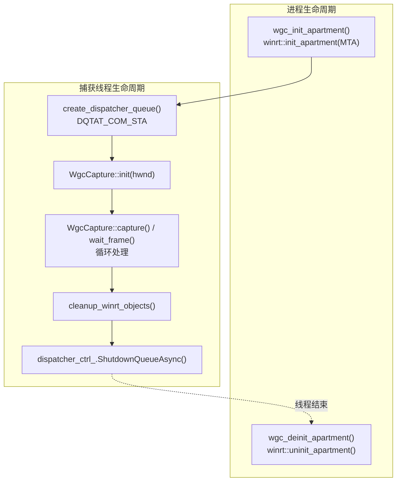

Windows.Graphics.Capture (WGC) 是微软自 Windows 10 1803 起推出的现代屏幕捕获 API，通过 GPU 直接抓取窗口/显示器内容，支持被遮挡窗口（非最小化），在 Win11 下可去除边框。与 DXGI Desktop Duplication 相比，WGC 无需全屏独占、无需循环等待新帧——它基于事件驱动（FrameArrived），配合 Direct3D11CaptureFramePool 提供缓冲池，天然适合低延迟、非破坏性读取的捕获场景。本项目的 WGC 实现在架构上遵循 OBS winrt-capture 的经典模式，但在 triple-buffered staging 数量（3→超越 OBS 的 2）和条件变量同步两方面做了深度定制，专为 CPU readback 管线优化。核心设计围绕四条轴线展开：**WinRT 多线程套间（MTA）初始化**、**DispatcherQueue 事件泵**、**Triple-buffered GPU→CPU 流水线**、以及**条件变量驱动的高效帧等待机制**。

## WinRT 套间模型：MTA 全局初始化 + STA DispatcherQueue 线程级事件泵

WGC 的 WinRT 对象（GraphicsCaptureItem、Direct3D11CaptureFramePool、GraphicsCaptureSession）依赖于正确的 COM 套间初始化。项目采用**双层套间策略**：进程级 MTA + 捕获线程级 STA DispatcherQueue。

**进程级 MTA（Multi-Threaded Apartment）**在 `wgc_init_apartment()` 中通过 `winrt::init_apartment(winrt::apartment_type::multi_threaded)` 完成，调用一次，整个进程生命周期保持 [`capture_wgc.hpp`](../capture/include/capture_wgc.hpp#L45-L47)。选择 MTA 而非 STA 的核心原因是：捕获线程需要自由地使用 `std::condition_variable` 等待帧就绪，同时允许主线程或其他辅助线程在任意时刻调用 API。MTA 下 COM 不强制消息泵，线程可阻塞在条件变量上而不影响其他 COM 调用。对应的 `wgc_deinit_apartment()` 在进程退出前调用，确保 WinRT 全局状态清理。

**线程级 DispatcherQueue** 是 WGC 能收到 FrameArrived 事件的必要前提。每一个运行 `WgcCapture` 的线程必须在创建捕获会话之前创建 DispatcherQueue，通过 `create_dispatcher_queue()` 函数实现 [`capture_wgc.hpp`](../capture/include/capture_wgc.hpp#L51-L65)。这里的关键机制是 `CreateDispatcherQueueController` 设置 `DQTYPE_THREAD_CURRENT` 和 `DQTAT_COM_STA`——DispatcherQueue 需要一个 STA 套间来运行其事件循环。该队列是一个轻量级的 WinRT 事件调度器，FrameArrived 回调在 DispatcherQueue 的线程上下文中触发，而不是在捕获线程的任意位置中断。在 `wgc_capture_single()` 和 `WgcStreamHandle::start()` 中均能看到严格的顺序：`create_dispatcher_queue()` 必须在 `cap.init(hwnd)` 之前调用 [`capture_wgc_ffi.cpp`](../capture/src/capture_wgc_ffi.cpp#L81-L84)。DispatcherQueue 的生命周期管理需特别注意：在 `capture_wgc_ffi.cpp` 中，`stop()` 方法 `detach` 而非 `join` 工作线程，以避免在 WinRT 回调阻塞时产生死锁 [`capture_wgc_ffi.cpp`](../capture/src/capture_wgc_ffi.cpp#L144-L150)。



Sources: [`capture_wgc.hpp`](../capture/include/capture_wgc.hpp#L40-L65), [`capture_wgc_ffi.cpp`](../capture/src/capture_wgc_ffi.cpp#L73-L96)

## D3D11 设备创建与跨 WinRT 桥接：从 GPU 适配器到 IDirect3DDevice

WGC 的 GPU 管线要求 D3D11 设备与 WinRT `IDirect3DDevice` 之间存在双向桥接。`create_d3d_device()` 展示了精细的适配器选择逻辑：通过 `MonitorFromWindow(hwnd, MONITOR_DEFAULTTONEAREST)` 获取窗口所在监视器，然后枚举 `IDXGIAdapter1` 和 `IDXGIOutput`，找到匹配该监视器的物理显卡 [`capture_wgc.cpp`](../capture/src/capture_wgc.cpp#L101-L127)。这种做法的意图是在多 GPU 系统（如笔记本集显+独显）上确保 D3D11 设备与窗口的渲染 GPU 一致，否则 `CreateCaptureItem` 可能返回 `E_INVALIDARG` —— 这是 WGC 文档中未明确说明的坑。如果未找到匹配（可能发生在窗口跨越多个显示器时），回退为 `D3D_DRIVER_TYPE_HARDWARE` 使用默认适配器。同样的逻辑适用于 `create_d3d_device_monitor()`，区别在于入参是 `HMONITOR` 而非 `HWND` [`capture_wgc.cpp`](../capture/src/capture_wgc.cpp#L60-L97)。

设备创建标志 `D3D11_CREATE_DEVICE_BGRA_SUPPORT` 是强制性的——WGC FramePool 的像素格式 `B8G8R8A8UIntNormalized` 要求 D3D11 设备支持 BGRA 表面。设备创建后，桥接通过两层转换完成：

```
ID3D11Device → IDXGIDevice → CreateDirect3D11DeviceFromDXGIDevice → IDirect3DDevice
```

`CreateDirect3D11DeviceFromDXGIDevice` 是 Windows.Graphics.DirectX.Direct3D11.Interop 中的关键函数，它生成一个 WinRT 可消费的 `IDirect3DDevice` 对象，随后传递给 `Direct3D11CaptureFramePool::Create()`。反向桥接（从 WinRT surface 取回 D3D texture）则通过 `IDirect3DDxgiInterfaceAccess::GetInterface(IID_ID3D11Texture2D)` 实现 [`capture_wgc.cpp`](../capture/src/capture_wgc.cpp#L336-L341）。

Sources: [`capture_wgc.cpp`](../capture/src/capture_wgc.cpp#L60-L153), [`capture_wgc.cpp`](../capture/src/capture_wgc.cpp#L336-L341)

## Direct3D11CaptureFramePool 配置与 Triple-buffered 设计决策

FramePool 的创建发生在 `create_frame_pool()` 中，三个参数决定了捕获管线的行为 [`capture_wgc.cpp`](../capture/src/capture_wgc.cpp#L171-L212)：

| 参数 | 值 | 设计理由 |
|---|---|---|
| Direct3DDevice | `d3d_dev` (从 D3D11 device 桥接) | 必须与捕获目标的 GPU 一致 |
| PixelFormat | `B8G8R8A8UIntNormalized` | 32bit BGRA，CPU 端内存布局与 `std::vector<uint8_t>` 兼容 |
| BufferCount | **3** | Triple-buffered：GPU 写入→CopyResource→CPU readback 三级流水线 |
| Size | `item_.Size()` | 匹配捕获项目的初始尺寸 |

`BufferCount = 3` 是本项目与 OBS 的关键差异点（OBS 使用 2，即 double-buffered）。理由在于处理管线的差异：OBS 的 WGC 捕获在 GPU 侧完成所有处理（通过 shader 做格式转换和缩放），然后在 GPU 上通过共享 handle 直接送给编码器，无需 CPU readback；而本项目的管线需要将帧数据从 GPU staging texture **Map 回 CPU 内存**（`D3D11_MAP_READ`），这个过程会阻塞直到 GPU copy 完成。三缓冲区允许如下重叠流水线：

```mermaid
gantt
    title Triple-buffered 流水线 (BufferCount=3)
    dateFormat  X
    axisFormat  %s

    section Buffer 0
    GPU Writes Frame N     :a0, 0, 2
    CopyResource G→S       :a1, 2, 4
    CPU Map + memcpy       :a2, 4, 6

    section Buffer 1
    GPU Writes Frame N+1   :b0, 3, 5
    CopyResource G→S       :b1, 5, 7
    CPU Map + memcpy       :b2, 7, 9

    section Buffer 2
    GPU Writes Frame N+2   :c0, 6, 8
    CopyResource G→S       :c1, 8, 10
    CPU Map + memcpy       :c2, 10, 12
```



当 CPU 正在对 Buffer 0 执行 readback 时，GPU 可同时向 Buffer 1 写入新帧，而 Buffer 2 可能正在接受 `CopyResource` 传输。如果只有 2 个 buffer，CPU readback 和 GPU 写入将在同一个 buffer 上冲突，导致流水线停顿。

创建 FramePool 后，立即注册 FrameArrived 事件**早于** `CreateCaptureSession` 的调用 [`capture_wgc.cpp`](../capture/src/capture_wgc.cpp#L197-L200）。这个顺序很重要：如果先创建 Session 再注册事件，可能丢失 Session 启动后产生的第一批 FrameArrived 通知。事件注册使用 WinRT 的 event_token 模式，返回的 `frame_arrived_token_` 保存在类中，shutdown 时通过 `pool_.FrameArrived(frame_arrived_token_)` 撤销注册。

Session 创建后应用两个可选配置：
- **`IsBorderRequired(false)`**：Win11+ 特性，去除 WGC 捕获时默认添加的白色边框[`capture_wgc.hpp`](../capture/include/capture_wgc.hpp#L101-L104)。运行时检测 `ApiInformation::IsPropertyPresent` 确保向下兼容。
- **`IsCursorCaptureEnabled(false)`**：同样运行时检测，禁用光标捕获以提升性能——项目后续可通过输入模拟模块自行叠加鼠标光标 [`capture_wgc.hpp`](../capture/include/capture_wgc.hpp#L108-L111)。

Sources: [`capture_wgc.cpp`](../capture/src/capture_wgc.cpp#L171-L216), [`capture_wgc.hpp`](../capture/include/capture_wgc.hpp#L40-L55)

## 事件驱动帧到达通知 + 条件变量同步

WGC 捕获管线的核心同步模型是 **FrameArrived 回调→条件变量→wait_frame**。FrameArrived 事件的实现极为简洁 [`capture_wgc.cpp`](../capture/src/capture_wgc.cpp#L296-L302）：

```cpp
void WgcCapture::on_frame_arrived() {
    std::lock_guard<std::mutex> lk(frame_mtx_);
    frame_ready_ = true;
    frame_cv_.notify_one();
}
```

回调仅做三件事：加锁、设置标志位、通知等待线程。不做任何帧处理——实际帧抓取发生在消费线程的 `capture()` 或 `wait_frame()` 中。这种做法符合"回调最小化"原则，避免在 DispatcherQueue 线程上下文中执行耗时操作阻塞事件泵。

`wait_frame()` 提供了事件的阻塞等待语义 [`capture_wgc.cpp`](../capture/src/capture_wgc.cpp#L462-L477)：

```
wait_frame():
  1. 尝试非阻塞 capture() — 如果帧已就绪立即返回
  2. 无帧 → 条件变量 wait_for(timeout_ms)，等待 frame_ready_ 或 !ok_
  3. 超时 → 返回 false
  4. 被唤醒 → 再次 capture() 获取实际帧
```

这里需要特别关注**竞态条件保护**：`capture()` 内部在 `TryGetNextFrame()` 返回 null 时**不会**重置 `frame_ready_` 标志 [`capture_wgc.cpp`](../capture/src/capture_wgc.cpp#L312-L316）。原因是 `on_frame_arrived` 可能在 `TryGetNextFrame()` 返回 null 之后、当前线程检查 `frame_ready_` 之前设置该标志——如果重置会导致该通知永久丢失（经典 TOCTOU 竞争）。只有真正消费了一个帧（`TryGetNextFrame` 返回有效帧且 `Map/Unmap` 完成后）才将 `frame_ready_` 置为 false [`capture_wgc.cpp`](../capture/src/capture_wgc.cpp#L446-L449）。

`signal_stop()` 和 `on_closed()` 则通过设置 `frame_ready_ = true` 和 `notify_all()` 确保等待线程能够及时退出，不会永久阻塞在条件变量上 [`capture_wgc.cpp`](../capture/src/capture_wgc.cpp#L487-L497）。

Sources: [`capture_wgc.cpp`](../capture/src/capture_wgc.cpp#L296-L477)

## GPU→CPU 完整捕获管线：CopyResource + Staging Texture + Row-pitch 处理

帧捕获的核心管线在 `capture()` 方法中，包含五个精确计时的阶段 [`capture_wgc.cpp`](../capture/src/capture_wgc.cpp#L305-L456)：

| 阶段 | 计时字段 | 操作 | 耗时典型值 |
|---|---|---|---|
| 等待帧到达 | `cap_us` | `pool_.TryGetNextFrame()` | 0-16ms (取决于帧率) |
| 获取 D3D surface | （含在 cap_us） | `IDirect3DDxgiInterfaceAccess::GetInterface` | 微秒级 |
| GPU 拷贝 | `copy_us` | `ctx_->CopyResource(staging, src_tex)` | 0.1-0.5ms |
| CPU readback | `readback_us` | `ctx_->Map(D3D11_MAP_READ) + memcpy` | 0.5-3ms |
| 总耗时 | `total_us` | 端到端 | 1-4ms (不含等待) |

`CopyResource` 是 GPU 侧的纯 DMA 操作，将 WGC FramePool 提供的 texture 拷贝到 staging texture。这里采用**轮转索引**选择 staging buffer slot：`staging_idx_ = (staging_idx_ + 1) % STAGING_COUNT`，确保每个 slot 消耗后 GPU 可以有足够时间完成后续写入 [`capture_wgc.cpp`](../capture/src/capture_wgc.cpp#L350-L353）。`src_tex.Reset()` 紧随 `CopyResource` 之后调用，主动释放 WinRT frame 引用，让 FramePool 能回收该 surface 用于下一帧。

`ensure_staging()` 使用 **create-before-destroy** 安全模式创建 staging textures [`capture_wgc.cpp`](../capture/src/capture_wgc.cpp#L262-L292）。当窗口尺寸发生变化时，先在新数组中创建所有 3 个 texture，全部成功后再一次性替换旧数组。这种模式防止了在创建中途失败时留下部分旧 texture、部分新 texture 的不一致状态——虽然 `CreateTexture2D` 很少失败，但窗口尺寸突变（如全屏切换）时 D3D 设备可能出现 Out-of-Memory 状态。

`Map` + `memcpy` 阶段包含 row-pitch 处理 [`capture_wgc.cpp`](../capture/src/capture_wgc.cpp#L426-L441）：

```
if (pitch == width * 4):
    单次 memcpy — 连续内存布局，GPU 未做行对齐填充
else:
    逐行 memcpy — GPU 纹理行有对齐填充 (row-pitch > width*4)
```

D3D11 staging texture 的行对齐（row-pitch）通常为 16 字节整数倍，但实际纹理宽度 * 4 不一定满足该对齐。帧数据输出始终为紧凑布局（width * height * 4），不存在行尾填充，这与其他模块（预处理管线、TCP 传输）要求的连续内存布局一致。

Sources: [`capture_wgc.cpp`](../capture/src/capture_wgc.cpp#L305-L456)

## 设备丢失检测与恢复策略：item.Closed 事件

WGC 捕获会话在窗口销毁、目标显示器断开或 GPU 设备重置时失效。项目通过 `item_.Closed` 事件注册回调 `on_closed()` 来检测这些情况 [`capture_wgc.cpp`](../capture/src/capture_wgc.cpp#L156-L162）：

```cpp
closed_token_ = item_.Closed([this](...){
    on_closed();
});
```

`on_closed()` 将 `ok_` 置 false 并 `notify_all()` 唤醒所有等待线程 [`capture_wgc.cpp`](../capture/src/capture_wgc.cpp#L304-L312）。这导致 `wait_frame()` 中的条件谓词 `[this] { return frame_ready_ || !ok_; }` 立即满足，`capture()` 返回 false，上层逻辑可据此触发重初始化流程。

此外，`capture()` 内部检测 texture 格式变化 [`capture_wgc.cpp`](../capture/src/capture_wgc.cpp#L347-L352）：

```cpp
if (desc.Format != format_) {
    ok_ = false;
    frame_cv_.notify_all();
    return false;
}
```

虽然 WGC 理论上固定使用 B8G8R8A8，但当设备重置或窗口切换到不同的 GPU 时，格式可能意外变化。捕获到此变化后标记失败，等待上层重新初始化。

Sources: [`capture_wgc.cpp`](../capture/src/capture_wgc.cpp#L156-L162), [`capture_wgc.cpp`](../capture/src/capture_wgc.cpp#L347-L352)

## FFI 层与流式线程管理：WgcStreamHandle 生命周期

`capture_wgc_ffi.cpp` 提供的 C-compatible FFI 层将 `WgcCapture` 包装为可被从 Rust（通过 `extern "C"`）调用的流式接口 [`capture_wgc_ffi.h`](../capture/include/capture_wgc_ffi.h#L3-L6）。`WgcStreamHandle` 封装了一个完整的后台捕获线程，包含：

| 组件 | 职责 |
|---|---|
| `cap` (WgcCapture) | 核心捕获引擎 |
| `worker` (std::thread) | 后台运行，持有 DispatcherQueue |
| `dispatcher_ctrl_` | 管理线程的 DispatcherQueue 生命周期 |
| `mtx` + `frame_buf` | 线程安全的最新帧缓存 |
| `has_frame` (atomic) | 无锁的标志位，指示帧是否就绪 |

`start()` 方法展示了**初始化同步模式**：工作线程启动后立即创建 DispatcherQueue 并初始化 `cap`，完成后通过 `init_cv.notify_one()` 通知调用线程 [`capture_wgc_ffi.cpp`](../capture/src/capture_wgc_ffi.cpp#L73-L126)。调用线程在 `init_cv.wait_for(..., 5秒)` 上阻塞等待，若超时或初始化失败则销毁句柄。这种设计在"调用者必须等待初始化完成"和"初始化可能发生在不同线程"之间建立了可靠的同步屏障。

`stop()` 方法不调用 `worker.join()` 而是 `worker.detach()` [`capture_wgc_ffi.cpp`](../capture/src/capture_wgc_ffi.cpp#L144-L150）。注释明确说明原因：如果 worker 线程阻塞在 WinRT 回调中（虽然条件变量有超时，但 DispatcherQueue 内部可能在某些边缘情况下阻塞），`join()` 会导致永久死锁。detach 后，worker 线程在下次循环中检测到 `running = false` 会自然退出；即使在线程终止前进程退出，操作系统也会回收线程资源。

FFI 层同时提供单帧捕获函数 `wgc_capture_single()`，它内部临时创建 DispatcherQueue，捕获一帧后立即 `ShutdownQueueAsync()`，适合不需要持续流的场景 [`capture_wgc_ffi.cpp`](../capture/src/capture_wgc_ffi.cpp#L204-L234）。

Sources: [`capture_wgc_ffi.cpp`](../capture/src/capture_wgc_ffi.cpp#L22-L234)

## 性能特征与优化要点

综合 WGC 捕获管线各环节的微秒级计时数据，典型性能特征如下：

```
GPU CopyResource (copy_us):    ~0.2ms  (1080p → staging texture)
CPU Map + memcpy (readback_us): ~1.0ms  (1080p, row-pitch处理)
Cap wait (cap_us):              ~0.01ms (帧已就绪时 TryGetNextFrame)
端到端延迟 (total_us):           ~1.2ms  (不含外部 wait_frame 等待)
```

三个关键优化点值得关注：

1. **Triple-buffered 的 3 比 OBS 的 2 更适合 CPU readback 场景**：OBS 使用 2 因为它在 GPU 侧完成所有处理；本项目需要 `Map(D3D11_MAP_READ)` 阻塞等待 GPU copy 完成，3 个 buffer 允许 GPU 写入、GPU copy、CPU readback 三级并行。

2. **条件变量 vs 轮询**：`wait_frame()` 使用条件变量 + `wait_for(timeout_ms)` 而非 `TryGetNextFrame` 轮询。前者在无帧时线程挂起，CPU 占用接近零；后者会在 60fps 下每秒执行数百次无意义的轮询调用。`wgc_bench_capture.cpp` 的 `--poll` 参数提供了轮询模式的对照实验开关。

3. **staging texture 的 create-before-destroy 模式**：防止窗口尺寸变化时的中间状态导致数据损坏，这在窗口从 1920x1080 切换到全屏 3840x2160 的边界场景中尤为关键。

4. **format 变化检测的防御性设计**：虽然 WGC 格式理论上恒定，但 GPU 设备重置后的状态恢复可能导致 `Direct3D11CaptureFramePool` 产生不一致的 texture 格式——主动检测并标记失败比静默传递错误数据更安全。

Sources: [`capture_wgc.cpp`](../capture/src/capture_wgc.cpp#L262-L292), [`capture_wgc.cpp`](../capture/src/capture_wgc.cpp#L305-L456)

---

**下一步阅读建议**：理解 WGC 捕获出的原始 BGRA 帧数据后，下一步应深入[帧预处理管线](10-zheng-yu-chu-li-guan-xian-ren-yi-fen-bian-lu-bgra-cai-jian-84x84shuang-xian-xing-suo-fang-hui-du-hua-4zheng-dui-die-gui-hua-float32zhang-liang)，了解如何将任意分辨率的 BGRA 帧经裁剪、缩放、灰度化、堆叠、归一化后转换为 4×84×84 的 float32 张量——这是视觉 AI 模型的直接输入格式。如果对捕获引擎的完整后端对比感兴趣，可回溯[捕获引擎架构](8-bu-huo-yin-qing-jia-gou-chou-xiang-jie-kou-icapturebackend-yu-wu-chong-hou-duan-wgc-desktopblt-getwindowdc-printwindow-screenbitblt)页面了解 WGC 与其他四种后端的优劣取舍。