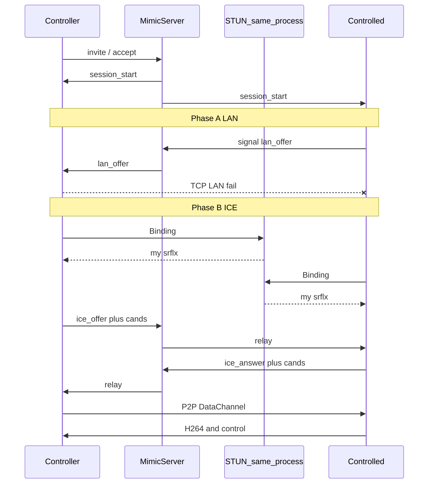

# Mimic 公网直连（ICE）详细计划

> 状态：待用户确认后开发  
> 日期：2026-07-19  
> 范围：PC ↔ PC、PC ↔ Android；信令 + 自建 STUN 单进程；**无 TURN / 无画面中继**

---

## 1. 目标与铁律

### 1.1 产品目标

让不在同一局域网的两台 Mimic 客户端（你与远程朋友）能够：

1. 经 **MimicServer** 完成账号、上线、邀请/接受；
2. 画面与控制尽量 **端到端直连**；
3. **绝不**把 H.264 / 控制大流量经 MimicServer 或任何 TURN 中继转发。

### 1.2 架构铁律

| 流量类型 | 是否经服务器 | 说明 |
|----------|--------------|------|
| 账号 / 设备列表 / 邀请 | 是（信令） | 极小，服务器需在线 |
| STUN Binding（查自己的公网映射） | 是（STUN 端口） | 极小，不是画面 |
| ICE 候选交换（offer/answer/cand） | 是（信令 `signal`） | 极小纸条 |
| H.264 画面 + 键鼠控制 | **否** | 仅 LAN 或 ICE 直连 DataChannel |
| TURN 中继画面 | **不做** | 用户无高带宽云、明确拒绝 |

### 1.3 用户已确认的约束

- 不要 TURN（不要画面走服务器）。
- 信令一直在线 ≠ 视频中继；信令几乎不耗带宽。
- 双对称 NAT 无法保证打通时：**失败并提示**，不上中继。
- **单进程双端口**部署（见第 5 节）——采纳。

---

## 2. 概念澄清（讨论结论）

### 2.1 信令看到的「公网 IP」≠ 媒体用的映射

WebSocket 连信令时，服务器看到的 `remoteAddress` 是 **「连信令这条 TCP」** 的 NAT 映射。  
家用（尤其对称）NAT 常对 **每个目标** 分配不同端口。  
因此不能仅靠「信令上不断更新对方公网 IP」打洞。

### 2.2 STUN 做什么、不做什么

- **做**：客户端用 UDP 问 STUN「我出去时长什么样」→ 得到 **自己的** srflx（IP:端口）。
- **不做**：不通知朋友；不传画面；**不解决**对称 NAT「一目的地一端口」。
- 通知朋友：客户端把候选放进 `signal`，由 MimicServer **原样转发**。

### 2.3 对称 NAT

| 情况 | 预期 |
|------|------|
| 至少一侧为锥形 / 可复用映射 | ICE 直连往往可成功 |
| 双侧强硬对称 NAT | 纯打洞经常失败 |
| 要「保证通」又不要中继 | **做不到** |

### 2.4 公共 STUN vs 自建

- Google STUN 国内常不稳。
- 国内公共（如 `stun.qq.com`）可作备用，不可控。
- **本方案：自建 STUN 与信令同进程**，国内可达、运维简单。

---

## 3. 连接回退逻辑（请重点确认）

你描述的「LAN 失败 → 用 STUN」需要改准一句：

> **STUN 不是一种传输方式**，而是 ICE 打洞前「查自己公网地址」的步骤。  
> 传输方式只有两档成功态：`lan` / `p2p`（直连），再加失败。

### 3.1 正确状态机

```text
session_start
    │
    ▼
【阶段 A】局域网直连（现有）
    被控：listen + signal{lan_offer, ips[], port}
    控制：逐 IP TCP 连接（短超时）
    │
    ├─ 成功 ──────────────────────────────► transport = lan
    │                                      画面走现有 LanMedia 帧格式
    │
    └─ 失败 / 超时
            │
            ▼
【阶段 B】ICE 直连（新建）
    双方：向「本机 MimicServer 的 STUN 端口」做 Binding
         得到各自 srflx（及 host 候选）
    经信令交换：
         ice_offer / ice_answer / ice_cand（trickle）
    ICE 库自动尝试所有候选对（不「假设」谁是锥形）
    │
    ├─ DataChannel open ──────────────────► transport = p2p
    │                                      同一套 [type][len][payload] 走 DC
    │
    └─ ICE failed / 超时
            │
            ▼
【阶段 C】失败（无 TURN）
    UI：明确错误
    「无法直连（可能双方均为对称 NAT 或防火墙拦截）。
     请尝试同一局域网、或任一侧做端口映射/公网，本版本不提供中继。」
    transport = none
```

### 3.2 对你提法的逐条对齐

| 你的说法 | 计划中的真实行为 |
|----------|------------------|
| LAN 连不上就用 STUN | LAN 失败后进入 **ICE**；ICE **内部会用** STUN 采候选 |
| 先假设一方是锥形再试 | **不人工假设**；ICE 对所有候选对试连（锥形时更容易成功） |
| 试到双方都对称就没办法、不上 TURN | **是** → 阶段 C 失败退出 |
| 不断用信令更新公网 IP 保证打通 | **否**；只交换 ICE 候选，不保证对称 NAT |

### 3.3 时序图



### 3.4 超时建议（实现时写入代码常量）

| 阶段 | 建议超时 |
|------|----------|
| LAN 每 IP connect | ~1–2s（现有量级） |
| LAN 总尝试 | ~3–5s |
| ICE gathering + connect | ~10–15s |
| 总会话建立上限 | ~20s 后进阶段 C |

---

## 4. 单进程双端口（采纳你的建议）

### 4.1 结论：**行，且推荐**

不必拆成两台机器、两个安装包。  
**一个 Node 进程**同时：

| 端口 | 协议 | 职责 |
|------|------|------|
| **8443**（现有） | HTTP + WebSocket | 账号、presence、invite、`signal` 转发 |
| **3478**（新增） | UDP STUN | Binding Request → 返回 XOR-MAPPED-ADDRESS |

同机、同进程、逻辑上仍是「两种服务」；部署仍是「拷一份 MimicServer 起来」。

### 4.2 实现要点（server）

- 在现有 [`server/server.js`](server/server.js) 用 `dgram` 加最小 STUN Binding 响应（RFC 8489 子集即可）。
- **不**实现 TURN（无 Allocate / 无中继）。
- 可选：`GET /api/ice` 返回  
  `{ stunUrls: ["stun:<公网或selfUrl主机>:3478"] }`  
  客户端启动 ICE 时拉取，避免写死。
- 防火墙：放行 **UDP 3478** + 现有 TCP 8443。
- 健康检查：`/health` 可增加 `stunPort: 3478`。

### 4.3 为何不「一个端口兼做 STUN+信令」

STUN 是 UDP Binding，信令是 TCP/WS，协议不同；**同进程双端口**是标准且正确的做法。

---

## 5. 客户端技术选型

| 端 | 直连实现 | 媒体载荷 |
|----|----------|----------|
| PC (C++) | 自研 UDP hole-punch + STUN（[`peer_udp.cpp`](../pc/client/src/peer_udp.cpp)） | MPC1 分片；重组后同 LAN `[type][len][payload]` |
| Android | 同协议 [`UdpMedia.kt`](../android/setup/client/src/main/java/com/mimic/client/peer/UdpMedia.kt) | 同上 |
| 解码 UI | 不变 | `peer_frame` 不变 |

> 实现说明：为避免 Windows 链 libdatachannel 的构建依赖阻塞发版，采用与计划等价的 **STUN + UDP 打洞直连**（无 TURN、画面不经 MimicServer）。信令 kinds：`wan_probe` / `ice_offer` / `ice_answer`（含 `cands[]`）。

信令消息（经现有 `signal.payload`，服务器不解析）：

- `lan_offer` / `lan_ack`（已有）
- `wan_probe`（进入 ICE/UDP punch）
- `ice_offer` / `ice_answer`（候选列表）

---

## 6. 模块改动清单

### 6.1 Server（单进程）

- [ ] UDP STUN Binding（3478）
- [ ] `/api/ice`（stunUrls）
- [ ] 文档：防火墙与「无 TURN」说明
- [ ] bump `server/package.json`，部署重启阿里云

### 6.2 PC

- [ ] 引入 libdatachannel，新 `peer_ice.cpp`
- [ ] [`peer_session.cpp`](pc/client/src/peer_session.cpp)：LAN 失败 → ICE；DC 复用收发路径
- [ ] Build.ps1 链接
- [ ] `transport`：`lan` | `p2p` | `none`

### 6.3 Android

- [ ] WebRTC 依赖 + `IceMedia.kt`
- [ ] [`PeerSession.kt`](android/setup/client/src/main/java/com/mimic/client/peer/PeerSession.kt) 对称状态机
- [ ] 与 PC 相同 signal kinds / 帧格式

### 6.4 前端

- [ ] Peer 面板显示 `LAN` / `P2P` / 失败原因
- [ ] 失败文案（无 TURN、对称 NAT 提示）

### 6.5 明确不做

- [ ] TURN / coturn 中继
- [ ] MimicServer WebSocket 转发音视频
- [ ] 用信令 TCP remoteAddress 冒充 srflx 作为唯一候选

---

## 7. 验收标准

1. **同 Wi‑Fi**：仍走 LAN，模式显示 LAN，延迟正常。  
2. **跨网且至少一侧非强硬对称 NAT**：能出画面与控制，模式 P2P；阿里云流量无明显视频级上涨。  
3. **双对称 NAT / 严格防火墙**：在超时后失败提示，不挂死、不偷偷中继。  
4. **单进程**：一台机只跑一个 `node server.js`，8443 + 3478 均监听。  
5. **挂断**：LAN/ICE 资源释放干净，可再次邀请。

---

## 8. 风险与预期话术（对朋友测试）

- 跨运营商家宽：成功率视 NAT 类型而定，**不是 100%**。  
- 失败时引导：同一局域网测试、检查 UDP 出网、任一侧路由器 UPnP/端口映射（高级用户）。  
- 若未来产品要求「几乎总是能通」：需另开 TURN 项目（会吃中继带宽）——**本阶段不做**。

---

## 9. 请你确认的清单

请逐条确认（回复「确认」或指出要改的条目）：

1. **回退**：LAN → ICE（内含自建 STUN 采候选）→ 失败结束；**无 TURN**。  
2. **不**把 STUN 当成单独传输模式；不「假设锥形」人工分支。  
3. **单进程双端口**：8443 信令 + 3478 STUN；同意。  
4. 画面 **永不**经 MimicServer。  
5. 确认后开始开发并发版（PC + Android + Server）。

---

*本文档汇总 2026-07-19 关于 ICE/STUN/TURN/对称 NAT/单进程部署的全部讨论。*
